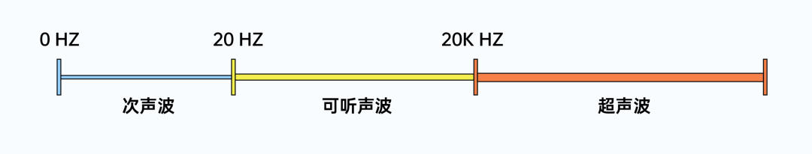
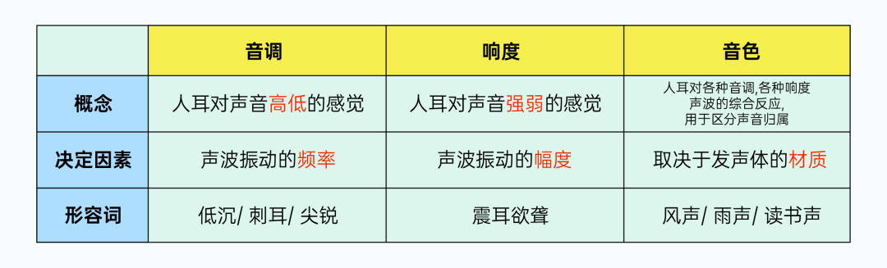
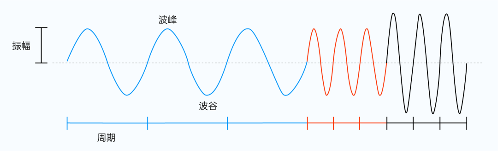
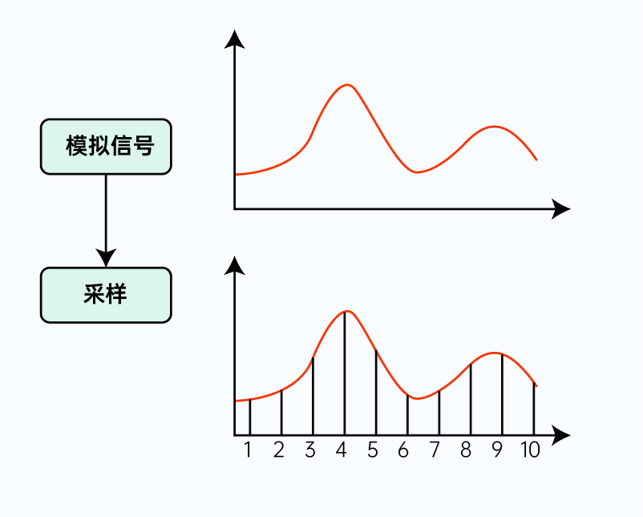
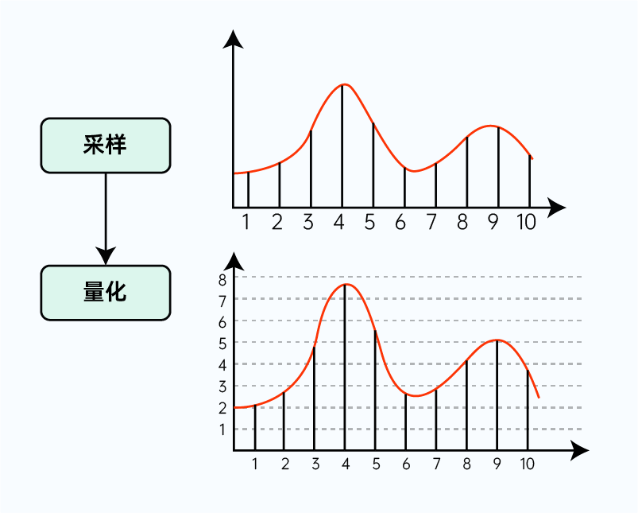
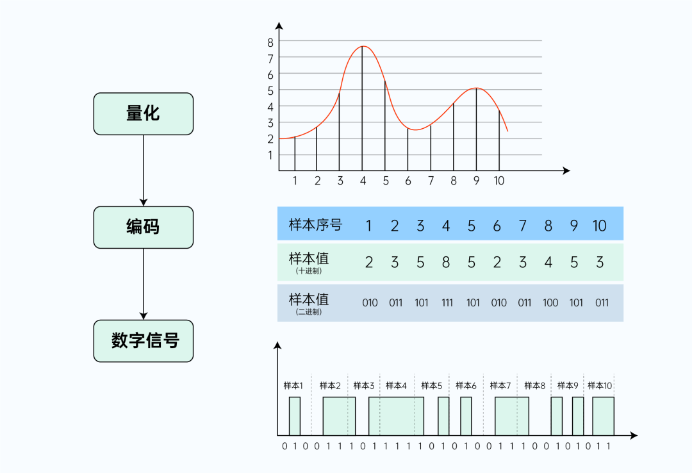
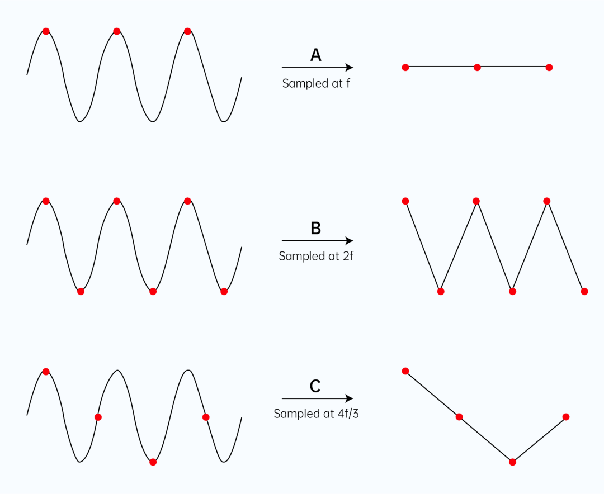
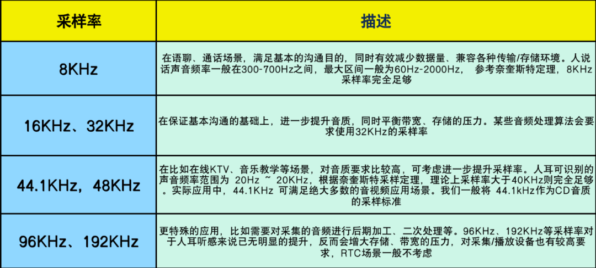
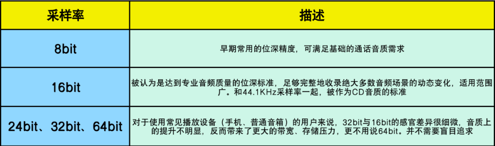
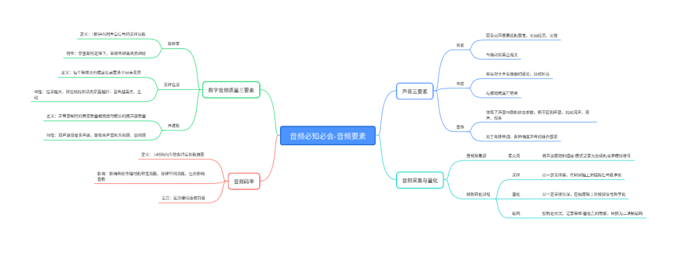

## 前言

“风声，雨声，读书声，声声入耳”，关于声音，大家肯定都不陌生。作为最基础的信息载体之一，声音被用于社交沟通、唱歌娱乐，被用于人机语音交互、智能控制，在我们生活中的方方面面都在被感知和使用。纵观各大应用商店，以纯音频为主要玩法搭建的应用也数不胜数，场景诸如语音交友、语音开黑、语音阅读、狼人杀、实时 KTV 等等，可谓琳琅满目。 

2022 年初，以语聊为核心场景的 ClubHouse 火遍全球，估值一度超过 10 亿美金，与其相关的“声音概念股”大涨。虽然现在看 Clubhouse 似乎是昙花一现，但这受运营策略、内容生态诸多因素的综合影响，抛开这些因素，我们仍能从中窥探到“声音”的魅力，对于“声音”的探索，必定还有更广阔的空间。 

但所谓万变不离其宗，无论玩法如何变化、创新，要打造一个成功的音频产品，始终离不开对音频技术的娴熟应用。而对任何一门技术，其基础知识都是重中之重的，这篇文章，希望和大家一起以初学者的角度，聊聊音频技术的一些基础概念。

我们会从**声音的三要素**出发，了解声音最基本的特征，再通过学习**声音的采集和量化**，了解自然声音、模拟音频、数字音频之间的转换过程，最后，我们再重点了解**数字音频的关键质量指标**，理解影响音频质量的诸多要素。

## 声音三要素 · 音调、响度、音色

正如一开始说的，对于声音，我们似乎已再熟悉不过。但如果要你具体描述某一种声音，你会从哪方面入手呢？我们描述一个人的时候，可以使用性别、外貌、身高、体重等特征，而描述声音时往往会使用一些形容词，比如刺耳、低沉、响亮、微弱；或者说明具体的声音种类，比如风声、雨声、人声等。但这些描述似乎都只能“耳听”不能“言传”，更无法进行量化。我们需要更明确的属性，对这些形容词、名词做进一步定义。这就涉及到声音的三个基础且重要的特征：音调、响度和音色，也称为声音的三要素。

### 1 音调

“刺耳、低沉”，这其实是我们对声音高低的感觉描述，这一特征我们称之为音调。在物理定义上，声音是物体振动（比如我们的声带）产生的波，而音调由发声体振动的频率决定，频率越高（振动越快）则音调越高，听起来就越“刺耳”，反之音调越低、听起来就越低沉。我们声带的振动频率，约在100Hz~10KHz之间，基本对应于常说的男低音至女高音的频率。而我们耳朵的听力范围仅限于频率20Hz ~ 20KHz，低于或者高于这个频率范围的声音，分别被称为次声波（＜20Hz）和超声波（＞20KHz），无法被人耳感知。不难发现，虽然人耳的感知范围有限，但人类的发声频率完全包含于人耳的感知范围之内，这意味着任何人说的话，总能被耳朵捕捉到，每个人都有发声的权力，也总有一双耳朵能倾听到你的声音。 

### 2 响度

“响亮、微弱”，是我们对声音强弱的感觉描述，这种特征我们称之为响度。响度由发声体振动的幅度决定，当传播的距离相同时，振动幅度越大、则响度越大；相反，当振幅一定时，传播距离越远，响度越小，就是我们常说的“距离太远了，听不见”的原因。 

### 3 音色

“风声、雨声、人声”，是我们对各种音调、各种响度声音的综合感受，这种特征我们称之为“音色”。音色是一种“感官属性”，我们利用这种“感官属性”，能区分发声的物体，发声的状态，还能评价听感上的优劣，比如“钢琴声、二胡声”，比如“只闻其声，如见其人”，比如“悦耳、动听”等等。那么音色是怎么“产生”的，又由什么“决定”呢？前面我们了解到，声音是由物体振动产生的波，而物体整体振动发出的只是基音，其各部分还有复合的振动，这些复合的振动也会发出声音并形成泛音，基音+泛音的不同组合就产生了多样化的音色，声音世界才变得丰富多彩起来。我们一般认为音色由发声体的材质决定。 我们再通过表格对比一下这三种特征： 

带着上述的了解，我们看看下面的波形图，是一个声音振源在一段时间内的振动情况。 波形图的水平方向为时间轴，我们把相邻两个波峰、或相邻两个波谷在时间轴上的水平间隔称为波振动的周期（周期的倒数即为振动的频率）。波形图平面的竖直方向为幅度轴，波峰、波谷在竖直方向上距离的一半，被称为波形振动的振幅。有了上述基础设定后，我们可以将波形图从左到右，分为三个不同的阶段，分别使用蓝、红、黑三种颜色来区分。 

从左往右来看：蓝色波形和红色波形，在竖直方向上波峰、波谷的距离相同，但是红色波形在水平时间轴上更密集。此时，我们称蓝色波和红色波的振幅相同，但是红色波的频率更高（周期更短）； 再继续往右看，红色波形和黑色波形，在水平方向上的密集程度相同，但是黑色波形在竖直方向上距离更长。此时，我们称红色波和黑色波的频率相同（周期相同），但是黑色波的振幅更大。 结合之前对声音三要素的认识，我们可以认为：蓝色波和红色波的响度相同，但是红色波的音调更高；红色波和黑色波的音调相同，但是黑色波的响度更大。需要注意的是，这里没有引入泛音的影响，故不对音色进行区分描述。

## 声音的采集与量化

我们现在知道，声音可以从三要素的维度来进行描述、区分，但仅仅是描述还远远不够，我们需往实际应用层面继续前进，要对声音进行应用开发，而应用开发的前提是要将其进行采集和存储。在空气或固液体等介质中以波形式传播的声音，如何才能被捕获，并转换为可在电子设备、网络链路中传输的数据呢？ 

### 1 声音的采集

最常见的音频采集方式是使用麦克风、话筒等拾音设备进行录制。我们每天使用的手机上就有多个麦克风设备，比如用于日常电话语音的底部麦克风、视频通话的顶部麦克风、便捷录音的背部麦克风等等。这些拾音设备里有一层薄且敏感的振动膜（类似于人耳内的鼓膜），在不同振幅、频率声波的影响下，振动膜会同步振动，并配合其他关联模块将振动转换为变化的电流。如此，便把将声波的振动模式记录为了连续的电学模拟信号，也即记录声音的关键要素特征，“捕获”了声音。 

### 2 音频信号的数字化

前面我们了解到，声音可以被麦克风等设备采集、转换为电学模拟信号。模拟信号，意味着它在时间维度和幅度维度上，都是连续的，可以被无限分割为任意小的点，无法穷举。听起来似乎比较复杂且难以处理？是的，其实不仅我们觉得如此，计算机也有“同感”。虽然计算机常常和“智能”挂钩，但它其实非常“单纯”，只能识别处理“0”、“1”形式的数字信号（区别于模拟信号，数字信号是离散的、有限个、可穷举的）。 

所以，为了“照顾”单纯的计算机，我们还需要将设备采集到的模拟信号“翻译”为数字离散态。也即，将音频模拟信号转换为音频数字信号，这个过程称为音频模拟信号的数字化（也叫模数转化，A/D转换），整个过程主要包括采样、量化、编码等步骤。下面，我们来具体了解一下。 

如下图，红色波形是一段时间上（假设为1s）的模拟信号波。我们仍取水平横轴为时间维度、纵轴为幅度维度，一步步将其转换为数字信号。 

**第一步，采样**：以一定采样率，在时间轴上对模拟信号进行数字化。 

首先，我们沿着时间轴，按照固定的时间间隔 T（假设 T=0.1s），依次取多个点（如图中 1~10 所对应波上的点）。此时 T 称为取样周期，T 的倒数为本次取样的采样率（f=1/T=10Hz），f 即表示每秒钟进行采样的次数，单位为赫兹（Hz）。显然，采样率越高、单位时间的采样点越多，就能越好地表示原波形（如果高频率、密集地采集无数个点，就相当于完整地记录了原波形）。 

**第二步，量化**：以一定精度，在幅度轴上对模拟信号进行数字化。 

完成采样后，我们接下来进行音频数字化的第二步，量化。采样是在时间轴上对音频信号进行数字化，得到多个采样点；而量化，则是在幅度方向上进行数字化，得到每个采样点的幅度值。 

如下图，我们设定纵轴的坐标取值范围为 0 ~8，得到每个采样点的纵坐标（向上取整），这里的坐标值即为量化后的幅度值。因为我们将幅度轴分为了 8 段，有 8 个值用于量化取整，即本次量化的精度为 8。显然，如果分段越多，则幅度的量化取值将越准确（取整带来的误差就越小），也能越好的表示原波形。对于幅度的量化精度，有一个专有术语描述 — 位深，我们后面会详细说明。

**第三步，编码**：按特定格式，记录采样/量化后的数据。 

经过量化后，我们得到了每个采样点的幅度值。接下来，就是音频信号数字化的最后一步，编码。编码是将每个采样点的幅度量化值，转化为计算机可理解的二进制字节序列。 

如下图，参照编码部分的表格，样本序号为样本采样顺序，样本值（十进制）为量化的幅度值。而样本值（二进制）即为幅度值转换后的编码数据。最终，我们就得到了“0”、“1”形式的二进制字节序列，也即离散的数字信号。这里得到的，是未经压缩的音频采样数据裸流，也叫做PCM 音频数据(Pulse Code Modulation，脉冲编码调制)。实际应用中，往往还会使用其他编码算法做进一步压缩，以后的文章我们会再展开讨论。 

至此，我们基本走完了音频模拟信号数字化的全流程。它包括了采样、量化、编码三个主要步骤，通过在时间轴和幅度轴上的数字化，最终得到了音频信号的二进制形式编码。终于，单纯的计算机将可以理解、处理音频信号了，这迈出了音频数字化应用的重要一步。 

就像声音有三要素一样，音频数字信号也有几个需要我们关注的基础属性，分别是采样率、采样位深和声道数。这些属性是影响音频数字信号质量的关键指标（我们常说的音质），也称为音频数字信号的质量三要素。在讲解数字化的过程中，我们已经对这些属性有所提及，接下来需要再详细学习下。 

## 音频数字信号质量三要素

#### 1 采样率

音频采样率，指的是单位时间内（1s）对声音信号的采样次数（参考数字化过程-采样）。常说的 44.1KHz 采样率，也即 1 秒采集了 44100 个样本。 

我们前面了解到，采样率越高、采样点越多，就可以越好地表示原波形，这就是采样率的影响。而更详细的说明，可以参考奈奎斯特采样定理：采样率 f，必须大于原始音频信号最大振动频率fmax 的 2 倍（也即 f > 2\*fmax，fmax 被称为奈奎斯特频率），采样结果才能用于完整重建原始音频信号；如果采样率低于 2\*fmax，那么音频采样就存在失真。比如，要对最高频率fmax=8KHz 的原始音频进行采样，则采样率 f 至少为 16KHz。 

对于最大频率为 f 的音频信号，当我们分别采用 f、2f、4f/3 的采样率进行采样时，所得到的采样结果参考下图。显然，只有当采样率为 2f 时，才能有效地保留原信号特征。采样率 f 和3f/4 下得到的结果，都和原波形差别很大。 

那么，我们需要多大的采样率？ 

按前面的讨论，采样率似乎越大越好，是否如此呢？理论上来说，最低采样率需要满足奈奎斯特采样定理，在该前提下，采样率越高则保留的原始音频信息越多，声音自然就越真实。但需要注意的是，采样率越高则采样得到的数据量越大，对存储和带宽的要求也就越高。在实际应用中，我们为了平衡带宽和音质，不同场景往往会有不同的选择。常见的选择如下： 

从上面的示例，我们发现，当采样率从 8KHz 翻倍至 16KHz 时，听感明显变得更清晰、空灵和舒适。此时，采样率的提升带来了明显的音质提升。而采样率从 16KHz 提升至 44.1KHz 时，实际听感却好像没有太大的变化，这是因为采样率到达一定程度后，音频质量已经比较高，再往上提升带来的优化已经很细微。 借助专业的频谱分析软件，或许可以观察到高频谱区域的能量差异，但对于人耳来说，已经很难进行区分。所以实际应用中，我们不需要一味追求高采样率，而是要综合带宽、性能、实际听感，选择合适的配置即可。 

### 2 采样位深

我们在学习音频数字化过程的“量化”步骤时，就提及了量化精度-位深的概念。采样位深，指的是在音频采集量化过程中，每个采样点幅度值的取值精度，一般使用bit作为单位。

比如，当采样位深为 8bit，则每个采样点的幅度值可以用 2^8=256 个量化值表示；采样位深为 16bit 时，则每个采样点的幅度值可以用 2^16=65536 个量化值表示。显然，16bit 比 8bit 可存储、表示的数据更多、更精细，量化时产生的误差损失就越小。位深影响声音的解析精度、细腻程度，我们可以将其理解为声音信号的“分辨率”，位深越大，音色也越真实、生动。 

**采样位深选择** 

和采样率的选择类似，虽然理论上来说位深越大越好，但是综合带宽、存储、实际听感的考虑，我们应该为不同场景选用不同的位深。

### 3 声道数

相对于采样率和位深，接下来要讨论的声道数，大家应该比较熟悉。我们常说的单声道、双声道，其实就是在描述一个音频信号的声道数（分别对应于声道数 1 和 2）。声波是可以叠加的，音频的采集和播放自然也如此，我们可以同时从多个音频源采集声音，也可以分别输出到多个扬声器，声道数一般指声音采集录制时的音源数量或播放时的扬声器数量。

除了常见的声道数1、2，PC上还有4，6，8等声道的扩展。一般来说声道数越多，声音的方向感、空间感越丰富，听感也就越好。目前很多手机厂商已经将双声道扬声器作为旗舰标配。在RTC音乐场景，越来越多的应用也开始采用双声道配置，其目的也是进一步提高听感，给用户更好的体验。 

**声道数的选择** 

[实时音视频](# "实时音视频")场景下，声道的选择受限于编解码器、前处理算法的能力，一般仅支持单、双声道。而双声道配置主要在语音电台、音乐直播、乐器教学、ASMR 直播等场景使用，其它场景单声道即可满足。 

当然，最终能否使用哪一种声道配置，还是由实际采集、播放设备的能力决定。解码音频数据时，可以获取数据的声道数，在实际播放时，也要先获取设备属性。如果设备支持双声道，但待播放数据是单声道的，就需要将单声道数据转成双声道数据再播放；同理，如果设备只支持单声道，但数据是双声道的，也需要将双声道数据转换成单声道数据再播放。 

## 音频码率

前面我们谈到，数字音频的三要素不仅影响音频质量，也会影响音频存储、传输所需的空间、带宽。而实际应用场景下，音质决定用户体验、带宽决定成本，都是我们必须考虑到。音质可能更多是主观上的感受，但带宽、空间是比较容易量化的，我们需要了解音频码率的概念。 

音频码率，又称为比特率，指的是单位时间内（一般为1s）所包含的音频数据量，可以通过公式计算。比如采样率 44.1K Hz，位深16bit的双声道音频PCM数据，它的原始码率为：

原始码率 = 采样率/s x 位深/bit x 声道数 x 时长(1s)

44.1 \* 1000 \* 16 \* 2 \* 1 = 1411200 bps = 1411.2 kbps = 1.411 Mbps （需要注意单位之间的差异和转换，b=bit） 

如果一个PCM文件时长为1分钟，则传输/存储这个文件需要的数据量为：1.411 Mbps \* 60s = 86.46Mb 

需要注意的是，上述计算结果是未经压缩的、原始音频PCM数据的码率。RTC场景下，往往还需要再使用 AAC、OPUS 等编码算法做编码压缩，进一步减小带宽、存储的压力。码率的选择也是一个综合质量和成本的博弈，以后我们会详细讲解音频编码的知识，此处大家先了解即可。 

## 总结

至此，我们已经基本了解了声音的基本特征，知道从哪些维度来描述一个声音信号。也学习了声音信号采集、量化的主要过程，知道了自然界的声音是如何被采集并转换为计算机可理解的形式。最后，通过学习音频数字信号的关键质量指标，我们了解了影响音质的一些关键参数。

这些知识，会伴随我们音频技术应用中的每个阶段，大家有必要对不理解或感兴趣的知识点做进一步学习。

下面，我们再通过一个思维导图，梳理一下整篇文章的内容： 

## 思考题

### 本期思考题

理论上，参考奈奎斯特采样定理，40KHz 采样率就能覆盖人耳听力范围的声音，为什么我们还需要 44.1KHz 呢？

（我们下期揭秘）