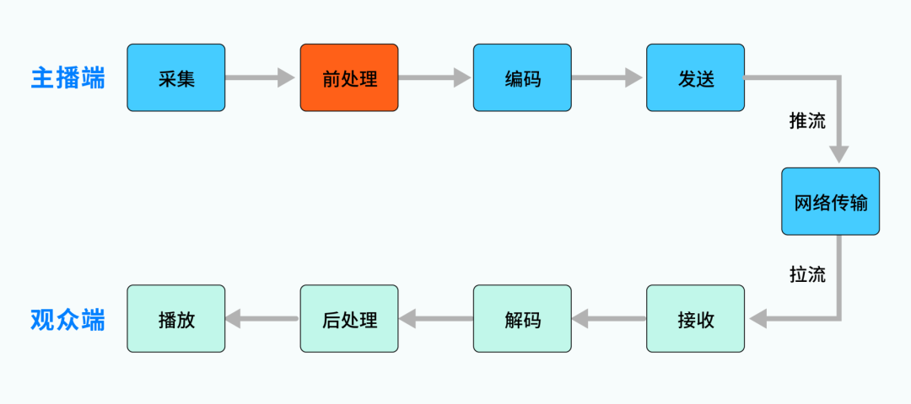
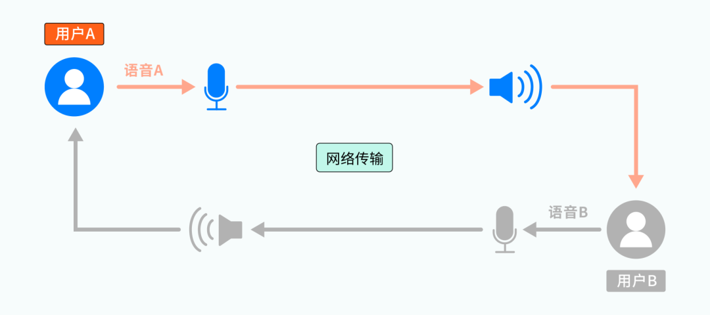
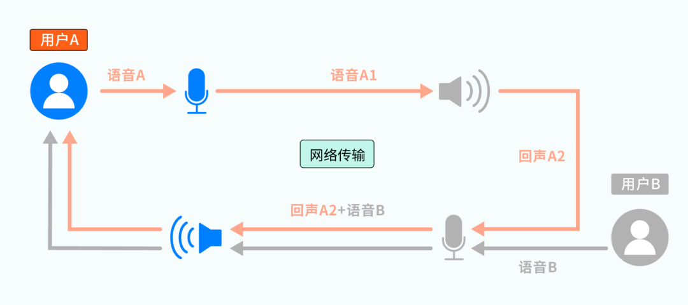
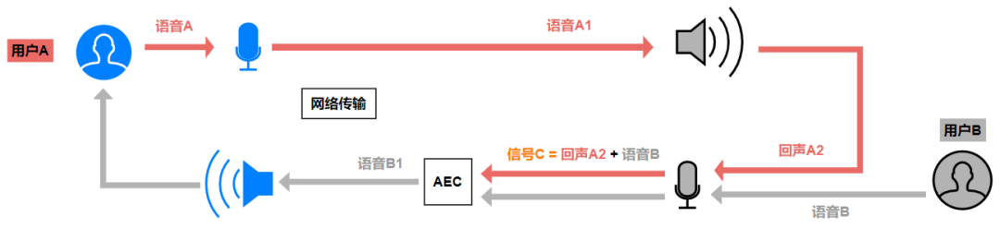
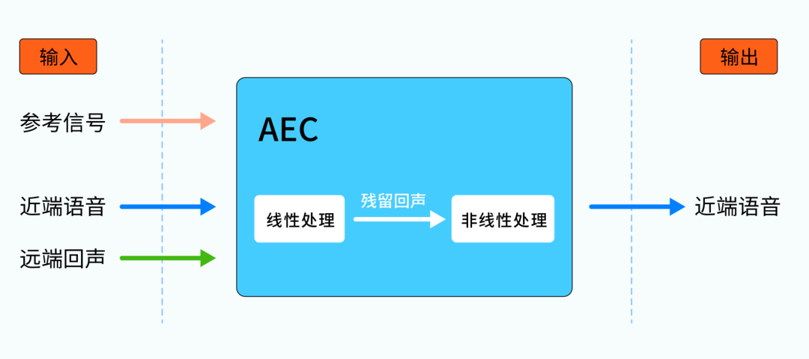
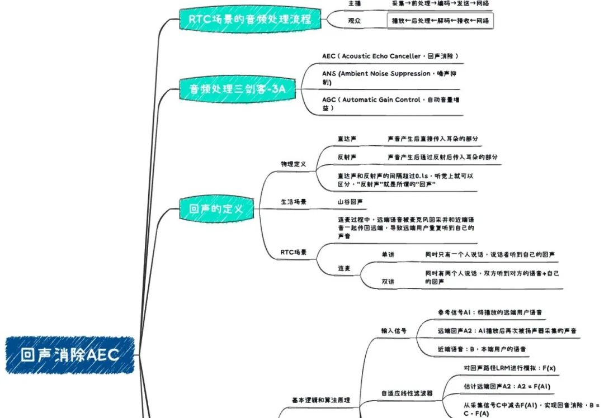
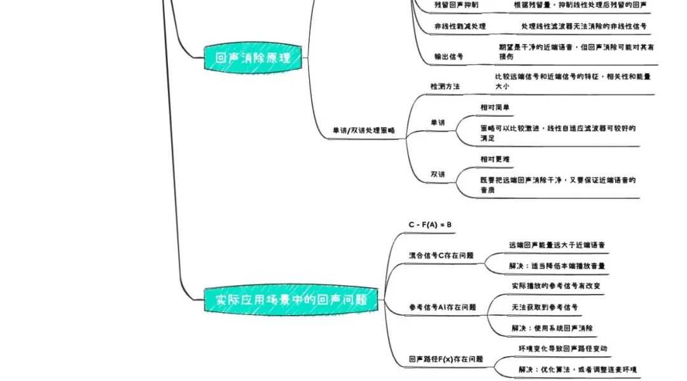

在上一期课程《[音频要素](./001.md)》中，我们从声音三要素、音频模拟信号的数字化和音频数字信号特征等方面，重新认识了“声音”这个老朋友。今天，我们会进一步聊聊这个老朋友在 RTC 世界中的其他故事。

磨刀不误砍柴工，在主题开始之前，我们先来了解一下 RTC 场景中音视频数据的基本处理流程。结合实际的应用场景，可以从主播、观众两个角色来阐述。 

## 音视频数据流转链路

简单来说：主播端需要进行音视频数据的采集和发送，观众端需要进行音视频数据的接收和播放，主播和观众之间通过实时网络进行连接。进一步说：主播端采集到的音视频数据，可能存在噪声、回声等问题，数据量也很大，往往不适合直接用于网络传输；观众端从网络中拉取到的数据，是编码压缩的形式，也无法直接用于播放。为解决这些问题，我们又引入了前/后处理、编/解码等模块，就形成了一个**最基本的、以网络为纽带的“对称”链路**，如下图所示。 

 

需要注意，图中展示的只是“主播→观众”的单向链路，可以称为“单主播”场景。它也可以是双向的，比如我们常说的“连麦”场景：两个用户进行[音视频通话](# "音视频通话")，比如微信电话，此时双方互为主播和观众，数据流就是双向的。 RTC 场景下的音视频数据流转基本遵循上述链路，我们今天主要关注其中的“**前处理**”的模块。

## 音频处理三剑客——3A 处理

音频前处理的功能不少，有一些处理是为了让声音更“好听”，比如：[回声消除](# "回声消除")、噪声抑制等，它们会消除声音信号中的“无关信号”，让声音更“干净”；有一些处理是为了让声音更“好玩”，比如：语音变调、虚拟立体声、混响等，它们让声音具备丰富的特效，让声音更“有趣”。 而在那些让声音更“好听”的前处理中，有号称**音频处理三剑客的 3A 处理** ： 

*   AEC（Acoustic Echo Canceller，回声消除）
*   ANS (Ambient Noise Suppression，噪声抑制)
*   AGC（Automatic Gain Control，自动音量增益）

他们是音频处理过程的常客，我们后续会为大家一一介绍。 这“三剑客”中，噪声抑制和自动音量增益这两位，大家应该从名字上就能大概联想其能力，毕竟噪声和音量是我们耳熟能详的概念。但是“回声消除”这位剑客似乎比较神秘，大家可能比较陌生，仅从名字上看：是要把声音中的回声信号消除掉。 但什么是 RTC 场景的回声呢？为什么语音信号中会存在回声？又为什么需要将它消除掉呢？ 我们马上来揭开它的神秘的面纱！

## 回声产生原因

大家在日常生活中其实都有遇到过回声，想象这么一个场景：如果你对着山峦大声呼喊 “ 你好！”会有什么现象呢？首先，你会立刻听到自己发出的声音 “你好！”，很快还会听到山峦“答复”的声音，也是相同的 “你好！”。这里，山峦的“答复”就是一种回声现象。 

物理学上对回声的简单解释如下：声音由发声体振动产生后，会向四周传播，一些会直接传入人耳（称为直达声），一些会遇到障碍体（如墙壁）被反射后再传入人耳（称为反射声）。 如果耳朵听到直达声和反射声的间隔超过 0.1s，感官上就可以区分出二者，而后者就是所谓的“回声”。

了解了生活中和物理学上的回声，而我们今天的主角：音频前处理 AEC要面对的，RTC 场景中的回声，还有些不太一样。我们结合一个连麦场景来进行说明。 参考下图，用户 A 和用户 B 正在连麦，他们各自有独立的麦克风和扬声器：

从整体上看，用户 A、B 说话的语音，被各自的麦克风采集后，通过网络传输给对方，并通过对方的扬声器播放出来，这里还没有发现什么端倪。而从某一次具体的交互上看，会有如下过程： 

1、某一时刻，用户 A 开始说话，产生的语音 A 被麦克风 A 采集、并通过网络传输给用户 B，成为待播放的语音 A1； 

2、语音 A1 被扬声器 B 播放后，通过直射、周围环境反射等方式，最终又被麦克风 B 采集为语音 A2（图中的回声 A2）； 

3、被回采的语音 A2，会通过网络再传输给用户 A，并通过扬声器 A 播放出来。 

经过上述过程，用户 A 会发现：自己刚说完一句话，过一会儿居然又听到了自己的“复述”，这就是 RTC 场景下的“回声”现象。回声 A2 中主要包括直接回声（A1 由扬声器播放后，未经任何反射直接进入麦克风的声音）和间接回声（A1由扬声器播放后，经过环境的一次或多次反射后进入麦克风的声音）等。_（注：此处仅讨论声学回声，因设备线路异常产生的线路回声暂不涉及）_ 

上面过程描述的是连麦“单讲”场景（同时间只有一人说话），如果用户 A、B 同时说话（双讲场景），那么回声 A2 将和用户 B 的语音 B 混在一起传给用户 A，会严重干扰用户 A 的收听。同理，用户 B 也会遇到相同的问题，听到自己的回声。 

可以想象，这种情况如果不加以处理，连麦双方都会反反复复地听到自己的回声、无法听清对方的语音，体验会非常差。**无论是在日常的语音电话、还是游戏开黑、KTV合唱等场景，回声问题都是开发者必须关注和解决的“大难题”**，而致力于解决这个大难题的，就是我们三剑客之一 ，回声消除 AEC。接下来，我们就来领略这位“剑客”的绝技。

## 回声消除原理

### 1 回声消除的基本逻辑 

参考之前的分析过程，用户 A 在连麦时听到的回声，是用户 B 的麦克风回采了用户 A 的语音导致。用户 A 是“无辜的受害者”，要解决这个问题，需要从始作俑者用户 B 侧着手，如下图：

图中，语音 A1 会通过扬声器播放，属于已知信号，我们称之为参考信号。回声 A2 和语音 B，我们根据其产生方式分别称为远端回声信号和近端语音信号，二者被麦克风采集为混合信号 C（C = A2 + B）。混合信号 C 是可获知，但其中的 A2 、 B 就像盐和白糖都溶解在一杯水中，很难进行区分。 

综上，如果能够从信号 C 中将远端回声 A2 减去，就只剩下了“干净“的近端语音 B（B1 = C – A2 ），这就是图中 AEC 模块 的工作。乍一看，这个过程貌似很简单？A2 既然是已知的参考信号 A1 的回声，二者从听感上应该差不多，那索性用 A1 代替 A2，直接从信号 C 中减去 A1 不就大功告成了吗？可惜，理想很美好，现实却很残酷。 

从参考信号 A1 被播放、到回声 A2 被采集之间，经过了扬声器 → 环境 → 麦克风的传播路径（LRM，Loudspeaker-Room-Microphone)，环境是实时多变的，LRM 路径也如此，这种不确定因素使两个信号在数字处理层面有很大差别。如果直接从信号 C 中减去参考信号 A1，得到的结果会有大量残留、和语音 B 也相差甚远。 

无法直接使用 A1 代替，A2 又不可能凭空臆想出来，我们难道就无能为力了吗？当然不是，语音 A1 和回声 A2 就像一对外表相似、个性有别的双胞胎，它们之间仍有不可忽视的相关性。利用这些相关性，我们就有了间接的求解途径： 

将 LRM 路径通过数学方式进行模拟，求解为函数 F(x)，则有 A2 = F(A1)。从混合信号 C 中减去 F(A1)，也能实现回声消除目的。而这，就是回声消除算法的关键工作，其基本逻辑是：通过估计回声路径的特征参数，对该路径进行模拟。利用模拟得到的路径函数 F(x) 和参考信号 A1，计算出回声信号 A2，最后从采集信号 C 中减去 A2，实现回音消除。也即： 

理想结果：C – A2 = B

实际结果：C – F(A1) = B1

二者差异：B – B1 = F(A1) – A2 

如果我们能对回声路径进行精确的求解，则 F(A1) = A2 ，B1=B，也就实现了完美的回声消除。但是，在实际应用中要实现 “F(A1) = A2” 是非常困难的，我们不仅需要面对复杂的外部反射环境，还要考虑采集、播放设备可能引入的异常。 

设计一个优秀的回声消除算法是项大工程，毕竟这是剑客 AEC 的核心秘籍，需要一定的数学知识、信号处理知识、以及大量的实践才能修炼。作为一个应用开发者，我们可以先不深究算法的具体细节，但有必要了解其基本原理，这有助于我们解决实际应用场景下的回声问题。

### 2 回声消除算法的基本原理

参考前面的讨论，回声消除的输入信号主要包括：参考信号（参考前述的语音A1），远端回声信号（参考前述的回声 A2）和近端语音信号（参考前述的语音B），期望的输出信号是干净的近端语音。环境中的回声路径 LRM 未知，我们通常需要一个线性滤波器来进行模拟。又因为 LRM 是动态的、时变的，一个固定参数的滤波器无法满足需求，所以我们还需要它能做到“自适应”，能够根据自身状态和环境变化动态调整各项参数。 

总而言之，我们**需要一个“自适应线性滤波器”完成对回声路径 F(x) 的求解**，它能在复杂多变的环境中根据参考信号 A1 估计出回声信号 A2，利用二者的相关性，在信号 C 中尽可能地将回声消除掉。 经过自适应线性滤波器的处理，已经一定程度上“提纯”了近端语音 B，但当中往往还残留着部分回声，我们需要根据残留量进行残留回声处理，再进行一轮消除。这里的残留量，指的是通过分析残留回声与远端参考信号的相关性，相关性越大，说明残留越多，反之说明残留越少。 

最后，可能还会存在少部分顽固分子，比如扬声器、麦克风等设备失真引入的非线性信号，这些非线性信号是线性滤波器无法消除的，还需要对它们做非线性剪切处理。 

综上，**线性自适应滤波 + 残留回声抑制 + 非线性剪切处理**，这才完成了一次比较完整的回声消除。

### 3 单讲/双讲场景下的回声消除策略

前面我们提到，连麦场景根据同时刻说话的人数，有单讲和双讲的区分。两种场景下，回声消除的输入信号不同，处理策略也有所区别。

首先，我们可以通过比较远端信号和近端信号的特征，比如峰值相关性、频域相关性、幅值相似性，来判断是否是为双讲状态（如果各信号的能量都很高、相关性又很低，就可能为双讲场景）。 

如果是单讲场景，由于只有远端用户 A 说话，用户 B 麦克风采集的语音信号只包含远端回声，不包含近端语音。这种情况下的回声消除相对容易，我们甚至可以用比较激进的策略，比如直接干掉所有语音信号，再适当地填充舒适噪音来优化听感。此时，线性自适应滤波器就可以达到比较好的回声消除效果，降低了后续的残留回声抑制、非线性剪切处理的工作量。 

如果是双讲场景，由于远端、近端用户同时在说话，麦克风采集的信号包含远端回声和近端语音，二者混合导致处理难度加大：既要把远端回声消除干净，又要保证近端语音的音质。如果远端回声较近端语音的能量更高（比如高出 6~8dB ），消除过程就很难避免对近端语音的损伤。此时，可能就要适当降低自适应滤波器的消除力度，对后续残留回声抑制、非线性剪切处理的策略也要相应调整。 

回声消除技术一直是各大音视频厂商的尖端领域，而对残留回声的处理效果，对近端语言音质的保护程度，代表了一个回声消除算法的水平。 

## 实际应用场景中的回声问题

通过前面的内容，我们已经比较系统的了解了：RTC 场景下的回声定义以及回声消除 AEC 的基本原理。接下来，我们看看如何利用这些知识，协助定位、解决实际应用场景下的回声问题。 

首先，我们要明确一点：如果两个用户在连麦过程中，某一方听到了“自己的回声”，那么大概率是“对方的回声消除“没有做好。而其他“小概率”的情况：比如用户使用了耳返功能、比如耳机线路故障产生了线路回声、比如用户使用声卡重复播放了采集音频、比如业务上有 bug、用户将自己发送的语音再次请求回来了等等。虽然最终现象都是用户重复听到自己的声音，但这些并不是常规意义上的回声问题，也不是回声消除 AEC 可以解决的，需要从设备调优、使用方式、业务逻辑上进行规避。 

排除了非常规的“回声”问题后，其余的“大概率”问题，一般可以参考 C – F(A1) = B1 这个公式来分析。我们来一一列举下： 

 

我们继续结合上图来阐述： 

### 1 信号 C 的问题

信号 C 是麦克风采集的、待进行回声消除的混合信号，其中包含了近端语音和远端回声。如果C 中的远端回声能量远大于近端语音，比如说扬声器离麦克风太近、扬声器输出音量太大把近端语音掩蔽掉了，在这种情况下进行回声消除必定是杀敌一千、自损八百。此时，建议适当调低本地播放的音量。

### 2 采样信号 A1 的问题

信号 A1 是回声消除使用的参考信号，回声消除算法将基于该参考信号来估计回声（ F(A1) ），所以 A1 的准确性会直接影响回声消除的效果。实际播放的声音信号和参考信号之间的差异越大，越难进行模拟估计。理想情况下，我们期望参考信号 A1 = 扬声器即将播放的信号，但如果出现以下情况： 

A、实际播放的信号有改变：比如输出设备对 A1 进行了音效处理，导致实际播放的信号和参考信号间存在天壤之别，基于错误信号计算出的 F(A1) ，自然无法实现良好的回声处理； 

B、无法获取到参考信号 A1：这种情况，一般是因为回声消除的执行者不是信号 A1 的生产者。比如：应用 a 使用自研算法做回声消除，但是扬声器播放的信号中包含了应用 b 产生的音频（比如某个音乐软件正在后台播放），由于应用 a 不是该音频的生产者、也没有系统级别的权限，所以无法获知该音频作为参考信号，所谓“巧妇难为无米之炊”，其他处理也就谈不上了； 

信号 A1 异变或缺失导致的回声问题，难以在算法上解决，除了关闭音效处理、避免第三方音频播放之外，只能寄希望于系统硬件的前处理模块。因为系统模块拥有最高权限，可以获取系统扬声器播放的最终、最完整的信号，这也是系统前处理相较于应用级别前处理的天然优势。 

### 3 回声路径 F(x) 的问题 

如果我们能拿到正确的参考信号，混合信号 C 中远端回声和近端语音的能量比也合理，却还存在回声消除不理想的情况，那可能就是回声路径的模拟出现了异常。如果排除回声消除算法本身的问题，可能是由播放、采集的环境存在频繁异变导致（包括硬件/自然环境），比如音频设备在不停移动、被遮盖，比如用户从空旷的房间突然进入了嘈杂的走廊，都会导致 LRM 路径变化，滤波器还未来得及适应和收敛（甚至无法收敛），就会出现回声。这种情况，一方面需要进一步优化回声消除算法、提高自适应、收敛的速度，一方面还是得改善连麦环境，尽可能保证其稳定。 

最后，再补充一个可以解决大多数常规回声问题的绝招：戴上耳机。 

因为戴上耳机后，远端音频的播放都集中在人耳，基本不会再向外传播，也就不会再被麦克风回采，自然也不需要进行回声消除。并且，在一些对音质要求极高、实时性要求极高的场景，比如多人实时 KTV 合唱场景，为了避免回声消除对音质的损伤和处理过程引入的耗时，也建议用户戴耳机上麦，并关闭回声消除。 

## 总结

当然，RTC 场景中的导致回声问题的因素、解决回声问题的方法还有很多，大家不必生搬硬套，而应该在理解回声消除原理的前提下，用理论指导实践，并从实践中积累经验、不断完善我们的知识体系。 正如前面所说的，回声消除技术一直是各大 RTC 厂商的尖端领域之一，它还有更复杂、更深奥，当然也更有趣的内容等待大家的探索。我们今天仅仅是在基本原理和简单应用上进行了初探，虽然还远不足以让你设计出一个优秀的回声消除算法，但希望可以帮助你迈出应用实践的第一步。 

下面，我们再通过一个本期课程的**思维导图**，梳理一下整篇文章的内容： 

## 思考题

### 上期思考题揭秘

问：

理论上，参考奈奎斯特采样定理，40KHz采样率就能覆盖人耳听力范围的声音，为什么我们还需要44.1KHz呢？

答：

人说话声音频率一般在300-700Hz之间，最大区间一般为60Hz-2000Hz，根据奈奎斯特定理，8KHz采样率就足够。而人耳可识别的声音频率范围为 20Hz ~ 20KHz，根据奈奎斯特定理，理论上采样率为40KHz（20KHz\*2）便可以保留/还原这些信号。但是40KHz毕竟是理论值，实际应用中我们还需考虑以下问题：

为避免混叠失真（Anti-Aliasing），实际采样前必须对模拟信号进行低通滤波处理（滤除模拟信号中高于奈奎斯特频率的信号）。而抗混叠所使用的低通滤波器并非理想模型，无法实现理想的衰减特性，会存在一个衰减过渡带（Transition Band）。为了确保低通滤波在奈奎斯特频率处有充分的衰减，必须在奈奎斯特频率前留出一部分频带作为过渡带。

早期的磁带录制为兼容PAL和NTSC两种制式，采样率方面需要同时满足PAL和NTSC的规格，44.1KHz是一个计算得到的可用配置。

综合上面两个考虑，最早的无损采样率标准被定为44.1KHz，并沿用至今。

### 本期思考题

使用移动设备时，在系统回声消除和应用级别回声消除的选择上，应该考虑哪些因素？

（我们下期揭秘）
