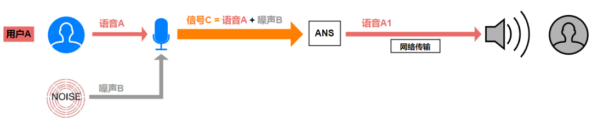
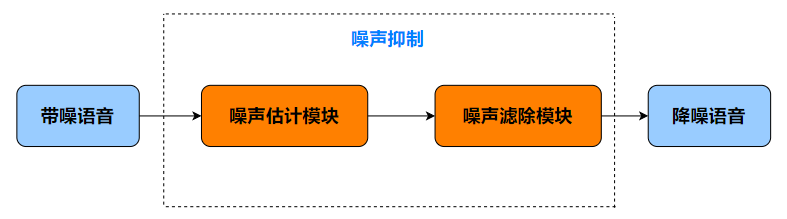
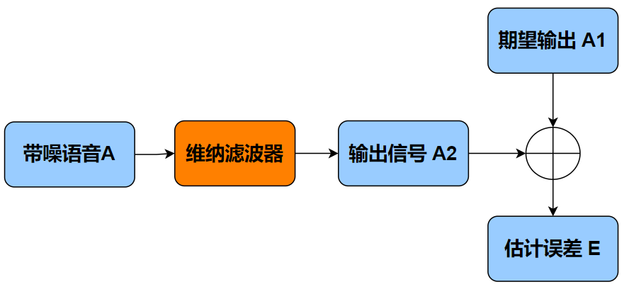
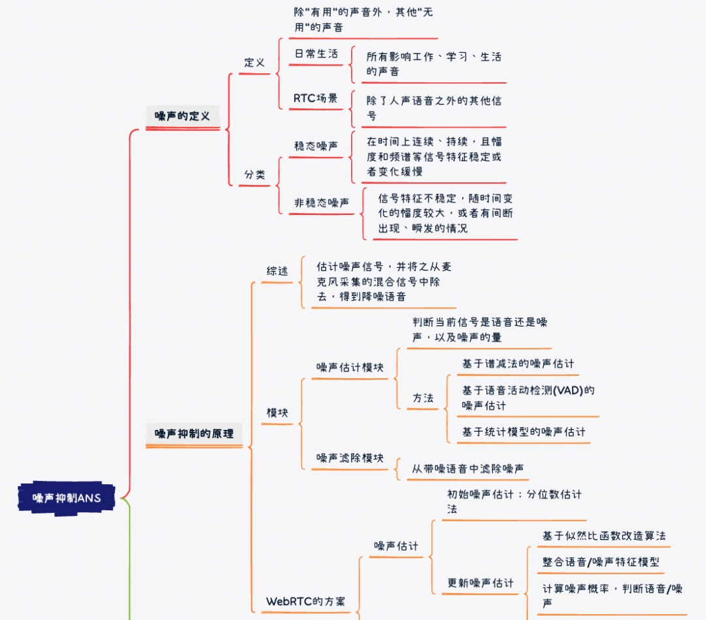
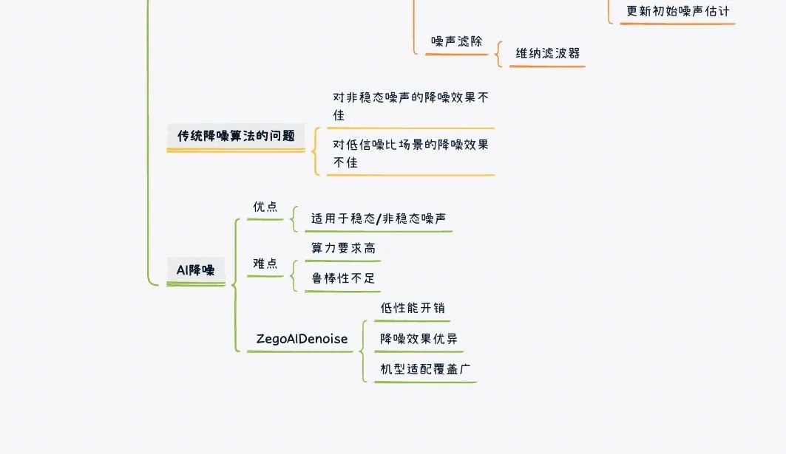

在上一期课程《[第二讲：回声消除](./002.md)》中，我们接触了音频前处理的概念，还认识了音频前处理的三剑客之一 AEC 回声消除。今天，我们继续来认识三剑客中的第二位：[噪声抑制](#) ANS (Ambient Noise Suppression)。

经常被卷入在线会议的你，想必也曾抱怨过：“太嘈杂了，什么都听不清”、“周围比较吵闹，需要换个安静的地方”。这里导致“嘈杂”和“吵闹”的罪魁祸首，就是无所不在的噪声。噪声问题和回声问题一样，严重影响音视频场景下的用户体验，是所有开发者绕不开的槛。想要解决这个问题，“换个安静的地方”固然有效，但未免太原始且不够优雅，我们需要剑客“噪声抑制”的帮助。

## 什么是 RTC 场景下的噪声

剑客“噪声抑制”，顾名思义是来帮助我们解决RTC场景的噪声问题的，想要好好认识它，第一步，就是要了解什么是噪声？

相较于回声，噪声在我们日常生活中更常见，比如办公室空调电机的低吼、隔壁装修电钻的轰鸣、机场飞机起降的呼啸、市场商贩的叫卖等等，可以说所有影响了我们正常的工作、学习、休息的声音都是噪声。所以噪声的定义没有那么严格，实际上除了“有用”的声音外，其他所有“无用”的声音都可以算是噪声，只不过不同的场景对于“有用”和“无用”的定义不同。

在 RTC 场景下，最基本的需求是保证语音沟通的质量，所以“有用”的声音一般指人说话的语音，而除了人声语音之外的其他信号，就可以算作“无用”的噪声。这些“无用”的噪声，根据它们随时间变化的特性，又可以分为两类：稳态噪声和非稳态噪声。

**稳态噪声**，关键在稳。指的是那些在时间上连续、持续，且幅度和频谱等信号特征稳定或者变化缓慢的噪声。比如空调声、风扇声等，听起来是持续、平稳的“嗡嗡嗡”。

**非稳态噪声**是相对于稳态噪声而言的，它的信号特征不稳定，随时间变化的幅度较大，或者有间断出现、瞬发的情况。比如菜市场里嘈杂的人声、键盘的敲击声、关门声、烟花炮竹声等等，它们或是持续存在但变化不停，或是瞬发的、短暂存在后就消失。

稳态噪声相较于非稳态噪声，在抑制难度上更低，抑制方案也更成熟。而非稳态噪声则是音视频开发者的大难题，对非稳态噪声的抑制效果，是检验剑客能力重要指标。

需要强调的是，我们今天讨论的噪声，**无论是稳态还是非稳态，都是相对于“有用的声音”（人声）的加性噪声**。加性噪声和人声不相关，人声的存在与否不影响加性噪声的存在性，它们的混合信号可以通过相加得到。

注：那些因人声的存在才存在、通过“有用的人声”变化而来的噪声，比如房间混响，它们与人声满足“乘性关系”，不在今天的讨论范围内。

## **噪声抑制原理解析**

已经认识了什么是RTC场景下的噪声，以及它的简单分类，接下来我们牵手“噪声抑制”，“真枪实弹”地处理它。第一步，要了解噪声抑制的基本原理。

### 1 噪声抑制原理的简单理解   

回想一下，我们在上一篇课程中学习的，回声消除的关键工作：使用待扬声器播放的远端参考信号，估计出回声信号，在麦克风采集的混合信号中将回声信号减去，保留近端语音。这一过程，只需要稍作调整就可以对应到噪声抑制上：**估计出噪声信号，并将之从麦克风采集的混合信号中除去，得到降噪语音信号**。如上图所示，稳态或非稳态的“加性噪声” B，和“有用信号”语音 A 相加，形成了混合的带噪语音 C1，经过 ANS 模块的处理后，最终输出降噪语音 A1。

即：

C = A + B

A1 = C – B1

虽然核心工作也就短短一句话，但其中玄机不少。传统 ANS 算法的核心工作可以拆解为两个模块：**噪声估计模块 + 噪声滤除模块**。

### 2 噪声估计模块

噪声估计模块的主要工作是：判断当前信号是语音还是噪声，以及噪声的量。相较于回声估计，噪声估计的差异在于：噪声并非由远端参考信号变化得到（加性噪声），而有其独立的发声源，无法像回声一样利用其和远端参考信号的相关性来估计，大多数情况下，我们的原材料是有混合带噪语音 C。噪声估计的准确性是至关重要的，但要从混合信号中，估计出其一部分，听起来似乎有些难为人？好在方法总比困难多，凡事都有两面性，既然无法利用“相关性”进行估计，不如试试从“不相关性”下手。

我们先看看下面两种噪声估计的方式：

*   **基于谱减法的噪声估计**

基于谱减法的噪声估计，一般会认为带噪语音的前几帧不包含语音活动，是纯净的噪声信号，因此，可以取这前几帧的平均信号谱（幅度谱或能量谱）作为噪声谱的估计。

*   **基于语音活动检测(VAD)的噪声估计**

基于语言活动检测的噪声估计，会对混合信号 C 进行逐帧检测，如果某音频帧经VAD检测没有语音，则认为是噪声、并更新噪声谱，否则就沿用上一帧的噪声谱。

上面两种方法，往往都需要比较纯净的噪声段，并希望噪声尽可能的稳定，这对于待处理信号的要求就比较高，对于复杂多变的实际应用场景来说就显得尤其苛刻了。

*   **基于统计模型的噪声估计**

在 RTC 场景下，通常会采用另一种方案：**基于统计模型的噪声估计**。

基于统计模型的噪声估计，一般需要语音信号和噪声信号是统计独立的（不相关），并服从特定的分布，以将问题归入到统计学的估计框架中。开源 WebRTC 的降噪模块，也使用了基于统计模型的估计方式。我们不妨通过学习 WebRTC 的降噪模块的估计方案，来帮助了解。WebRTC的噪声估计过程如下：

*   **首先，进行初始噪声估计**：使用分位数噪声估计法。基于一个共识，即使是语音段，输入信号在某些频带分量上也可能没有信号能量，可以对某个频带上所有语音帧的能量进行统计，设定一个分位数值，能量低于分位数值的认为是噪声，反之则认为是语音。这种方式，相比于 VAD 的逐帧判断，进一步细化了噪声统计的粒度，即使是语音帧也能提取到有效的噪声信息。

*   **然后，更新初始噪声估计**：初始噪声估计的结果是不够准确的，但可以作为初始条件应用于噪声更新/估计的后续流程 – 基于似然比函数改造的噪声估计：将多个语音/噪声分类特征合并到一个模型中，结合模型以及初始噪声估计的先验/后验信噪比，对输入的每帧频谱进行分析，计算某一帧是音频/噪声的概率来判断是否为噪声，进一步更新初始噪声估计。

*   更新后的噪声估计会比初始估计更准确，更新后需要重新计算一下先验/后验信噪比，再用于后续的噪声滤除模块

综上，就是WebRTC使用的一些噪声估计方案，我们从噪声估计模块得到了比较准确的噪声信息，接下来就是 ANS 的另一个关键步骤：噪声滤除模块。

### 3 噪声滤除模块 

噪声滤除的方式也有多种，比如前面提到的谱减法，使用带噪语音的信号谱减去估计的噪声谱，就得到了估计的干净信号谱。但我们说过，这种方式不适用于复杂多变的 RTC 场景，所以干脆一步到位，直接来了解 WebRTC 使用的噪声滤除手段：基于维纳滤波器的噪声滤除。

什么是维纳滤波器呢？

如下图所示：将带噪语音 A 输入一个噪声滤波器，如果期望的输出信号为 A1，实际的输出信号为 A2，通过计算得到 A1 和 A2 的估计误差 E。我们希望 A2 尽可能的逼近 A1，那么估计误差 E 就应该尽可能小，而能实现这个目标的最优滤波器就是维纳滤波器。

维纳滤波器是一种线性滤波器，其数学表达式的推导需要用到语音信号的先验/后验信噪比，如此一来，前面噪声估计模块的输出信息就有了用武之地。通过这些信息，我们就可以将 WebRTC 的噪声估计模块、噪声滤除模块衔接起来了。

现在将两个模块结合起来，总结一下其核心逻辑：

*   首先利用分位数噪声估计法得到噪声的初始估计，并基于该估计计算后验/先验信噪比；

*   接着，利用基于似然比函数的改造算法、以及整合了语音/噪声分类特征的模型，分析每帧频谱得到每帧语音/噪声的概率，利用概率判断噪声、进一步更新更准确的噪声估计；

*   基于更准确的噪声估计重新算后验/先验信噪比、推演出维纳滤波表达式；

*   最后，使用维纳滤波完成降噪，得到降噪语音。

## WebRTC 降噪模块存在的一些问题

以上内容，我们通过学习 WebRTC 的一种降噪方案，大致了解了噪声抑制的基本原理。基于对这些原理的了解，我们可以进一步讨论WebRTC 降噪模块存在的一些问题：

### 1 对非稳态噪声的降噪效果不佳

*   如果噪声的统计特性不稳定，那么基于统计模型的噪声估计效果会大打折扣，也会影响降噪效果
*   因为只有在概率足以判断当前音频帧为噪声时，算法才会更新初始噪声估计。如果噪声经常改变，而且在语音段有变化（比如有人说话的时候），可能就无法被判定出来，影响抑制效果

### 2 对低信噪比场景的降噪效果不佳

在大噪声/低语音能量的场景下，由于信噪比很低，对语音/噪声的概率判断成功率会下降，可能导致噪声抑制不干净，甚至可能错误抑制了语音造成语音损伤

大家在实际应用中，如果使用了WebRTC降噪、或者基于WebRTC降噪改良的降噪方案，遇到噪声抑制效果差的问题时，也可以参考上面两点进行初步分析。

## AI 降噪—弥补传统算法的不足

对于非稳态噪声、低信噪比等复杂场景的降噪效果不佳，其实是传统降噪算法的通病，也是对各大 RTC 厂商的技术挑战。如何弥补传统算法的不足呢？AI，可能是一个正确的答案。

随着深度学习的广泛应用，业界涌现了大量基于神经网络的音频降噪算法，这些算法在降噪效果、泛化能力上都有比较好的表现，但也存在一些无法忽略的问题。比如一些算法的算力要求比较高，很难应用到实际的用户设备上，尤其是一些低端设备来说，将 AI 算法跑起来简直是奢望。即使是在高端设备上，如何合理地分配算力资源避免性能浪费也是个难题。另外，AI 算法在不同场景、尤其是在 Training Data 未涉及的场景下，其降噪效果可能无法保证鲁棒性。

## 总结

至此，以 WebRTC 的降噪模块为媒介，我们关于剑客 ANS 的了解就告一段落了。由于在讲述过程中，我们尽可能剥离了复杂的数学演算过程，仅对核心逻辑进行梳理和总结，对于实际做底层算法研究的开发者来说，很多地方可能略显浅显或不甚严谨，如果你有兴趣，可以尝试研究开源的 WebRTC 源码做进一步学习。对于没有接触过音频降噪算法的应用开发者，希望大家对平时调用几个 SDK API 就能开启的音频降噪功能，能有进一步的认识，帮助你更好的理解和解决应用开发中的问题。

下面，我们再通过一个思维导图，梳理一下整篇文章的内容：

## 思考题

### 上期思考题揭秘

问

使用移动设备时，在系统回声消除和应用级别 回声消除的选择上，应该考虑哪些因素？

答

1、对于回声消除效果要求较高，并且对音质不怎么敏感的场景，可以使用系统回声消除；

2、对于参考信号包含第三音频、并且需要将此音频消除掉的场景，需要使用系统回声消除；

3、对于音质要求较高的的场景，建议使用应用级别的回声消除（前提是应用层面有比较优秀的回声消除算法）；

4、iOS 设备上由于苹果对于软硬件系统的高度定制，系统回声消除的效果可以得到保证；Android 系统上，由于不同厂商的能力不同、软硬件规格不同，系统回声消除的效果参差不齐、甚至可能没有系统回声消除，建议是增加应用级别的回声消除作为保底措施。

### 本期思考题

噪声抑制可能会损伤“有用信号”，这一现象在音乐场景尤为明显，原因是什么呢？

（我们下期揭秘）
