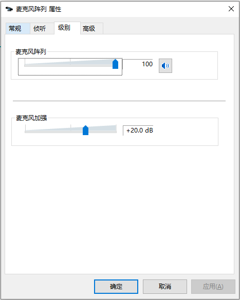
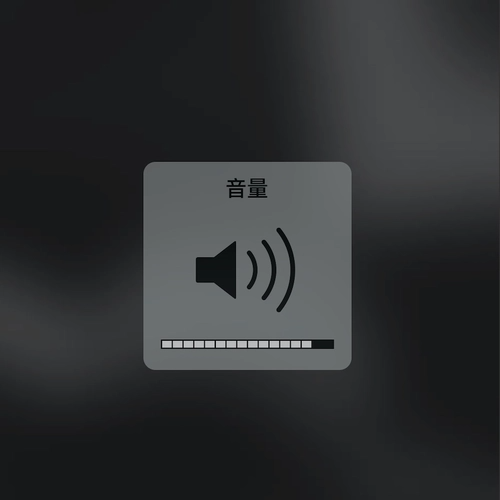
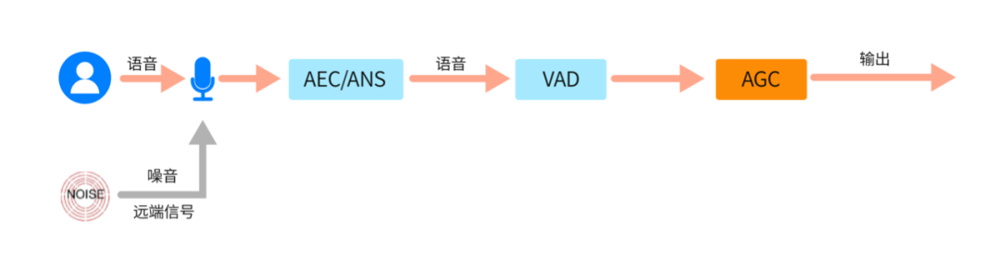
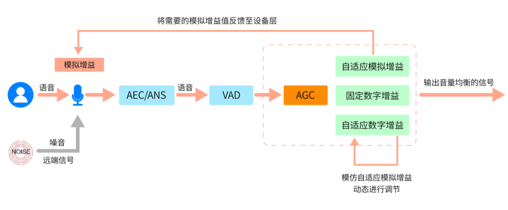
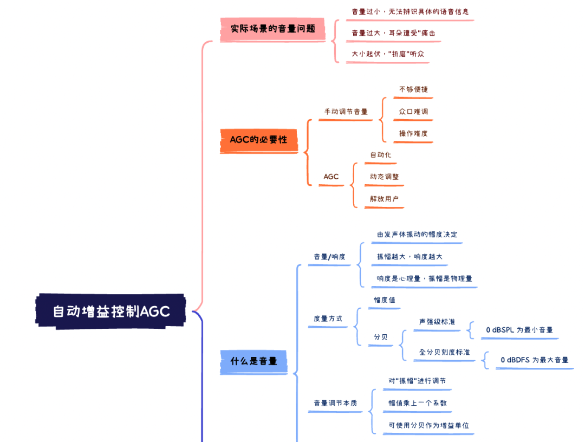
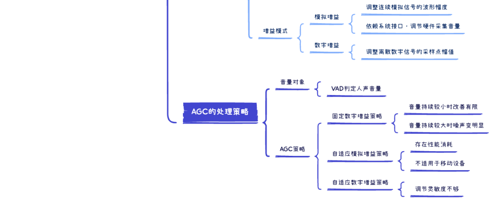

在之前的文章中，我们已经接触了两个重要的音频前处理模块 – 回声消除 AEC 和噪声抑制 ANS，它们分别解决了 RTC 场景下的回声、噪声问题，极大提升了用户的体验。至此，音频前处理三剑客中，就只剩下一位 – **音频自动增益控制 [AGC](#)**（Automatic Gain Control）还没有介绍，今天我们就来认识一下它。

## 实际场景的音量问题和AGC的必要性

相较于回声和噪声，音量相关的问题似乎不怎么“严重”，如果排除播放端误操作的因素，实际场景中还会有哪些音量问题？什么情况下我们会有“需要调整音量”的想法呢？

**情况一：音量太小，我们无法辨识具体的语音信息**，甚至需要贴着扬声器、皱着眉头“聆听”。原因可能是讲话者距离麦克风过远，也可能是麦克风的采集音量就比较小；

**情况二：音量太大，我们的耳朵遭受“痛击”**，不得不对扬声器“敬而远之”。原因可能是讲话者距离麦克风过近、可能其说话本身就比较“用力”。

**情况三：音量忽大忽小，一段语音里可能同时存在前述两个问题**，音量起起伏伏、若即若离，对听众来说无疑也是一种”折磨”。

对于这些音量问题，除了让讲话者调整与麦克风的距离、自身说话的声音大小外，我们熟知且习惯的解决办法是：在采集端，调节麦克风的采集增益；在播放端，调节播放软件的音量条、或者设备扬声器的播放增益。

这些手动的操作，其实都还算得上立竿见影。这么一看，既然动动手就可以自行解决，音量问题貌似的确不是什么大问题，为什么还需要自动增益控制呢？

我们需要意识到，“动动手”这种被动的音量调节方式，虽然有一定效果，但“不够便捷”，也“众口难调”。实际场景中，环境复杂多变：说话者不同则声音的原始音量有差异，说话者距离麦克风远近不同则声音传播的衰减有差异，麦克风设备不同则采集的增益有差异。

这些差异，使得一次“手动调节”很难适应采集环境的动态变化，如果场景中存在多个用户使用同一个麦克风的情况，更难一一兼顾。对于不熟悉设备系统的用户来说，如何调节设备采集增益、调节到多少合适或许都是“不可能完成的任务”（你知道如何调节PC端的麦克风增益吗？）。如果只依赖于手动调节，尤其是频繁的手动调节，势必会给用户带来负担，影响体验，对于产品设计来说也不够“优雅”。

此时，一个智能的音量调节机制的必要性就体现出来了。

**AGC 针对上述情况，会自动调节采集端的音量“增益补偿”**。简单来说，如果讲话者的声音过大， AGC 会自动降低增益；反之，会自动提高增益，以确保音量维持在一个比较稳定的水平。这个过程，用户无需频繁操作设备，就能避免声音起伏导致的不良体验，可以专注于 RTC 的音视频交互。

了解了常见的音量问题，以及 AGC 在解决这些问题上的优势，大家应该能领会到 AGC 存在的合理性和必要性，是时候再进一步了解下其中的技术点了。所谓“音量自动增益控制”，想要做具体了解，我们不妨把它拆解一下，逐个击破：

*   什么是“音量”？
*   音量“增益”的本质是什么？
*   AGC进行音量增益“自动控制”的策略是什么？

我们接下来就一一解答这些问题。

## 什么是音量

在探讨 ANS、AEC 的文章中，我们都会先理清相应模块的处理对象，比如噪声是什么、回声是什么。所谓知己知彼，AGC 也不例外，我们需要先知道：究竟什么是音量？

其实，在系列文章的第一讲 – 音频要素中，我们就接触了音量的概念，只不过使用的是另外一个名称：响度。

我们回忆一下响度的定义：“响亮、微弱，是对声音强弱的感觉描述，这种特征被称为响度。响度由发声体振动的幅度决定，当传播的距离相同时，振动幅度越大、则响度越大；相反，当振幅一定时，传播距离越远，响度越小，就是我们常说的“距离太远了，听不见”的原因。“音量、响度”描述的是声音的同一属性，从定义上来看，它们是人耳对声音强弱的“感受”，主要由声音振动的“幅度”决定。感受是一种“心理量”，无法被具体量化；而振幅是“物理量”，在音频采样位深为 16bit 时，其幅度取值为 \[-32768,32767\]，范围非常大，不便于检测和计算（关于采样位深和幅度的概念，可参考系列文章的第一讲–[音频要素–声音的采集与量化](./001.md)）。

为了简化表示，我们又引入其他计量标准来表示音量，常见的有“声压级”标准和“全分贝刻度”标准，二者使用的单位均为分贝（dB）。

分贝是一个对数单位, 用于表示两个相同单位物理量的比，所以它需要参考一个基准量来进行计算，基准量不同，得到的数值体系也不同：

*   **声压级（SPL，Sound Pressure Levels）**：单位为 dBSPL。使用声压作为基准量，其基准值为 20 μPa （声音在空气中振动会引起大气压强的变化，也即“声压“，单位为 Pa 。20 μPa 是人耳在频率1KHz下能感知的最小声音，相当于三米外一只蚊子的声音）。我们把声压为 20 μPa 的音量记为 0 dBSPL，音量越大，声压级分贝越大。我们正常谈话聊天的声压级音量约为 40 ~ 60 dBSPL，如果音量达到 90dBSPL 以上会损伤听力，190 dBSPL 以上甚至会危及生命。常见的噪声等级划分，就使用了声压级参考系。
*   **全分贝刻度（DFS，Decibels Full Scale）**：单位为dBFS。使用音频采样点的幅度值作为基准量。和声压级不同，全分贝刻度的基准值不是最小值，而是最大值。比如，对于采样位深为16bit的音频，音频采样点的最大振幅为32768，此时音量最大。我们取振幅 32768 作为基准量，对应全分贝刻度 0 dBFS，0 dBFS 也即全分贝刻度标准下的最大音量，除了最大音量外都是负值，16bit下的最小值为 -96 dBFS。数字设备、数字音频处理均使用全分贝刻度作为音量单位，AGC 处理也是如此。

通过上面的描述，大家对于“什么是音量？”，应该有了初步的认知，有兴趣的同学，还可以具体去了解不同音量标准的对数计算公式，有助于大家进一步理解“分贝”的概念。

接下来，我们继续“音量自动增益控制“ 概念逐个击破的第二部分：音量“增益”的本质。

## 音量“增益”的本质是什么

“增益”指的是放大一定倍数，音量“增益”简而言之就是将音量放大一定倍数。

我们已经知道，决定音量大小的物理量为“振幅”，如果能对“振幅”进行调节，其实也就调节了音量。所以，“将音量放大一定倍数”实际上是“将音频采样点的幅值放大一定倍数”，实现上就是将音频采样点的幅值乘上一个系数，系数小于 1，就是缩小幅值，大于 1 就是放大幅值。

需要注意的是，幅值的放大倍数和人耳的听觉感受并不统一，更不成线性关系。也就是说，幅值放大一倍，人耳的听感并没有相应的也放大一倍。针对这种涉及两个物理量比值的非线性关系，我们仍可以借助分贝来处理。

音频采样位深 16bit 下，振幅为 A1 的音频相对于振幅为 A2 的音频，其音量的增益为 ：dB = 20 \* log10（A1/A2）。

*   假设采样点幅值放大为2倍（A1/A2 = 2），则该声音被增益了 20\*log10(2) ≈ 6dB
*   假设采样点幅值不变（A1/A2 = 1），则该声音被增益了 20\*log10(1) = 0dB
*   假设采样点幅值缩小为1/2（A1/A2 = 1/2），则该声音增益了 20\*log10(1/2) ≈ -6dB

若增益为正数，表示对音量做放大处理；反之增益为负数时，表示对音量做缩小处理；增益为 0dB 表示使用原始的音量（大家需要注意，虽然都是 0dB，但不要混淆 音量大小 和 音量增益）。使用 dB 来进行增益计算，就和使用全分贝刻度作为音量大小单位联系起来了。

基于对音量增益本质的了解，我们进一步了解一下**常见的音量增益途径**：模拟增益和数字增益。两种增益途径的具体细节就不做展开，结合已知的基础知识，大家只需要简单了解如下：

*   **模拟增益**：调整连续模拟信号的波形幅度，一般依赖于设备系统接口，控制设备硬件的采集增益，调节系统采集音量

*   **数字增益**：调整离散数字信号的采样点幅值，不依赖于设备系统接口，不调节系统采集音量

一般来说，Windows 和 Mac 端普遍支持模拟增益调节，这些平台往往会采用模拟增益 + 数字增益结合的策略调节音量。其中 Windows 端因采集声卡种类繁多，有些声卡的采集音量极小，如果不做系统音量的模拟增益、直接做数字增益，可能会因精度不够，导致数字增益后音质不佳。而移动端（iOS、Android）、Linux 端一般没有调节系统采集音量的接口，无法进行模拟增益调节，只能依赖于数字增益。

当然，只有两种基本的增益方式是无法满足复杂多变的实际场景的，AGC 算法需要根据平台差异和实际需求，灵活选择/搭配上述两种方式，并以此作为基础进一步制定处理策略。这也就是我们 AGC 概念逐个击破的第三部分内容：AGC 进行音量增益“自动控制”的策略是什么？

## AGC进行音量增益“自动控制”的策略是什么

在了解 AGC “自动控制”的策略之前，我们先对其处理的音量对象做进一步明确。

显然，并不是所有信号都要进行音量增益控制的，和 ANS/AEC 只抑制噪声/远端回声、要保留近端语音一样，AGC 也要针对采集信号中的近端语音做甄别，避免对噪声、回声等无关信号的增益。考虑这点，把 AGC 模块放在 AEC、ANS 处理之后就比较合适，因为此时信号中的噪声和回声已经被极大的削减。

但位置的“优势”，不代表 AGC 就可以毫无顾虑的开展工作。为避免漏网之鱼，往往需要进行人声检测（VAD），进一步区分语音段和无话段。一般来说，VAD 算法在信噪比低的时候准确性也会降低，为解决这类问题，可以增加谐波检测，通过检测谐波特征量来辅助甄别人声，进一步保证后续 AGC 处理的效果。

明确了AGC处理的音量对象，我们这就开始了解其开展“自动控制”的策略。

任何策略的制定都要基于明确的目标和限制，围绕这些目标和限制才能保证策略得到准确、有条理的实施，对于 AGC 来说，其遵循的目标和限制主要为（参考经典的 WebRTC-AGC 算法）：

*   **目标音量**：表示音量调节的目标大小，使用全分贝刻度标准。比如设置输出音量的目标值为 -3dB;
*   **增益能力**：表示音量调节的最大增益，使用分贝度量方式。比如设置最大增益为12dB，也即可将幅值最高放大4倍；
*   **压限开关**：表示是否使用压限逻辑。是否对超过目标音量的部分进行抑制。

基于上述目标和限制，常见的 AGC 策略主要有如下几种（参考经典的 WebRTC-AGC 算法）：

### 1 固定数字增益策略

首先是最基本的控制策略：固定数字增益策略。该策略的核心逻辑，就是**对音频音量做固定的、不超过所设增益能力的数字增益调节，且调节后的音量需低于目标音量（若使用压限逻辑**）。

固定数字增益的整体策略相对简单，但其缺点也比较明显。由于增益量固定，**缺少反馈调节机制**，对于音量持续较小的信号改善有限；而对于音量持续较大的信号，如果增益能力设置不合理，可能导致噪声音量相对语音部分提升更多（因为语音音量会受目标音量的限制，而噪声一般达不到压限标准），处理后噪声变得相对更明显，这种情况在前序的 ANS 处理不完善时，会尤为严重。

发现了问题，自然就要思考解决方案，一方面是优化前序的噪声消除模块；另一方面，既然是增益固定引入的缺陷，我们可以增加一些动态调整的机制。

### 2 自适应模拟增益策略 

第二种控制策略 “自适应模拟增益”，在固定数字增益策略的基础上，**利用反馈机制，增加了对当前设备模拟增益值的控制**。

它会综合对前序调节效果的评估，分析当前的模拟增益值是否合理，并计算出所需的模拟增益值，再调用系统接口将“所需的模拟增益”设置到设备层，调节原始的采集音量，作用于后续的处理。

该策略的好处是，固定数字增益和动态模拟增益相辅相成，利用反馈机制提高了策略的灵活性、以及均衡效果。但由于模拟增益需要调用系统接口，如果信号比较复杂、调整比较频繁，会产生额外的性能消耗。另外，**该策略不适用于缺少相关系统接口的移动设备，局限性也比较大**。

### 3 自适应数字增益策略 

为解决自适应模拟增益存在的部分问题，并继承其反馈机制的优点，第三种控制策略应运而生 –自适应数字增益。

自适应数字增益策略，在数字增益控制中参考了模拟增益的原理。并同样使用基于反馈机制的调节逻辑，会根据前序处理效果、动态调节数字增益参数，持续优化增益效果。由于只进行数字增益，不依赖于系统接口，**可以应用于移动设备，适用范围更广**。

但遗憾的是，自适应数字增益策略也**存在缺点 – 灵敏度不足，增益调节速度不够快**。在音量起伏频繁时，可能会将用于小音量的大增益，误用于大音量、或者将用于大音量的小增益，误用于小音量，导致大音量更大、小音量更小。

## 总结

了解了 AGC 常见的处理策略及其优劣势，可以发现没有哪一个策略是绝对完美的，需要取长补短、合理搭配，并且不断的总结精进。设计一个优秀的 AGC 算法，也是任重道远的。

现在，AGC 自动增益控制的各个概念要点，我们已经逐一击破了，今后在实际应用中再遇到音量问题，我们不应仅仅满足于“动动手”，还可以进一步借助 AGC 模块来解决，对于 AGC 处理不佳的情况，也可以尝试探究其原因和优化方案，进一步加深理解。

至此，致力于让声音更“好听”的音频前处理三剑客，已经和大家介绍完毕了，在当今的 RTC 场景下，3A 处理已然是不可或缺的一环，我们很难想象，再回到充斥着回声、噪声、音量还起伏不定的环境会是一种怎样的“折磨”，用户体验无从谈起，恐怕再优秀有趣的玩法都无济于事。

在未来，随着 RTC 场景的不断扩展，我们必然会遇到更多的技术挑战，但我们有理由相信，随着技术应用的不断深入，业界势必也会有更优秀、更智能的 3A 算法落地，会持续为我们的用户体验保驾护航，我们大可以拭目以待！

下面，我们再通过一个思维导图，梳理一下整篇文章的内容：

## 思考题

### 上期思考题揭秘

问

噪声抑制可能会损伤“有用信号”，这一现象在音乐场景尤为明显，原因是什么呢？

答

《无间道》中有一句经典台词：“高音甜、中音准、低音沉，总之一句话就是通透”，大概是对“好听”最贴切的描述之一。这里的“高音、中音、低音” 是指声音的不同频率。一段悦耳的音乐，在每个频段上（尤其是高频部分）都有着丰富的细节，任何频段的损失都可能影响听感。但是，音乐在中高频（尤其是高频）部分的能量往往较低，这就导致叠加噪声之后，信噪比很小，给ANS处理带来难度。中高频的音乐细节很可能被误当做噪声处理掉，造成损伤。相比之下，人声一般集中在中低频，能量、信噪比也较高，在 ANS 处理中的损伤会相对少。  
  
综上，音乐更容易被 ANS 误伤，在有高音质要求的音乐场景，建议降低降噪等级，甚至关闭降噪处理，尽可能从环境层面降低噪声干扰。

### 本期思考题

谐波检测为什么可以用于辅助定位人声，提高 VAD 的准确度？

（我们下期揭秘）

