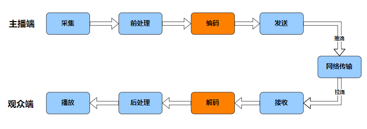
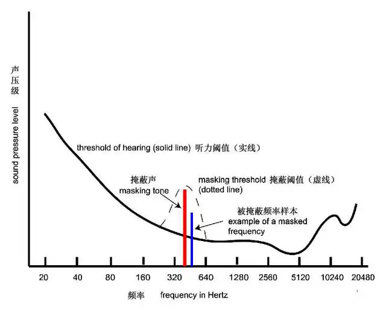
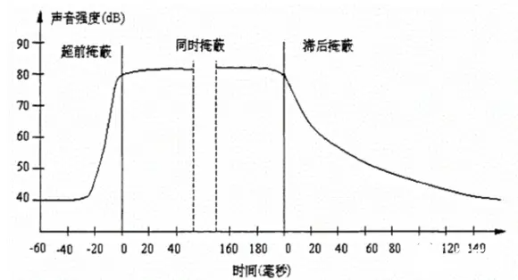
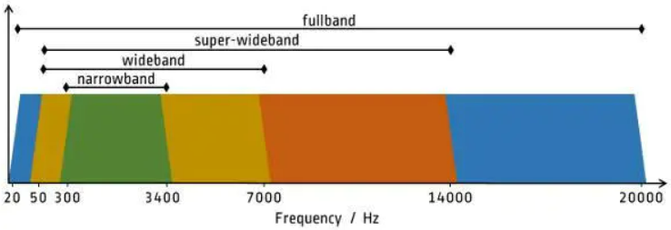
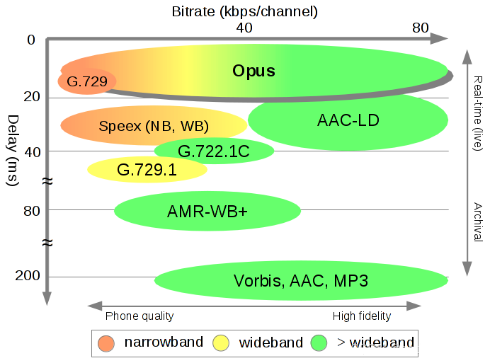
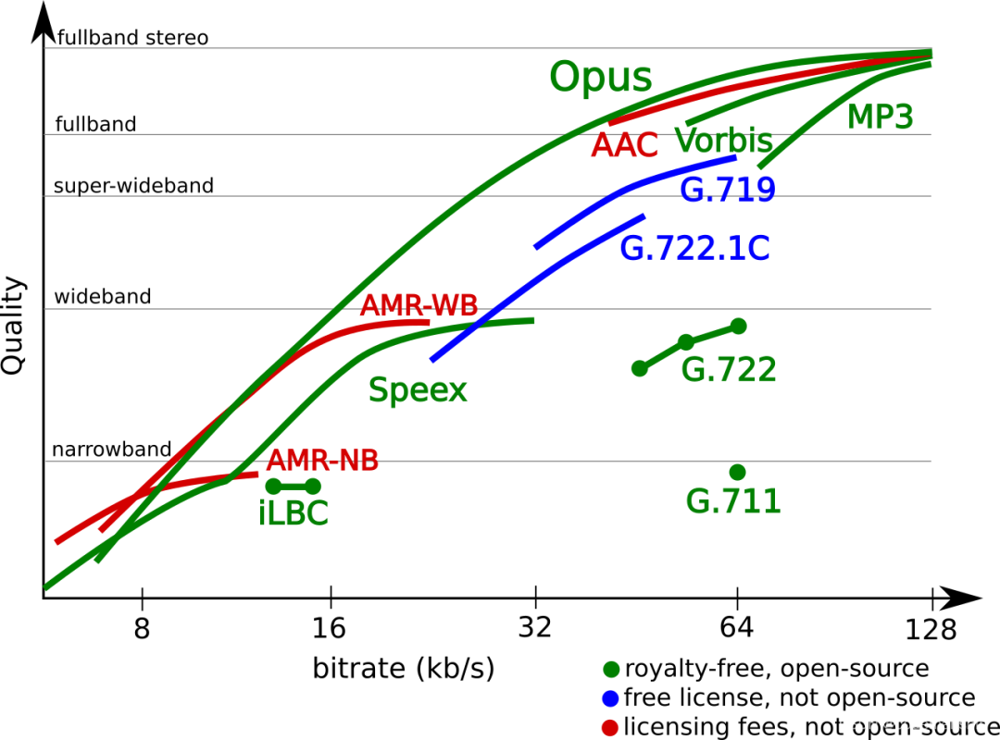
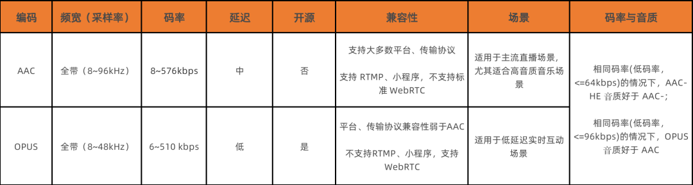
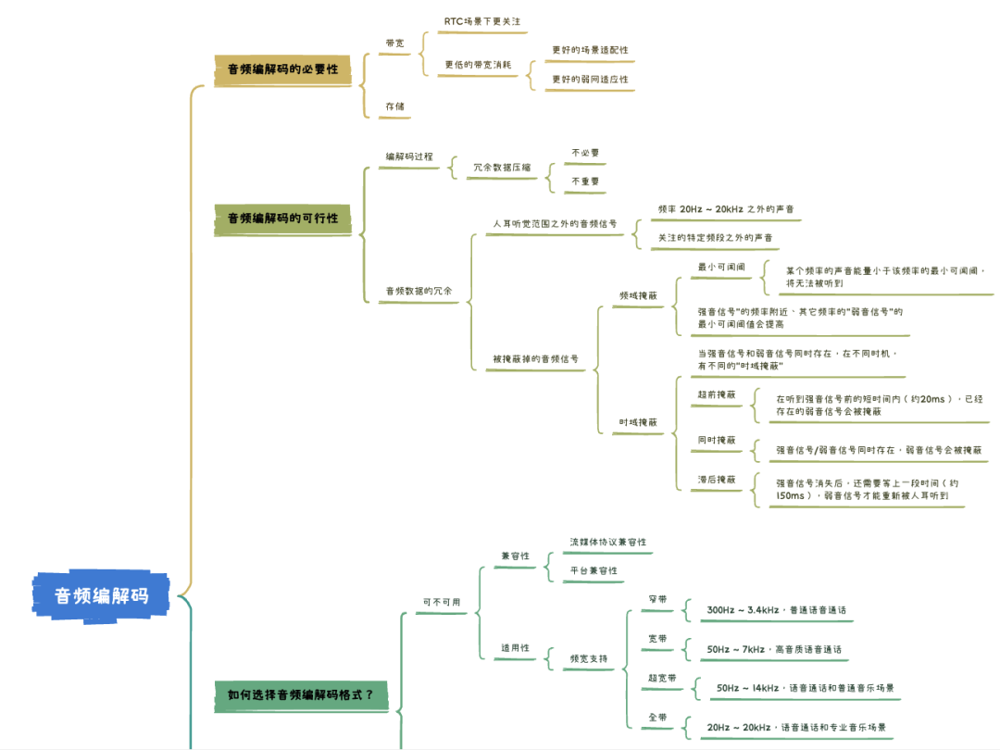
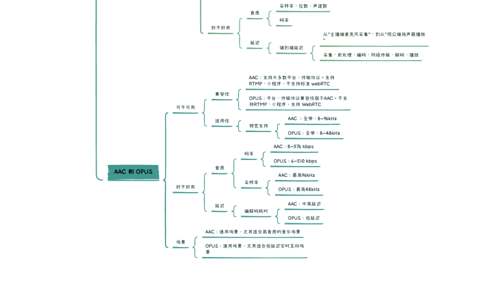

在上一篇文章中，我们完成了对音频前处理三剑客的学习。声音信号经过音频前处理模块，已经“洗尽铅华、去除杂质”，现在，你是否已迫不及待想要将它们分享到世界各地了呢？但稍安勿躁，想要更好地与世界分享我们的声音，还有一个不得不考虑的问题，而这个问题将由我们今天的主角 “[音频编解码](# "音频编解码")”来解决。

## 音频编码压缩的必要性

我们都知道，要想把音视频数据实时分享到世界的各个角落，有一个传输工具必不可少：网络。而要用好这个传输工具，有一个必须关注的点：网络带宽。

作为资深网民，大家肯定都了解过带宽。它指的是网络链路1秒钟内能传输的最大数据量，其单位一般使用 bps（bit per second），对应到推流（上传）/拉流（下载），可以相应分为上行带宽和下行带宽。如果把网络比喻为高速路，那么带宽就相当于这条路的宽度，音视频数据相当于路上来往的车辆。公路越宽，则允许并行通过的车辆越多，其运输能力就越强，如果道路太窄、需要并行通过的车辆又太多，可能会出现阻塞、甚至是车祸。对应的，网络带宽越大，单位时间能传输的数据越多，如果带宽不足，势必导致传输异常，产生卡顿、甚至数据丢失等影响用户体验的问题。

基于对带宽的了解，我们进一步看看纯音频场景对带宽的需求情况。我们已经知道，音频模拟信号经数字化处理会得到标准的数字⾳频数据裸流，其格式为 PCM。不妨先来计算一下，如果直接传输 PCM 数据需要多少带宽。

音频数据传输所需的带宽，可以通过音频码率来度量，在 音频必知必会之音频要素 一讲中，我们已经学习了音频码率的概念及计算方式。对于采样率 44.1K Hz，位深 16 bit 的双声道音频 PCM 数据，它的码率为：

_采样率/Hz \* 位深/bit \* 声道数 \* 时长(1s) = 44100 \* 16 \* 2 \* 1 = 1411200 bps = 1.4112 Mbps（bps = bit per second）_

也就是说，要求推流用户的上行带宽、拉流用户的下行带宽至少为：1.4112 Mbps。这是单条音频流的情况，如果将场景扩展到语聊房或在线会议，带宽要求还需要依据上麦人数翻 N 倍。而在一些特殊场景，比如曾风靡一时的 ClubHouse 或 势头正旺的 MetaWorld，它们甚至号称“不限制上麦人数”，对于带宽的要求必然会更高。根据统计数据显示，2021年我国宽带网络的上行速率中值约为35Mbps，考虑到实际场景中除了音频之外，还有其他数据需要传输（比如视频数据，所需带宽是音频的数十倍），综合考量下来，带宽也算是“寸土寸金”了，PCM 数据的码率着实让人“高攀不起”。

所以，**如何高效利用带宽，如何在有限的带宽下传输更多的音频数据，是我们的重要课题**。而音频编解码，就是这个课题的一个有效解决方案。

在 RTC 音视频数据的处理链路上，音频编码模块位于音频前处理模块之后、网络传输模块之前，其主要作用就是对原始音频数据进行编码压缩，以减小数据量、降低带宽消耗（音频解码模块位于网络接收之后，可以认为是音频编码的反向流程，也即对压缩后的数据进行解压缩、还原）。常见的编码算法，比如 AAC，能够实现相对于 PCM 数据1/15以上的压缩率，也即将码率 1.4112 Mbps 降低至 0.094 Mbps，带宽占用将得到显著的优化。对于 RTC 场景来说，更低的带宽消耗意味着更好的场景适配性、更好的弱网适应性，这对于 RTC 应用的普及、用户体验的保障都有裨益。除了带宽优化外，如果有保存音频为文件的需求，编码还能极大减轻存储空间的压力。

综上，**“降低带宽消耗”**和**“降低存储空间占用”**构成了音频编解码存在的必要性。了解其必要性之后，我们再进一步探究，为什么音频数据可以被编码压缩，编码压缩的“可行性”基础究竟是什么呢？

## 音频编码压缩的可行性

我们已经知道，音频编码过程是压缩、减少数据量的过程，但“减少”并不代表可以随意丢弃，而**要在减少“数据量”时，同时尽可能避免“信息量”的丢失，也即保真**。如果被压缩的音频数据，其所有信息可以被完整地解压、还原，我们称相应的处理为无损压缩；否则，相应的处理即为有损压缩，有损压缩能够带来更好的压缩效益，是 RTC 场景下普遍使用的方案，我们今天也着重了解有损压缩相关的技术点。

值得一提的是，有损和无损也是相对而言的，目前任何数字编码方案都无法做到完全无损，就像用数值表达圆周率 π = 3.1415926……，只能无限提高精度、无限接近，但永远无法相等。

_注：PCM 就属于“无损”的音频编码，我们已了解其原理是对模拟音频信号在时间轴、幅度轴上进行采样、量化处理，以使重构的语音波形尽可能与原始语音信号的一致，其保真度好，但编码码率很高，不适用于RTC场景。_

那么，既然是“有损压缩”，实现可观的压缩率，又要最大限度避免“信息量”丢失，这不是相互矛盾了吗？

其实，“信息量”再加上一个定语会更贴切，那就是避免“有用、重要的“的”信息量丢失。压缩过程中丢弃的数据相对于整体应该是“不必要”或“不重要” – 也即“冗余”的。在 RTC 场景中，人是音频信号的消费者，我们可以充分利用人耳听觉的生理、心理特性来寻找这些“不必要”、“不重要”的冗余成分，总结下来主要包括两方面：

### 1 人耳听觉范围之外的音频信号   

在系列第一讲-音频要素 中，我们了解到：人耳的听力范围仅限于频率 20Hz ~ 20kHz，低于或者高于该频率范围的声音无法被人耳感知，被称为次声波（＜20Hz）和超声波（＞20KHz）。这部分“无法被人耳感知”的声音，就属于音频信号中“不必要” 的“冗余”部分。同时，因为不同类型信号的频率特征不同，比如语音的频率集中在 300 ~ 3400Hz，如果只关注语音信号，300~3400Hz 频段之外的信号也可以视为“冗余”，可以在编码压缩过程中“丢弃”。

### 2 被掩蔽掉的音频信号   

除了对特定频率的声音不敏感外，人耳还会因为“掩蔽效应”而忽略某些“弱音信号”。关于“掩蔽效应”，我们以响度（声强级）作为参考（详见系列课程第四讲-音频AGC），做如下理解：

人耳对于不同频率的声音，有相应的最小响度可闻阈，如果某个频率的声音响度小于该频率的最小可闻阈，该声音将无法被人耳听到。并且，某一频率声音的最小可闻阈不是固定的，当存在能量较大的“强音信号”时，该“强音信号”附近频率的“弱音信号”的最小可闻阈值会提高，这就是掩蔽效应中的“频域掩蔽”，如下图【频域掩蔽】所示。

除了频域掩蔽外，当强音信号和弱音信号同时存在时，在不同时机，还会有“时域掩蔽”。如下图【时域掩蔽】所示，在强音信号出现前的短时间内（约20ms），已经存在的弱音信号会被掩蔽；当二者同时存在，弱音信号会被掩蔽；当强音信号消失后，还需要等上一段时间（约150ms），弱音信号才能重新被人耳听到。以上三种类型的时域掩蔽分别称为**超前、同时和滞后掩蔽**。

在频域掩蔽和时域掩蔽中，那些“被掩蔽的信号”无法被人耳感知，所以可以视为冗余信号，可以在编码压缩过程中“丢弃”。

除了利用人耳听觉的生理、心理特性定义的“冗余”外，基于信息论原理，音频信号在时域和频域上的特征具有统计相关性，也即存在数据冗余，这些冗余也可以通过信息编码的方式进行压缩处理。

综上，我们从声音信号中找到了“冗余”成分，它们是支撑音频编码压缩的“可行性”基础。

现在，我们已经了解了音频编码压缩的必要性和可行性，接下来该聊聊具体的音频编码格式了。

音频编解码技术的发展历经了多个阶段，从针对语音信号的时域编解码、到针对音乐信号的频域编解码，最后也演变出同时兼顾两种类型信号的“全能编解码”，关于发展史大家灵活使用搜索引擎可以了解到很多干货，在此不做赘述。

目前，已经有诸多成熟的方案供我们选择，除了前面提及的 AAC ，常见的**音频编解码格式还有：OPUS、SILK、SPEEX、MP3、iLBC、AMR、Vorbis、G.7 系列等等**，而在 RTC 应用中常用的有 AAC 和 OPUS，我们今天将重点了解这两种格式，并会围绕音视频业务开发者关注的：编码方案的优缺点、如何根据场景来灵活选择等维度进行讲述。

## 如何选择音频编解码格式

在具体介绍 AAC 和 OPUS 之前，先和大家聊聊：如何选择一个合适的音频编解码格式？以及当我们选择音频编解码方案时，我们究竟在 “选” 什么？

从大方向上看，我们选择音频编解码方案时主要考虑两点“可不可用” 和 “好不好用” ，而每个大方向上，会有其细分维度。

**首先是“可不可用”**。具体的应用场景，可能因为某些“限制”导致某些编解码方式“不可用”或者“仅可用”，这些限制主要涉及“兼容性”和“适用性”两方面。

对于兼容性，就音视频场景来说，主要指流媒体传输协议兼容性和平台兼容性。而平台可能绑定某种流媒体传输协议，二者一般是关联考虑的。比如微信小程序平台支持 RTMP 传输协议，而RTMP 协议支持 AAC 音频编码，就形成了一定制约。另外需要注意的是，如果某两个平台支持的音频编解码格式不同，又有互通需求，可能就需要通过服务端转码的方式来搭建桥梁。

对于适用性，主要指的是“频宽支持是否符合场景需求”。频宽指的是声音频率的支持范围，人耳对声音频率的感知范围（20Hz~20kHz）可以被划分成四个频宽区间：窄带、宽带（wideband）、超宽带（super-Wideband）和 全带（fullband），如下图所示：

结合已学习的声音频率、采样率、奈奎斯特采样定理等概念，大家应该很容易就能理解上述图表。举一个简单的例子，音频编解码格式 G.711 仅支持窄带信号，所以在编码普通语音（低频）时“可用“，适用于固话、电话场景，但是在编码全带信号时“不可用”，不适用于音乐直播等场景。

考虑了“可不可用”这个基本标准后，我们还需要有进一步的追求，那就是 **“好不好用”**。

某种编解码格式 “好不好用” ，主要指的是：**它在满足特定场景基本要求的基础上，能否将编码工作做到“尽善尽美”**。而在 RTC 场景下，关于“尽善尽美” 我们主要考虑音质和延迟两方面。

关于音质。音质是大家普遍关注的指标，它的影响因素还比较多，除了已经提到的采样率，还有采样位深和声道数，支持的采样位深越大、声道数越多，自然可以更好的保证音质。比如 AAC 支持 96khz 采样和多达 48 个声道，这让它在追求高音质的场景备受青睐。既然采样率、采样位深和声道数均影响音质，那么基于三者计算的综合指标 – 码率，自然也不例外。一般来说，支持的码率越高、越广，音质越能得到保障、灵活性也越大。那些仅支持固定码率的编码格式，比如仅支持 64kbps 码率的 G.711，其适用范围、音质上限就受到很大的限制了。

关于延迟。延迟在音视频传输中，指的是音视频数据从“主播端麦克风采集“、到从“观众端扬声器播放”的“端到端耗时”，这个耗时由音视频处理链路上的各个环节引入，包括采集、前处理、编解码、网络传输、渲染播放等等。显然，延迟越低意味着实时性越高，也就越接近于“面对面沟通”，在有连麦互动需求的场景中，“低延迟”甚至是最重要的需求之一，关乎用户体验的核心。所以，根据场景需求，选择一个延迟合适的编解码格式相当重要。

综上，当我们选择编解码方案时，我们其实是在**选择 “兼容性” 和 “适用性”，进一步的，还需要关注 “音质” 和 “延迟”**，通过这四个细分维度，就基本能保证所选方案是”可用“且“好用”的。最后，我们就 RTC 场景下常用的编解码：AAC 和 OPUS，再来对比说明下。

## AAC 和 OPUS 的选取

AAC，是基于MPEG-2规范，由 Fraunhofer IIS、Dolby Laboratories、AT&T、Sony 等公司于1997 年合力研发推出，经过 25 年的发展已经被各个领域广泛应用。而 OPUS 由 Xiph.Org、Skype 等基金会研发推出，2012 年才被 IETF 批准进行标准化，相对于 AAC ，OPUS 更“年轻”。关于 AAC 和 OPUS 以及其他常见音频编解码格式的特性对比，有两张图可以很直观的展示，我们直接看图说话。

上图展示了各编码算法的编解码耗时（Delay，纵轴）、支持码率范围（Bitrate，横轴）、支持频宽。

上图展示了不同音频编码在不同码率 （Bitrate）、不同频宽上的音质表现（Quaity）。

不难发现，在罗列的编码算法中，OPUS 格外瞩目，它在 “频宽支持”、“码率支持”、“延迟” 和 “音质”方面，都有比较明显的优势，可以说是“学霸”一个。**OPUS 的优势，得益于它集成了两种编码器：语音编码器 SILK、超低延迟的编码器 CELT，并做了很多针对性的优化**。它可以无缝调节高低码率，具有极低并灵活可控的算法延迟，并支持全频宽。在实际场景的测试中，OPUS 比 MP3、AAC 等编码有着更低的延迟和更好的压缩率，音质也不甘拜下风。因此，**OPUS 在 RTC 场景下备受青睐**，某些对端到端延迟极度敏感的场景，更是将其作为必选项，比如实时合唱KTV，多个用户同时上麦K歌，需要依赖极低的端到端延迟来保证同步性。

而**反观 AAC，其编解码耗时比 OPUS 高，相对来说不怎么适用于实时互动场景，但它在音质高保真方面，仍然有着不俗的实力**，尤其是在极高采样率、高码率、多声道配置下的编码效果尤佳（AAC 最高支持 96kHz 采样率，而OPUS 为 48kHz ，虽然都是全频宽，但是 AAC 在高频部分**能保留更多细节），非常适合音乐直播**。另外，除了标准规格，AAC 系列还在算法延迟、编码复杂度、编码效率等方面进行针对优化，推出了多种扩展规格，便于我们灵活选择。比如延迟优化版的 AAC-LD（Low Delay），从图一中我们看到其延迟已接近 OPUS；编码复杂度优化版的 AAC-LC （Low Complexity），在中高码率上进一步寻求音质和编码效率的平衡点，并提供更好的兼容性；编码效率优化的 AAC-HE（High Efficiency），进一步提高压缩效率，以追求在更低码率下获得更高的音质。

其实，从上面的介绍来看，各方实际测试数据表明，OPUS 作为一种“年轻”的编解码格式，的确有后来居上、长江后浪推前浪的实力，大部分场景下应该是更优于 AAC 的方案。但胜在“年轻”也输在“年轻”，年仅十岁的 OPUS 和已经二十五岁的 AAC 比起来，还缺少一点“人生经历”和“江湖地位”，别忘了，在“如何选择音频编解码格式”的评估维度中，有一个重要的指标：“兼容性”。

作为前辈，并且背靠 Fraunhofer IIS、Dolby Laboratories、AT&T、Sony 等巨头，AAC 在各领域已得到比较充分的普及，拥有广泛的硬件设备、软件应用和传输协议兼容性，这些都是 OPUS 短时间内无法超越的。比如，RTMP 是直播场景常用的流媒体传输协议，它对于 AAC 编码具有良好的兼容性，却不支持 OPUS 编码，而大部分的 CDN 厂商均默认使用 RTMP 作为推流协议，某些平台比如微信小程序也仅支持 RTMP 传输，为了保证兼容开发、推广效率，我们往往只能选择或优先选择 AAC。

值得一提的是，Google 鼎鼎大名的开源项目 WebRTC 使用了同样开源、免费的 OPUS ，作为其默认的音频编解码方案，但标准 WebRTC 不支持 AAC。这就导致，一些跨平台的音视频应用需要依赖服务端转码来实现与 WebRTC 的互通，转码操作一定程度上增加了传输延迟和开发运维成本。

最后，我们通过表格再整理一下 AAC 和 OPUS 的差别，并在细节上进行适当的补充。

**总结**

最后，简要总结一下今天的课程内容：首先，我们了解了音频编码压缩的必要性（带宽和存储空间）和可行性（冗余），学习了音频编解码方案的选择标准（“两大方向、四大维度”），并基于这些标准，对 RTC 场景下常用的编解码格式 AAC 和 OPUS 进行了比较，了解了它们优劣势和适用场景，今后你自己也能选择一个合适的编解码方案了。

至此，大家已完成了必知必会基础-音频编解码部分的学习。我们的声音走过了采集、前处理、编码的漫漫长路，终于蓄势待发，可以奔赴实时网络的各个角落，传递信息、传播价值，也希望大家能在音视频应用开发的学习道路上，有所收获，再迈出踏实的一步。

下面，我们再通过一个思维导图，梳理一下整篇文章的内容：

## 思考题

### 上期思考题揭秘

问

谐波检测为什么可以用于辅助定位人声，提高 VAD 的准确度？

答

在音频信号中，存在基波和谐波。基波的频率是音频信号的主要频率(基频)、最低频率，决定了声音的音调。谐波的频率比基波高，并且是基频的整数倍，如基频为50MHz，则谐波出现在100MHz、150MHz ……，谐波赋予了音频音色。

语音的一个明显特征是包含了基频及其多个谐波频率，即使在强噪声环境下，这一特征也是存在的，可以用自相关的方法找到基频所在频点。所以，提取音频信号中的谐波特征量，可以辅助判定人声。（乐器的音频也有明显的谐波特征，并且和语音相似。

所以，基于谐波特征辅助VAD判定的AGC算法，一般对乐器音频也是生效的）

### 本期思考题

作为采样率、位宽、声道数的综合指标，音频编码码率对音质会有显著的响应，那对于码率的选择，是否越高就越好呢？_  

（我们下期揭秘）