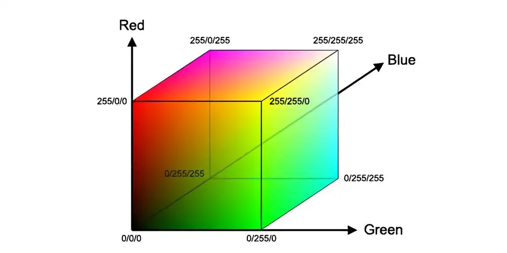
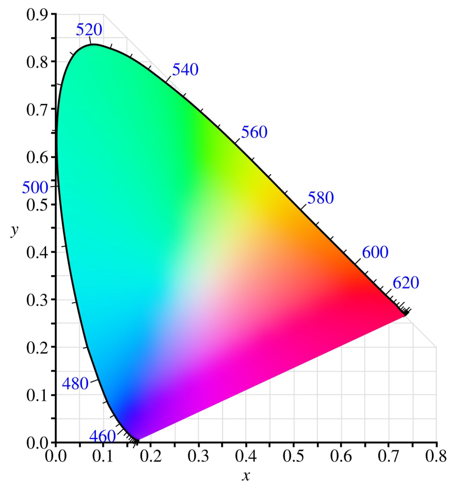
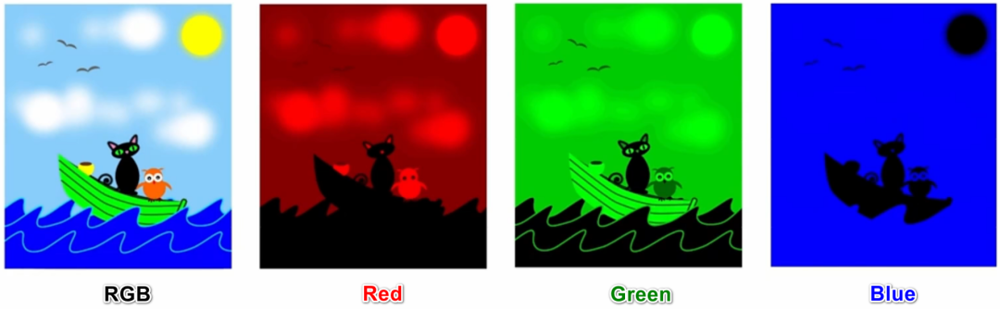
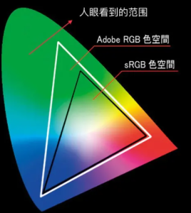
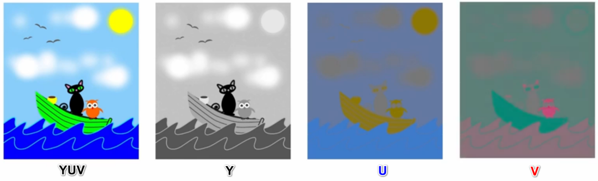

在前面几篇文章中，我们完成了音频相关基础知识的学习，从今天开始，我们要暂别音频，继续学习视频相关基础内容。

虽说声音在我们日常的生活、工作、娱乐过程中，发挥着不可替代的作用，但人们常说，百闻不如一见、耳听为虚眼见为实。我们对于世界的认识、对于沟通和互动的需求从未满足于“声音”这一个途径，在如今这个“看脸”的时代，**我们很多时候还追求“看见”、“面对面”，而这就是视频存在的意义**。

相对于纯音频，音视频能传递更直观、更丰富的信息，很多时候，视频的加入赋予了音频血肉，也给予了我们更多的选择。所有**基于纯音频的场景，都可以通过加入视频元素而演变出新的玩法**，比如音频语聊升级为视频通话、电台直播转变为秀场直播、语音课堂升级为视频课堂等等。当然，视频元素也并不局限于“摄像头”，屏幕采集、版权影视资源都可以作为视频数据源，满足了游戏直播、一起看电影等场景。

既然“视频”有这么多价值，作为一个音视频应用开发者，我们自然要来好好地了解一下它。

## 视频的本质——图像

在前几次和声音打交道的过程中，我们了解到声音的本质是物体振动产生的波，我们对于声音的感知，其实是通过耳膜感知了声波的振动，所以对于声音的学习是从声波的采集以及数字化开始的。现在，我们开始和视频打交道，自然要从视频的本质、以及我们对视频的感知方式聊起。

那么，**视频是如何产生的呢？**

大家一定有接触过“翻页连环画”，这种连环画的每一页都是静态的图片，常态下平平无奇，但如果我们快速地拨动翻页，让每一页图片快速、连贯地进行展示，原本“静态”的图片，在视觉上居然变成了“动态”的画面（如下图）。

这里**“静态图片”之所以会转变为“动态画面” ，是基于人眼的“视觉暂留“特性**：我们观看物体时，物体首先成像于视网膜、并由视神经传入大脑，大脑才感知到物体的像。而当物体从视线中移去时，视神经对物体的印象不会立即消失，会延续几百毫秒。当旧图像消失、新图像替换出现的频率足够快时，前后图像在视觉上就产生了“连贯”，形成了“动态画面”。而“动态画面”也就是我们所说的“视频”。

从“翻页连环画”的现象看，**视频的本质其实是一帧帧连续展示的图像**。而我们对视频内容的感知方式，就是通**过眼睛捕获到一帧帧图像上的“[色彩](# "色彩")”**。无论是最简单的黑白默剧，还是最丰富的炫彩影视，都需要由色彩组成血肉和骨骼。

所以，我们对于视频知识的学习，还需要从认识“色彩”开始。

## 图像的血肉和骨骼——色彩

大家都知道，眼睛之所以能看到物体，是因为接收了物体反射的光波。而色彩，则是大脑对光的一种“感觉”。相较于声音的“只可言传，不可意会”，色彩对于我们来说，是“只可眼观，不可言传”的。为了方便对色彩进行统一描述，也为了让数字电路能识别、处理色彩数据，我们需要**利用数字化的手段对色彩进行定义**。

说到色彩的定义方式，最为大家所熟知的是 **“光的三原色模型”** 。光进入人眼后，视觉细胞会产生多个信号，其中有**三种单色光信号：红（Red）、绿（Green）、蓝（Blue）**，这三种单色光按不同比例组合，形成了不同的色彩，我们也称其为 **RGB 模型**。参考 RGB 模型，我们选定了三种色彩分量，再对每种单色分量进行量化，也就完成了对色彩的数字化处理。

这种处理方式所使用的 “色彩模型” 的概念，很容易和 “多维空间、多维坐标系” 联系起来。比如 RGB 模型的三个分量，可以分别视为三维空间的 X、Y、Z 坐标，确定了具体的 RGB 分量值，相当于确定了一个（X，Y，Z）坐标点，每个不同的点即代表不同的色彩。如果我们计算出每个分量的取值范围（坐标范围），那么该范围内的所有分量的取值组合，就确定了一个色彩空间（Color Space），该空间中包含了该色彩模型可表示的所有颜色。

对于人眼来说，能识别的色彩数量有限，兼顾考虑技术瓶颈，实际应用中需要展示、能够展示的色彩也是有限的，我们往往不需要一个色彩模型的所有颜色，**不同场景下一般只需要选用某个色彩“子空间”，作为其标准的色彩空间（也称为 “色域”）**。而不同软硬件平台，只要约定好支持相同的色彩空间，只使用该色彩空间内的颜色，就能实现兼容互通，否则，它们对同一种色彩的展示就可能会出现差异。

在不同领域制定的众多色彩空间中，有一个比较特殊的空间：**CIE 色彩空间，它囊括了人眼所能感知的所有色彩**。CIE 色彩空间常常被当作标准的参考系，用于不同色彩空间之间的比较。如果我们将 CIE 色彩空间中的所有色彩，通过数学模型映射到一个二维平面中，将得到一个如下的**色域马蹄图**，封闭区域即为 CIE 色彩空间所能表示的所有颜色。

_CIE色彩空间：人眼的可视色彩范围_

当然，除了基于光的三原色的 RGB 模型，色彩模型/色彩空间还有很多种，常见的比如 YUV、CMYK、HSV、HSI 等等。而在 RTC 应用中，主要使用的是 RGB 和 YUV ，我们后面会重点了解这两种色彩空间。

而在了解具体的色彩空间之前，我们还有一个疑问需要解答：**色彩，是如何组成图像的呢？**

虽说视频的本质是图像，但图像并非不可分割，它仍然有更小的组成单位 – “像素”（Pixel）。关于图像和像素的关系，大家可以先观察如下两张图片：

在上面的图片中，左图为正常尺寸的图片全貌，右图为放大一定倍数之后的局部截图（企鹅的头部）。

我们可以看到，原本细腻的图片，在放大之后出现了一个个小方块，这些或色彩各异、或色彩相近的小方块按一定规则排列组合，最终呈现了“企鹅”的形象。这里的小方块，就是所谓的“像素”。

**一个像素，是图像的一个最基本单元，是构成图像的一个色点，我们也可以称其为像素点。**每个像素点上记录了某种色彩空间的每个分量值（比如 R、G、B），不同的分量值组合决定了这个像素点所表示的颜色，**多个表示特定颜色的像素点，按某种规则排列组合，就形成了完整的图像**。可以说，“像素们”承担了图片色彩构成的重任。

好了，关于像素、以及像素与图像色彩的构成关系，大家就先了解到这，后面我们还会和它们有进一步接触。现在，让我们回到色彩空间的话题上，来具体了解一下，RTC 应用中最常使用的色彩空间：RGB 和 YUV 。

### 1 RGB  

首先，我们来认识一下 RGB 色彩空间。

我们前面已初步了解，RGB 色彩模型基于光的三原色原理建立，其三个分量为：红（Red）、绿（Green）、蓝（Blue）。在 RGB 模型下，图像的每一个像素点都会存储 R、G、B 三个分量（如下图），每个分量取不同的数值（ 0 ~ 255 ），该像素点就能综合呈现出不同的色彩。基于此，如果按（R，G，B）的方式记录，那么（255,0,0）、（0,255,0）、（0,0,255）分别表示的就是最纯粹的 红、绿、蓝 。而比较特殊的，若 RGB 三个分量值均为 0，综合得到黑色；反之，若三个分量取最大值 255，综合得到白色。

RGB 可表示的色彩数量可达 1677 万，这远远超过了人眼的感知范围（约1000万种），正因如此，RGB 被广泛应用于各种显示领域。而不同领域、不同应用场景，根据其所需的颜色范围，又建立了基于 RGB 模型的、不同的色彩子空间，最常见的有 sRGB 和 Adobe RGB。

*   **sRGB 和 Adobe RGB**

sRGB 色彩空间由 Microsoft 在 1997 年主导制定，被广泛应用于显示器、数码相机、扫描仪、投影仪等设备。大家选购显示器时，肯定有在产品特性介绍中看到过诸如 “99%sRGB、100% sRGB” 之类的指标，其含义即为该显示器对 sRGB 色彩空间的覆盖程度，数值越高，意味着该显示设备所支持的色彩越丰富。而 Adobe RGB 比 sRGB 晚问世一年，由 Adobe 在 1998 年提出，它在 sRGB 的基础上增加了 CMYK 色彩空间（一种专用于印刷业的色彩空间，模型分量为青（Cyan），洋红（Magenta），黄（Yellow），黑（Black）），Adobe RGB 跟随着 Adobe 设计软件全家桶被广泛应用于平面设计行业。

*   **sRGB 和 Adobe RGB 的对比**

关于 sRGB 和 Adobe RGB 的比较，我们可以借助 **CIE 色彩空间马蹄图**作为参考。

如下图，我们将 CIE、sRGB 和 Adobe RGB 的色彩范围换算到同一个平面上。最外围的色彩区域为 CIE 色彩空间，三角形部分为 sRGB 和 Adobe RGB。可以看到，sRGB 和 Adobe RGB 的色彩范围均小余 CIE，但是 Adobe RGB 的覆盖范围比 sRGB 更广，尤其是在绿色区域覆盖得更多（sRGB 大约能覆盖 35％ 的 CIE，Adobe RGB 则为 50%），这使得 Adobe RGB 在摄像、图像处理、保真方面更游刃有余。

不过，即便 Adobe RGB 相较 sRGB 更出色，在应用范围上依旧是 sRGB 更广。作为“前辈”，抱着 Windows 的大腿，sRGB 凭借 Windows 雄厚的用户基础得到了广泛的普及。如今，互联网上绝大多数内容，比如视频网站的影视剧、比如这篇文章中的图片，基本都是以 100% sRGB 的色彩标准进行显示的。一张 Adobe RGB 标准的图片如果放在网页上观看，其颜色可能会变淡（相对于原始色彩），这是因为 Adobe RGB 图片的色彩超过了网页的显色标准，部分色彩信息出现了丢失。但即便如此，对于大部分用户来说，日常场景使用 sRGB 已然足够，当需要更广的色域以达到更优质的色彩效果时（比如专业平面设计/摄影场景），才有必要考虑 Adobe RGB。

从 RGB 两种子色彩空间的应用场景看，不得不承认 RGB 和大家的日常生活已是息息相关。但是，即便在采集、显示等用途上 RGB “一家独大”，当聚焦到视频处理领域时，它却有些施展不开手脚。

RGB 在表示颜色时有一个特点，那就是其三个通道分量是相关的，缺一不可。也即每个像素点必须同时存储 R、G、B 三个分量值才能正确表示颜色，这导致它不便于做编码压缩，如果用于存储或传输，会占用大量的空间和带宽（关于空间和带宽的重要性，我们在 音频必知必会-音频编解码中已有过讨论）。空间和带宽问题，在一帧图像上或许可以勉强忍受，但在视频资源上，就非常严峻了（时长 1s 的视频资源，一般包含数十帧的图像，空间和带宽占用将呈数十倍增长）。

因此，我们还需要其他的色彩空间，来替代 RGB 用于视频处理领域，而这就是接下来要和大家介绍的，YUV 色彩空间。

### 2 YUV

既然 RGB 三个分量的相关性，制约了其在视频领域的应用，作为其上位选择的 YUV 自然不能重蹈覆辙。YUV 色彩空间也有三个分量 Y、U、V，但和 RGB 不同的是，其三个分量并非都参与颜色的表示。

YUV 的三个分量中， Y 分量用于表示明亮度（Luminance），决定一个像素是明、或暗（可以理解为是黑、或白）以及其明暗的程度。我们仅记录明暗不同的 Y 分量，就能表示出图像的总体轮廓（ 如下图中的 【Y】）。而 U、V 分量表示色度（Chrominance），用于定义色彩和饱和度（ 如下图中的 【U】【V】）。一个记录了 Y 分量的像素，再添加上 U、V 分量，图像轮廓中就填充了 “黑白、明暗” 之外的其他色彩。

不难发现，即使没有 U、V 分量，仅凭 Y 分量我们也能 “识别” 出一幅图像的基本内容，只不过此时呈现的是一张黑白图像。而 U、V 分量为这些基本内容赋予了色彩，黑白图像演变为了彩色图像。这听起来是否有些似曾相识呢？这其实也是黑白电视和彩色电视之间的关系。

YUV 是在黑白、彩色电视的过渡时期应运而生的，它这种既可以完整记录彩色信号，又能通过仅记录 Y 通道信号来表示黑白画面的特性，很好地解决了黑白电视与彩色电视的兼容互通问题。并且，由于人眼对于亮度（Y）相较于色度（U、V）更高、更敏感，我们对于不同明亮度的识别能力，远远超过对不同色度的识别能力。这意味着，我们可以在保留 Y 分量信息的情况下，尽可能地减少 U、V 两个分量的采样，以实现最大限度地减少数据量，同时还能保证人眼视觉失真度最小，这对于视频数据的存储和传输是有极大裨益的。这也是为什么，YUV 相较于 RGB 更适合于视频处理领域。

### 3 YUV 和 RGB 的转换 

在了解了 RGB 和 YUV 的基础知识和应用场景后，你可能会有一些疑惑。既然在图像采集、显示方面，我们主要使用 RGB，但是在图像存储、处理、传输方面，我们又要选择 YUV。而在一个完整的应用场景中，视频的采集、存储、处理、 传输、显示等环节，却是相互关联、缺一不可的，这里是否会存在冲突呢？

是的，这里的确存在两种色彩空间的使用冲突，我们解决冲突的方式是“色彩空间转换”。

RGB 与 YUV 的相互转换，存在于视频处理链路的各个必要环节。

视频采集设备一般输出的是 RGB 数据，我们需要将其转换为 YUV 数据再进行后续的处理、编码和传输；同样的，显示设备通过传输、解码环节获取到 YUV 数据后，也需要将其转换为 RGB 数据，再进行消费展示。

关于这两种色彩空间转换的细节，大家暂不需要深究，但需要了解到：**色彩空间转换是一个基于“标准”来执行的过程，只有在明确标准的基础上，才能通过一定的数学运算完成二者的相互转换**。而“标准” 有很多种，比如 BT.601、BT.709 等等，不同的标准会有不同的转换公式，有兴趣的同学可以去查阅相关的资料做进一步了解。

关于 YUV 和 RGB ，除了要了解它们的基本原理，我们还需要关注它们的“采样方式”和“存储格式”。“采样方式”和“存储格式” 相关的内容，非常重要却也比较复杂，我们将在下一篇文章中，再详细地和大家探讨。

## 总结

本篇文章我们重点讲述图像与色彩基础知识的第一部分，在今天的学习过程中，大家可以了解到视频、图像、像素和色彩之间的关系，也初步认识了两种重要的色彩空间：RGB 和 YUV，以及它们的基本原理、差异和联系。

接下来，我们还是通过一个思维导图，整理一下所有的内容：

当然，以上的内容还只是开胃小菜，在下一篇文章中，我们会继续和 RGB、YUV 打交道，看看它们身上还有哪些“未解之谜”。期待和大家的下一次见面。

## 思考题

### 上期思考题揭秘

问

作为采样率、位宽、声道数的综合指标，音视频编解码码率对音质会有显著的响应，那对于码率的选择，是否越高越好呢？

答

理论上，对于有损压缩的音频编码，码率越高意味着压缩越少，音质保真度越高。但是，对于码率的选择，不仅仅需要考虑其对音质的影响，还需要关注实际使用场景的需求、限制。

1、对于音乐电台等场景，为了保证音质，会选用比较高的音频码率（>64kbps），根据不同的采样率、位深和声道数可以适当调整。但在相同的采样率、位深和声道数下，码率提高到一定程度后，对音质的提升已不再明显，继续提高收益不大。需要找到一个音质和压缩率最契合的“甜点”码率。比如，AAC-LC的甜点码率在96kbps，相当于MP3的128kbps，已经达到了CD音质；

2、对于语聊房等场景，多人同时上麦，如果码率太高势必会对带宽产生压力，如果有出海需求，因各国家地区的网络基建参差不齐，更要谨慎把控码率。按基本需求，16kbps就能保证语音沟通的质量；

3、码率是可以灵活设置的，同一个APP的不同场景，同一个场景下的不同角色，都可以按需设置；

### 本期思考题

RGB 颜色空间也能表示黑白色和彩色，为什么还需要 YUV 来解决黑白电视和彩色电视之间的兼容互通问题呢？

（我们下期揭秘）
