在上一篇文章[《第六讲：色彩和色彩空间·上篇》](./006_1.md)，我们带大家了解了视频、图像、像素和[色彩](# "色彩")之间的关系，还初步认识了两种常用的色彩空间，分别是大家比较熟悉的 RGB，以及更受视频领域青睐的 YUV。今天，我们将继续深入学习 RGB、YUV 的相关内容，进一步了解它们的常见采样格式和存储格式。

**色彩的采样格式和存储格式影响我们处理图像的方式**，只有使用正确的方式，才能呈现正确的图像效果。

## RGB 的采样和存储

我们已经知道，图像由像素组成，而像素通过记录色彩空间各分量呈现各种各样的色彩。对于 RGB 色彩空间，其三个分量 R（红）、G（绿）、B（蓝），它们之间具有相关性，对于色彩的表示来说缺一不可。

所以，**RGB 的每个像素都会完整采样三个分量，采样比例为 1:1:1**（指每个分量的采样数，而非每个分量的数值）。也正是因为这种采样要求，RGB 颜色空间在采集上不好进行数据压缩，不太适用于视频图像的编码、传输。

RGB 三个分量采样后，在内存中是依次排列存储的。但是，它们的存储顺序不一定是字面描述的 R、G、B。不同的应用场景，因处理逻辑差异可能会使用不同的规则。比如，MATLAB 使用的存储顺序为 R、G、B，而 OpenCV 则使用 B、G、R，如下图所示：

[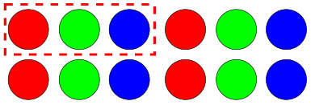](./images/006_2_1.png)

_R、G、B 顺序_

[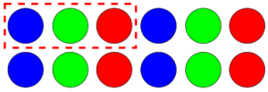](./images/006_2_2.png)

_B、G、R 顺序_

我们把 RGB 字面描述的分量顺序，称为**字面序**，将其实际存储的分量顺序，称为**字节序**。确定好色彩空间存储的字节序，是正确处理图像的前提，如果随意对各分量进行读取，可能会导致处理后的颜色出现异常。下图，即为使用 RGB 顺序读取字节序为 BGR 的图片的效果，此时，由于将 B、R 分量混淆了，得到了错误的图片颜色。

_左一：原图，存储格式为 BGR；_    _左二：使用 RGB 格式进行读取_

另外，大家还也会接触到 BGRA 这样的存储格式（比如在 iOS、MAC 上处理摄像头数据），其中的 A ，表示在 RGB 三个通道基础上，增加了一个透明度通道 Alpha，用于调整色彩的透明度，实现更丰富的色彩效果。对于增加了透明度的RGB，同样需要留意其实际的存储顺序，常见的有 BGRA、RGBA、ABGR 和 ARGB 等等。

总之，RGB 的采样格式、存储格式相对比较简单，我们也不做过多的展开。正如上篇文章所述，在视频处理领域，**YUV 色彩空间才是主角，它的采样格式、存储格式相对于 RGB 也更加复杂** 。

## YUV的采样和存储

### 1 YUV 的采样格式  

大家已经知道，区别于 RGB 色彩空间，YUV 色彩空间的三个分量并非都参与颜色的表示，即便仅存在亮度分量 Y，也能呈现黑白灰的图像轮廓。而人眼对于色度分量 U、V 不是特别敏感，减少一些也不会太影响观感。这种特性体现到采样上，意味着**允许我们少采集 U、V 分量、甚至于不采集 U、V 分量（黑白图像），从而在采集上实现可观的数据压缩**。按 U、V 分量的采集方式不同，主流的 YUV 采样格式有：YUV 4:4:4，YUV 4:2:2 和 YUV 4:2:0 几种。

看到 “ YUV A:B:C ” 这种标识格式，大家是否很容易将其理解为 “ Y:U:V = A:B:C ”？这种理解是符合直觉的，但并不正确。实际上， “A:B:C” 格式并不是将 YUV 拆分为 3 个分量、然后按 A:B:C 的比例采集，而是基于一个 “宽度为 A 个像素、高度为 2 个像素” 的采样区域，将 UV 分量作为一个整体进行采样，然后描述 UV 分量组相对于 Y 分量的采样率。

[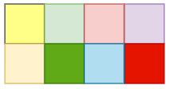](./images/006_2_4.png)

_宽 A 个像素、高 2 个像素的区域_

上面的解释可能比较笼统，要理解 YUV A:B:C 的采样逻辑，我们可以将其先进行拆解，整理为清晰可参考的 “规则”，再结合 “规则” 和实际案例进行分析。对于采样格式 YUV A:B:C 相关 “规则” 的一种理解如下：

*   对于一个宽度为 A 个像素、高度为 2 个像素的采样区域（两行四列）
*   第一行需要采样 A 个亮度分量 Y，B 个色度分量组 UV
*   第二行需要采样 A 个亮度分量 Y，C 个色度分量组 UV
*   如果 C 为0，则表示第二行不再重新采样 UV 分量，而是复用第一行的 UV 采样

接下来，我们针对主流的 YUV 采样格式，依据上述规则作具体解析，来帮助大家理解。

首先，我们来看看 YUV 4:4:4 采样格式。参照上述“规则”，解析如下：

*   对于一个宽度为 4 个像素、高度为 2 个像素的采样区域
*   第一行需要采样 4 个亮度分量 Y，4 组色度分量 UV
*   第二行需要采样 4 个亮度分量 Y，4 组色度分量 UV

除了文字解析外，我们还可以结合图例来观察。如果用空心圆圈表示 Y 分量，实心圆（蓝色）表示 UV 分量，则 YUV 4:4:4 采样逻辑可以表示为下图（图例颜色不代表实际采样颜色）：

[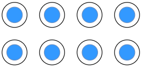](./images/006_2_5.png)

_YUV 4:4:4_

参考上面的图文说明，我们发现，在  YUV 4:4:4 采样格式下 ，每采样一个 Y 分量、就要相应地采样一组 UV 分量。显然，此时 UV 分量组相对于 Y 分量在宽度方向（水平）、高度方向（竖直）上均为等采样，不存在降采样的情况，也即 Y:UV = 1:1。这意味着，在 YUV 4:4:4 采样下，每个元素都包含独立、完整的亮度分量和色度分量。

YUV 4:4:4 采样相对还比较简单，大家肯定都能理解，我们再来看看 YUV 4:2:2。

参照“规则”，我们将 YUV 4:2:2 采样解析如下：

*   对于一个宽度为 4 个像素、高度为 2 个像素的采样区域
*   第一行需要采样 4 个亮度分量 Y，2 组色度分量 UV
*   第二行需要采样 4 个亮度分量 Y，2 组色度分量 UV

其对应的图例如下：

[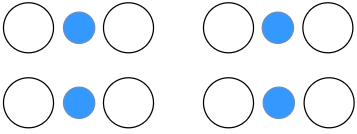](./images/006_2_6.png)

_YUV 4:2:2_

参考图例，YUV 4:2:2 采样中，UV 分量组相对于 Y 分量在宽度方向有降采样，水平每两个 Y 分量将共用一个 UV 分量组，也即 Y : UV = 2 : 1。高度方向上未进行降采样，第二行使用与第一行相同的采样逻辑，重新采样两组独立的 UV 分量。显然，由于宽度方向有降采样，YUV 4:2:2 对 UV 分量的采样比 YUV 4:4:4 更少。但基于 YUV 的特性，虽然少采样了部分 UV 分量，也不会太影响画面的色彩，这就在色彩保真的前提下，实现了采集数据的压缩。

以上，我们利用 “规则”，对 YUV 4:4:4 和 YUV 4:2:2 两种采样格式进行了解析。参考解析的结论，你可能会有一个疑问：目前讨论的两种采样格式，似乎并没有推翻 Y:U:V = A:B:C 的 “猜测” ？我们是否误解了它？

当然不是，我们还一个采样格式没有解析，那就是 YUV 4:2:0。

如果按  Y:U:V = A:B:C 的逻辑，YUV 4:2:0 即表示 “ 仅对 Y、U 分量按 4:2 的比例采样，不采集 V 分量 ”。这是一个错误的结论，YUV 4:2:0 采样中仍然包含 YUV 三种分量，UV 分量并未脱离彼此。究竟该怎么理解 YUV 4:2:0 ，问题越是蹊跷，我们越是要冷静，不妨继续参照“规则”，对 YUV 4:2:0 进行拆解：

*   对于一个宽度为 4 个像素、高度为 2 个像素的采样区域
*   第一行需要采样 4 个亮度分量 Y，2 组色度分量 UV
*   第二行需要采样 4 个亮度分量 Y，0 组色度分量 UV
*   第二行需要复用第一行采样的色度分量组 UV 

先从文字说明上理解，YUV 4:2:0 的采样逻辑相对于 YUV 4:2:2 的不同在于，它不仅在宽度方向上做了降采样，在高度方向上也做了“手脚”。采样区域的第二行，将不再采集独立的 UV 分量组，而是复用第一行的采样结果。

现在，我们再来看看图例：

[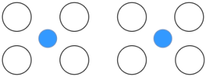](./images/006_2_7.png)

_YUV 4:2:0_

从图例上看，YUV 4:2:0 在宽度方向、高度方向综合起来，每 4 个 Y 分量（2 X 2 的采样区域）将共用一个 UV 分量。

现在，你肯定对 YUV 4:2:0 采样有了更清晰的认识，也明白了为什么 “ Y:U:V = A:B:C ” 是一个错误的“猜测”。同时，参考对 YUV 4:2:2 的分析，我们还可以推断，由于 YUV 4:2:0 进一步降低了对 UV 分量的采样，其采样数据量相对于 YUV 4:2:2 更少，数据得到进一步压缩。

除了以上三种主流的采样格式，YUV 采样格式还有诸如 YUV 4:1:1 等形式，我们就不做展开了。大家只要理解了 “A:B:C” 的规则逻辑，就能举一反三、融汇贯通。虽然 YUV 采样格式众多，**但其模型的共性可总结为：每个像素都会采样亮度分量 Y，但N个像素可能会共用一组色度分量 UV，后者的差异也带来了采样数据量的差异。**

关于 YUV 的采样格式我们就先了解到这里，确定采样格式对于正确处理 YUV 图像是至关重要的，如果采样格式判定错误，会读取到异常的图像。

如下，为基于 YUV444 采样格式读取 YUV420 格式图片的一种异常效果：

_左一：原图，YUV420；    左二：基于 YUV444 读取YUV420_

了解采样格式后，就需要考虑如何进行存储，YUV 的存储格式也有好几类，并且一种采样格式还可以选择不同的存储格式，不同采样格式搭配不同的存储格式，得到了不同的 YUV 类型，这些知识综合起来还是有一定理解和记忆难度的，大家跟着我的思路继续往下学习。

### 2 YUV的存储格式  

在阐述 RGB 色彩空间的存储格式时，我们重点关注了各个分量存储时的 “排列方式”，依据排列的顺序不同得到了 RGB 和 BGR 两种存储格式。在学习 YUV 的存储时，我们也可以借鉴这个思路。

比较特殊的是，**我们现在要引入数组，来表示 YUV 的一种存储结构****：平面（Plane）**。我们使用一个数组表示一个存储 “平面” ，N个不同的数组即为 N 个平面。基于平面的概念，再按 YUV 存储时的各分量的排列顺序不同、使用的平面数量不同，我们可以**将 YUV 存储格式分为三大类：打包模式（Packed）、平面模式（Planar）和 半平面模式（Semi-Planar）。**

我们先了解下各个模式的规则概述：

*   **打包模式（Packed）**：使用一个平面进行存储。在平面1上，将每个像素的 Y、U、V 分量打包后连续、交错存储；
*   **平面模式（Planar）**：使用三个平面进行存储。在平面1上，先连续存储所有像素点的 Y 分量；然后在平面2上，存储所有像素点的 U 分量；最后在平面3上，存储所有像素点的 V 分量（ U 和 V 的顺序可以交换）；
*   **半平面模式（Semi-Planar）**：使用两个平面进行存储。在平面1上，先连续存储所有像素点的 Y 分量；然后在平面2上，连续、交错存储所有像素点的 U、V分量（ U 和 V 的顺序可以交换）。

以上规则的描述，还是比较清晰的，我们下面结合具体的采样格式，看看不同采样格式、在不同存储格式下的具体表现。为便于理解，我们仍然基于 “宽度为 4 个像素、高度为 2 个像素” 的采样区域作讲述。

#### **2.1 YUV 4:4:4 的存储格式**

YUV 4:4:4 采样格式比较简单，相应的，其对应的存储格式也比较好理解。YUV 4:4:4  使用打包模式（Packed）进行存储时，4×2 像素采样区域的存储图示如下：

[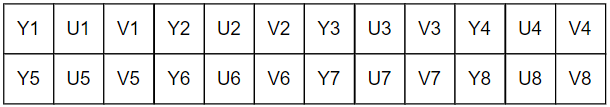](./images/006_2_9.png)

打包模式仅使用一个平面即可，我们可以将这个存储平面视为一个 12×2 的数组。

YUV 4:4:4 如果使用平面模式（Planar）进行存储，如下图：

[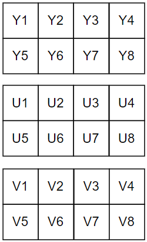](./images/006_2_10.png)

可以看到，从打包模式变为平面模式，存储平面增加了两个。YUV 各分量分别存储在不同的平面，每个平面均为一个 4×2 的数组。在 YUV 4:4:4 采样、平面模式存储下，如果按先 Y、再 U 、最后 V 的顺序存储，我们称这种 YUV 类型为 I444。如果调整存储顺序为先 Y、再 V 、最后 U，得到 YUV 类型为 YV24 。

最后，我们再来看看 YUV 4:4:4 使用半平面模式（Semi-Planar）存储的效果：

[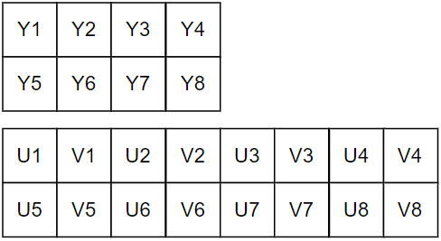](./images/006_2_11.png)

半平面模式下，存储平面为两个，分别存储 Y 分量和 UV 分量。其中存储 Y 分量的平面为 4 x 2 的数组，存储 UV 分量的平面为 8 x 2 的数组。YUV 4:4:4 采样、半平面模式存储下，如果第二个平面按 U、V 的顺序存储，对应的 YUV 类型为 NV24。若使用 V、U 的顺序存储，则为  NV42。

以上，即为 YUV 4:4:4 采样在不同存储格式的表现，以及各种采样格式、存储格式搭配得到的不同 YUV 类型。接下来，按照相同的思路，我们看看 YUV 4:2:2、YUV 4:2:0 的表现。

#### **2.2 YUV 4:2:2 的存储格式**

YUV 4:2:2 下各个分量的采样逻辑已经讨论过，结合上文，可简要概括为 “ Y分量全采集，宽度方向每两个 Y 分量共用一组 UV 分量，高度方向每行独立采集 UV 分量 ”，如果你对此不是很理解，可以回到 2.1 节再复习一下。

YUV 4:2:2 使用打包模式（Packed）存储，效果如下图(浅蓝色填充的每组 UV 分量，属于左右两个 Y 分量共用的采样)：

[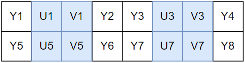](./images/006_2_12.png)

YUV 4:2:2 打包模式存储下，唯一平面为 8×2 的数组，每个 Packed 内部的顺序为 Y U V Y，并且遵循两个 Y 共用一组 UV 的特征，其得到的 YUV 格式为 YUVY（和 Packed 内顺序一致）。类似的，按照 Packed 内各分量顺序不同，还可以得到 YUV 类型 VYUY 和 UYVY。

YUV 4:2:2 使用平面模式（Planar）存储，效果如下：

[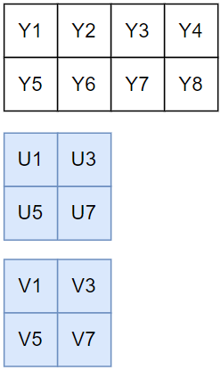](./images/006_2_13.png)

YUV 4:2:2 平面模式存储下，三个平面分别为 4×2、2×2、2×2 的数组，若后两个平面先存 U 后存 V ，则得到 YUV 类型  I422。若先存 V 后存 U ，则得到 YUV 类型  YV16。

YUV 4:2:2 使用半平面模式（Semi-Planar）存储，效果如下：

[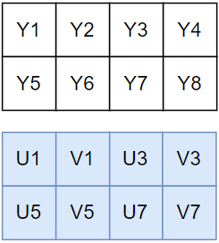](./images/006_2_14.png)

YUV 4:2:2 半平面模式存储下，两个平面均为 4×2 的数组，第二个平面内，若按 U、V 顺序交错存储，则得到 YUV 类型  NV16。若按 V、U 顺序交错存储，则得到 YUV 类型  NV61。

#### **2.3 YUV 4:2:0 的存储格式**

以上，YUV 4:4:4 和 YUV 4:2:2 的主要存储格式已介绍完毕，最后我们再来看看最常用的采样格式 YUV 4:2:0 的存储。YUV 4:2:0 主要使用平面模式（Planar）和 半平面模式（Semi-Planar）。

结合上文，YUV 4:2:0 采样可简要概括为 “ Y 分量全采集，宽度方向和高度方向每四个 Y 分量共用一组 UV 分量，即第二行复用第一行的 UV 采样”，如果你对此不是很理解，可以再回到 2.1 复习一下。

YUV 4:2:0 使用平面模式（Planar）存储：

[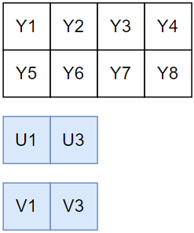](./images/006_2_15.png)

YUV 4:2:0 平面模式存储下，三个平面分别为 4×2、2×1、2×1 的数组，若后两个平面先存 U 后存 V ，则得到 YUV 类型  I420。若先存 V 后存 U ，则得到 YUV 类型  YV12。

YUV 4:2:0 使用半平面模式（Semi-Planar）存储：

[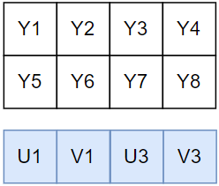](./images/006_2_16.png)

YUV 4:2:0 半平面模式存储下，两个平面分别为 4×2、4×1 的数组，第二个平面若按 U、V 顺序交错存储，则得到 YUV 类型  NV12。若按 V、U 顺序交错存储，则得到 YUV 类型  NV21。

以上，即为 YUV  主流采样格式在不同存储模式下的表现，以及各种组合搭配得到的不同 YUV 类型。值得一提的是，在诸多 YUV 类型中，NV21 是 Android 系统相机使用的类型，而 NV12 被 iOS、MAC 系统相机使用（前面提到，iOS 和 MAC 也会使用 BGRA），大家今后会经常遇到它们，可以优先熟悉熟悉。

与 RGB 一样，我们只有确认了 YUV 图像的存储格式，才能对其进行正确地处理，使用错误的格式会导致颜色异常。

如下，原图为使用平面模式存储、先存 U 平面、再存 Y 平面的 YUV420 图像（I420），如果按 YV12 格式读取（平面模式存储、先存 V 平面、再存 U 平面）将得到图2。

_左一：原图，I420；左二：基于 YV12 读取 I420_

为方便查阅，我们再将上面提及的，不同采样格式、存储模式、UV 存储顺序以及 YUV 类型的匹配关系，通过表格整理一下：

[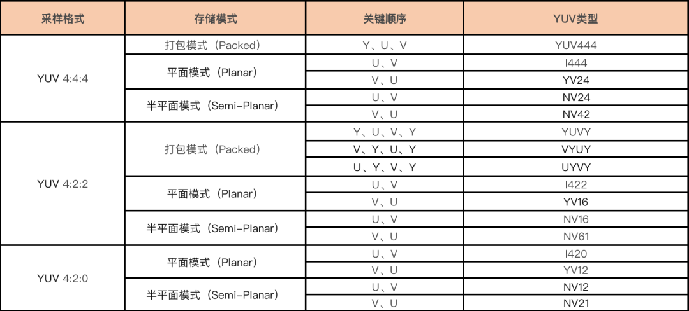](./images/006_2_18.png)

## 总结

不得不说，相较于 RGB，YUV 的采样格式和存储格式还是比较复杂的，组合得到的 YUV 类型也是眼花缭乱，你此时或许已云里雾里。这么多格式和类型，该如何去记忆呢？

答案是：无需死记硬背某种具体格式、类型的细节，当我们需要用到的时候，再查阅资料即可。我们需要重点掌握的，是对 “采样格式”、“存储格式” 概念规则的理解，在理解概念规则的基础上，对于任何⼀种 YUV 类型，我们都可以按 **“确认采样格式 → 确认存储格式 → 确认 UV 存储顺序”** 的思路进行分析，如前面所说，做到融会贯通方可举一反三。

最后，我们通过一个思维导图，梳理一下本篇文章的知识脉络：

[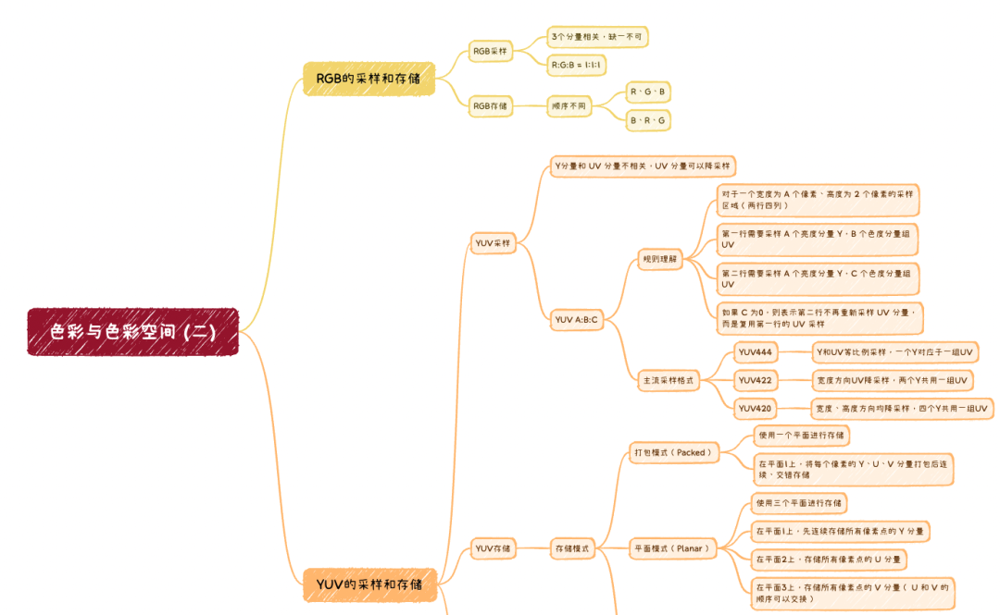](./images/006_2_19.png)

[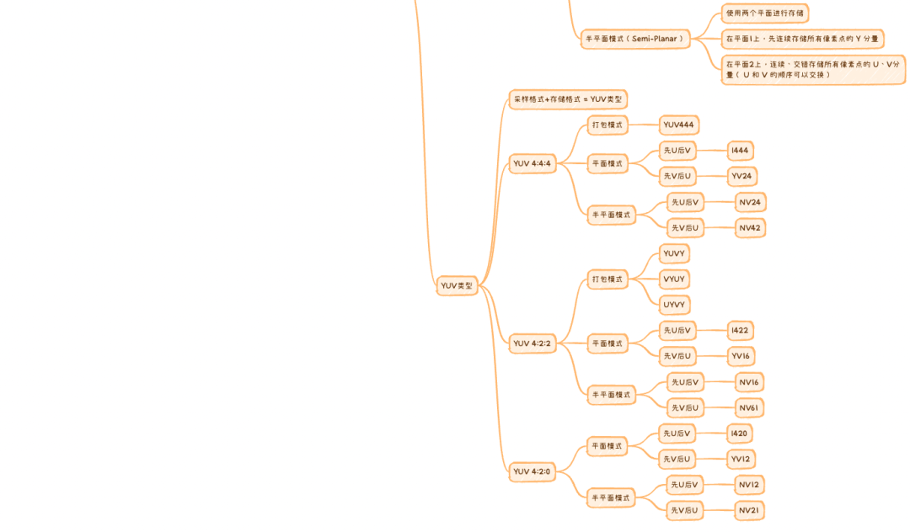](./images/006_2_20.png)

## 思考题

### 上期思考题揭秘

问

RGB颜色空间也能表示黑白色和彩色，为什么还需要YUV来解决黑白电视和彩色电视之间的兼容互通问题呢？

答

在黑白电视向彩色电视的过渡期，两种类型的电视系统需要共存互通。RGB 色彩空间可以满足彩色电视的显示需求，也完全能胜任黑白画面的显示任务，但是如果统一使用RGB色彩空间，会存在如下问题：

1、RGB 即使只表示黑白，也需要存储三个分量，只不过各分量的值均是0或1。而黑白电视作为旧系统，只能处理一个亮度分量，无法向前兼容RGB； 

2、RGB 必须使用三个通道，会极大增加传输带宽的压力。 而 YUV 很好地解决了上述问题： 1、黑白电视可以仅接收 Y 信号、忽略 U、V 信号，向后兼容；

2、YUV 可以与 RGB 无损转换，向前兼容；

3、YUV 可以对 UV 分量进行降采样，降低数据量同时色彩保真，节省带宽。

### 本期思考题

请参照 YUV 采样格式的“规则”，说明 YUV 4:1:1 的采样逻辑？

（我们下期揭秘）