在前两篇推文中，我们了解了色彩空间、像素、图像和视频之间的组成关系，并且比较详细的学习了色彩空间 RGB、YUV 的采样&存储格式。今天，我们基于这些内容，再补充一些重要的关联知识。  

我们已经知道，像素是图像的基本组成单元，所以对视频图像的存储，实际上是对像素的存储。计算机在处理图像时，需要按一定规则将像素数据从内存中读取出来。这里的“规则”，首先基于色彩的采样 & 存储格式，其规定了色彩分量的“存储顺序”以及“分平面存储逻辑”。但仅知道这些信息，对“单纯”的计算机来说还是不够的，我们必须明确地告诉它：要读取多少字节长度的数据，这里就会引申出 “定量” 的规则。

## 图像位深

由点及面，先从像素开始，**了解每个像素在计算机里是如何“定量”存储的，再扩展到视频图像上**。要学习这部分内容，先给大家介绍一个新面孔：**图像位深**。

其实，在之前 [音频要素](./001.md) 的推文中，我们已接触到 “音频采样位深” 的概念。音频采样位深，指的是用多大的字节空间来存储声音的量化值。一般来说，音频采样位深越大，则声音采样量化的精度越高、失真越少。现在，我们要把位深的概念延伸到视频图像领域。

在视频图像领域，关于位深的概念比较多，诸如：**通道位深、像素位深、色彩位深和图像位深**等。为了避免混淆，在本文中我们要将相关定义统一一下，并以 RGB 图像举例说明如下。

对于 RGB 图像，如果我们分别使用 8bit （1个字节）来存储色彩空间的各个通道分量，则一个完整的 RGB 像素将占用 3\*8 = 24bit 空间（3个字节）。此时，我们称：

*   **通道位深**：8bit，表示存储色彩空间的一个分量（通道）需要 8bit 空间；  
    
*   **像素位深**：24bit，表示存储一个 RGB 像素需要 24bit 空间。

_注：本文中，除非特别说明外，我们提及的图像位深均指像素位深。_

需要补充的是，图像位深 24bit 、通道位深 8bit 是比较标准的位深配置，大家可能还会接触到诸如 32bit、16bit、8bit 等图像位深，它们并不是 3 的倍数，无法平摊到 RGB 或者 YUV 的三个通道上。我们应该如何理解这些 “不规则” 的图像位深呢？

其实，我们只要确认到具体的通道位深，就可以比较清晰的理解了，如下：

*   **32bit 图像位深**：在 24bit RGB 图像的基础上，增加了一个 8bit 的透明通道 A。比如我们上篇推文提到的 RGBA、BGRA 等等，可以称为 RGBA32、BGRA32；

*   **16bit 图像位深**：R、G、B 通道分量，分别使用 5bit、6bit、5bit 通道位深 ，可以称为 RGB565；

*   **8bit 图像位深**：R、G、B 通道分量，分别使用 2bit、3bit、3bit 通道位深，可以称为 RGB233。

除上述举例外，还会有诸如 RGBA4444、RGB555 等等情况。当脱离本文范畴，大家在实际应用中接触到图像位深时，仍需要明确其具体含义，究竟是像素位深、还是通道位深、每个通道又是怎么分配的，避免混淆。

现在，让我们再回到图像位深为 24bit 、通道位深为 8bit 的配置上。在该配置下，RGB 的每一个通道分量可表示 2^8 = 256 个值。这意味着，如果仅考虑 R 分量，就会有 256 种深浅不同的红色。以此类推，三个通道综合，即可以得到 **(2^8)^3 = 16,777,216 种不同的组合**，每种组合表示不同的颜色。这也就是之前的推文中我们说 “RGB 色彩空间可以表示约 1677 万种色彩” 的原因。

显然，**图像位深越大，其像素可表示的颜色数量就越多，视频图像的色彩自然也就越丰富、细腻，在色彩渐变处也会更加平滑**。有一个比较极端的比喻可以用于帮助理解：试想我们要绘制一幅包含了七色彩虹的画，那么拥有七支不同颜色的画笔（高位深）和 只拥有单颜色的画笔（低位深），在绘制效果上自然会呈现出巨大的差异。

参考下图，分别为同一张图像，在 24bit 位深、8bit 位深（2^8 = 256 种颜色）、 4bit 位深（2^4 = 16种颜色）下的表现。

_图1：24 bit_  

_图2：8 bit_

_图3：4 bit_

可以看到，在 24bit 图像位深下，蓝天、云彩、企鹅绒毛的颜色自然细腻、过渡平滑，画面主次鲜明。而位深越低，由于可表示的颜色数量减少，部分颜色数据丢失并被替代，开始出现颜色趋同或断层，画面也越发的不自然。除了降低位深外，位深 24bit 若往上升，也有更高的 30bit（通道位深 10bit ）、36bit（通道位深 12bit ）等等。

那么问题来了，参考上面的对比效果，我们是否应该无条件地使用高位深呢？

答案是否定的。

需要注意的是，虽然图像的位深越大，能够表示的颜色越多，但**相应需要的存储空间也越大，传输所需的带宽也越多**，带来成本的提升，对于软硬件的要求也更苛刻。更何况，24 bit 图像位深已包含 1677 万种颜色，这远远超过了人眼的视觉感知能力，足以满足绝大部分业务场景。综合考量，现阶段仍主要使用 24 bit 的图像位深。

以上就是本期课程关于图像位深的相关知识。

## 图像宽高（Width、Height）与跨距（Stride）

再回到全文的开始：“图像的基本组成单元为像素，对视频图像的存储，实际上是对像素的存储”。基于图像位深，我们可以确定存储一个像素所需的字节数，下面，可以开始“指导”计算机如何定量读取图像数据了。

像素在图像中是一行一行排列、并逐行存储在内存中的，计算机在读取图像时，就需要逐行地、正确地读取出每一行的像素。这里就引出两个问题：每一行究竟有多少个像素？计算机每获取一行数据需要读取多少个字节呢？要解答这两个问题，我们需要再学习两个概念：**图像的宽高 （Width、Height）** 和**跨距 （Stride）**。

### 1 图像宽、高 

说到图像的宽高，大家直觉上可能会联想到 “厘米”、“英寸” 等长度单位，其实，从图像处理的角度并非如此。在视频图像处理上，描述图像宽高时，通常使用的是“计数单位”，而其具体的数值，则由图像的分辨率决定。

关于视频图像的分辨率，在系列推文中还没有和大家正式介绍，但大家对 “分辨率” 肯定是不陌生的。在各大视频/图片网站上、在各种视频/图像文件规格中，我们常看到诸如 540x960（540P）、720x1280（720P）、1080x1920（1080P）等参数，它们就是所谓的**分辨率**，其表示的含义为：**图像在水平方向、垂直方向上，每行、每列的像素 “个数”**。

*   **宽（Width）**：水平方向每行的像素个数，等于图像分辨率的宽

*   **高（Height）**：垂直方向每列的像素个数，等于图像分辨率的高

如下图所示，对于分辨率为 540x960 （宽 x 高）的 RGB 图像，其水平方向每行有 540 个 RGB 像素，垂直方向每列有 960 个 RGB 像素。

[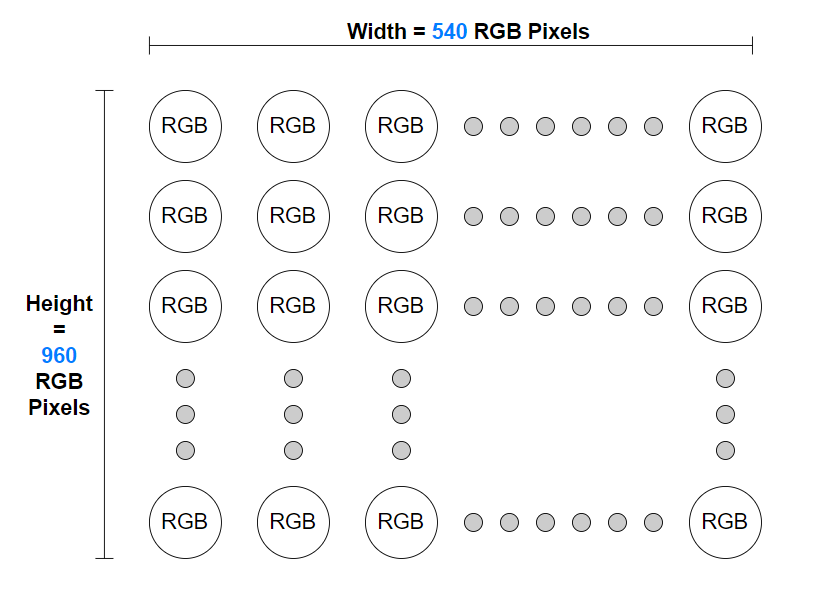](./images/006_3_4.png)

_图4：像素排布，分辨率 540x960，宽 x 高_

不难发现，分辨率宽高相乘得到的数值 = 图像中像素的总个数，540 x 960 的 RGB 图像中包含 518400 个像素，分辨率越高，像素的个数也就越多。

关于分辨率的知识，我们今后还会有专题作进一步讨论，今天大家了解到分辨率与图像宽高、像素个数的关系即可。

现在，我们已经通过分辨率信息，确定了图像每行的像素个数，可以尝试计算每行数据的长度（字节）。因为视频图像的处理通常是逐行进行的，计算机更关注每行有多少数据，而对于具体有多少行（Height）没有太多的要求。

以 24bit 的 RGB 图像为例，假设分辨率为 538 x 960，因为每个像素的 R、G、B 分量都连续存储在同一平面上（详见前文 [色彩和色彩空间-中篇](./006_2.md)），我们可以通过如下步骤，计算每行像素的字节长度：

*   每行像素的个数 = 图像分辨率宽 = 538
    
*   每行像素的字节长度 = 像素位深 x 每行像素的个数 = 24 bit x 538 = 1614 byte（ 注：1 byte = 8 bit）

如上，我们得到结论：对于分辨率为 538 x 960 的 RGB 图像，每行有 1614 byte 数据。计算过程看起来清晰明了，有理有据，于是我们信心满满地将 1614  byte 这个字节长度告知计算机，计算机也一丝不苟地按要求去读取一张 538x960 的图片。却可能会得到如下的结果：

_图5：原图，分辨率 538x960_ 

[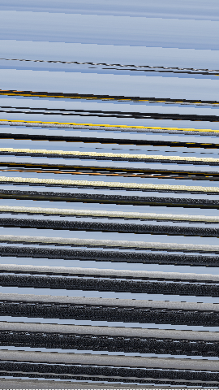](./images/006_3_6.png)

_图6：按每行1614 byte数据，进行读取和渲染_

我们发现，实际渲染出来的图像，呈现出规则的斜条纹，与原图相比已面目全非。

为什么会出现这样的问题呢？难道是计算机出现了 Bug ？或者说，计算机是无辜的，图像每行的像素个数实际上并不等于图像的分辨率宽度 ？要解答这些问题，我们就需要了解另外一个概念：跨距 （Stride）。

### 2 图像跨距

我们知道，计算机的处理器主要是 32 位或 64 位的，当处理器执行运算时，一次读取的完整数据量最好为 4 字节 或 8 字节的倍数。如果我们要求计算机读取非 4 字节或 非 8 字节对齐的数据，它就需要进行额外的处理工作。额外工作的引入，势必会影响效率和性能。为了规避这样的问题，就需要**在原始数据的基础上，再增加一些“无效数据”**，使待处理的数据量对齐到 4 字节 或 8 字节 。这样计算机才能以最高效的方式工作。当然，对齐规则也不一定是 4字节/8字节 的倍数，实际仍取决于具体的软硬件系统。

回过头来，看看前面计算得到的 “1614 byte”，大家是否发现问题了呢？

是的，这并非一个 4 字节或 8 字节倍数的数值。所以，基于前述的考量，如果在一个要求 4 字节 或 8 字节 对齐的系统内存中存储该图像，往往需要增加一些额外数据，将 1614 byte 对齐到比如 1616 byte。而这里的 1616 byte，即称为图像的跨距 （Stride）。

**跨距 （Stride），是图像存储在内存中，每一行数据所占空间的真实大小**，它大于或等于通过图像分辨率宽度计算的字节长度。每读取一个 Stride 长度的数据，意味着完整读取了图像的一行，下次读取就该“换行”了。其中，用于补齐至 Stride 而增加的额外数据，我们称之为填充（Padding）。Padding 仅影响图像在内存中的存储方式，无需（也不可以）用于实际渲染。

我们可以通过下图，直观的理解 Width 、Padding 和 Stride 的关系。

[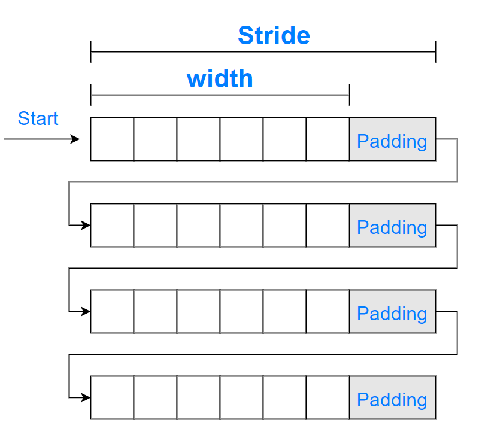](./images/006_3_7.png)

_图7：Width 、Padding 和 Stride_

参考上图，从 Start 位置开始， 计算机只有按 Stride 读取每一行图像数据，再按 Width 进行实际的渲染，避免将无效的 Padding 渲染出来，才能显示出正常的图像。如果仅使用 Width 计算 Stride（比如上面，我们告诉计算机将 Stride 设置为 1614 byte），那么就可能会**误将部分 Padding，视为有效的图像数据进行渲染**，行与行之间的像素相对位置也将发生累计偏移，出现诸如斜条纹等异常。

我们也可以通过一些简化的方式，来**理解斜条纹产生的原理**。

参考下图，我们先忽略“字节长度”，简单地把图像数据、填充数据的单位都统一至“像素”。假设原图的 Width x Height = 6 x 8，存储时将 Stride 对齐为 8。图中彩色部分为真实图像（原图左侧），黑色部分为填充的 Padding（原图右测），中间存在的空白间隙仅为方便区分。

[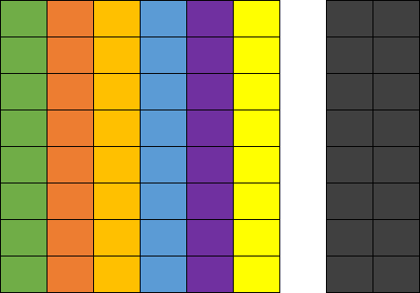](./images/006_3_8.png)

_图8：原图， Stride = 8，Width = 6_

若使用正确的配置， Stride = 8 进行读取，Width = 6 进行渲染，则仅会显示出彩色部分， 黑色部分的 Padding 在渲染时会被忽略。

如果使用错误的 Stride = 7，正确的 Width = 6，会出现如下问题：从第一行开始，少读取了一块 Padding，并将这部分少读取的 Padding ，误当作第二行的 “有效图像” 进行读取、排列。最终，计算机再以 Width = 6 进行渲染时，将得到如下图像，出现了右侧下沉的斜条纹效果。

[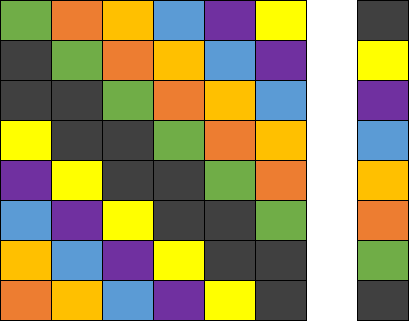](./images/006_3_9.png)

_图9：错误，Stride = 7，Width = 6，右侧下沉的斜条纹_

同理，Stride 偏大、Width 偏大、Width 偏小，都会影响图片的读取和渲染，大家在处理时需要注意。我们在下面也展示出相关的简化参考图：

[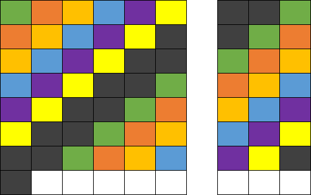](./images/006_3_10.png) 

_图10：Stride = 9，Width = 6，左测下沉的斜条纹_

[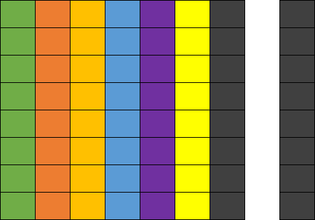](./images/006_3_11.png)

_图11：Stride = 8，Width = 7，多渲染出一列Padding数据_

注意，实际应用中如果 Padding 数据被错误渲染出来，不一定都是黑色的，具体由填充的数据而定。如果都使用 0 值填充，那么 RGB 图像的 Padding 为黑色，YUV 图像的 Padding 则为绿色。其他可能的错误情况，大家可以自己尝试推演一下，在此就不过多展开。

### 3 分平面 YUV 的 Width、Stride

上面对于 Width 、Stride 的讨论，都是基于 RGB 图像来举例。对于 RGB 图像，其色彩空间分量是同一平面、连续存储的，一般只需考虑一个平面的 Width 和 Stride。

而 YUV 图像比较特殊，它可能使用分平面（ Planar 、Semi-Planar ）的存储方式（详见[色彩和色彩空间-中篇](./006_2.md)）。

从整个图像的角度看，YUV 图像的每一行依旧有 Width = 720 个像素。但是从存储的角度看，Y、U、V 分量可能存放在不同的平面，计算机想要理解 YUV 色彩，就需要知道：**在每个平面上、每次要读取多少数据，才能正确地组合成原始图像的一行像素**。

“在每个平面上、每次要读取多少数据”，意味着需要知道每个平面的 Width 和 Stride。而考虑到 U、V 分量相对于 Y 分量可能有降采样，各个分量平面的 Width、Stride 可能不同， 必需要按存储规则分别求取。

下面，我们针对常见的 YUV 格式：I422、 I420 和 NV21 ，具体讨论一下，何谓分平面的 Width 和 Stride。  

我们将基于通道位深 = 8 bit，图像分辨率 Width = 720，Height = 1280，展开后续内容的讲解。为方便理解、简化过程，我们**假设处理器以 4 字节对齐，通过各平面 Width 计算得到的数据长度若满足 4 的倍数，即可作为各平面的 Stride，无需考虑 Padding 填充。**

关于这三种 YUV 格式的采样&存储原理，大家可详细参考上一篇推文 [色彩和色彩空间-中篇](./006_2.md)，下面用到时仅做简述。

由于 I422、 I420 和 NV21 的 Y 平面采样逻辑相同，Y分量均为全采样，我们先统一进行计算。

对于 Y 平面，因为 Y 分量为全采样，故:  

*   Width\_Y\_Plane = 每行 Y 分量个数 = 图像每行像素个数 = Width = 720

*   Stride\_Y\_Plane = Width\_Y\_Plane x 通道位深 = Width\_Y\_Plane x 8 bit = 720 byte

_注：因为 Width\_Y\_Plane x 8 bit = 720 byte 满足预设的对齐要求，故直接作为 Stride\_Y\_Plane，实际应用中，需要另外进行确认。后面若有类似处理，不再重复说明。_

对于 U、V 平面， 因为 U、V 分量在不同 YUV 格式下有不同的采样、存储逻辑，需要按规则具体计算。

#### **3.1 I422**

I422 的采样和存储逻辑简述为：

*   **采样**：Y 分量全采集，宽度方向每两个 Y 分量共用一组 UV 分量，高度方向每行独立采集 UV 分量

*   **存储**：Y、U、V 分别存储于三个平面，对于一个宽度为 4 个像素、高度为 2 个像素的采样区域，三个平面分别为 4x2、2x2、2x2 的数组 

[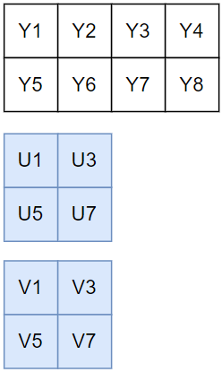](./images/006_3_12.png)

对于 U 平面， U 分量水平方向的采样为 Y 分量的 1/2，故：

*   Width\_U\_Plane = 每行 U 分量个数 = 每行像素个数/2 = Width/2 = 360

*   Stride\_U\_Plane =  Width\_U\_Plane x 通道位深 = 360 byte

对于 V 平面，其采样存储逻辑与 U 平面一致，故：

*   Stride\_V\_Plane =  Width\_V\_Plane x 通道位深 = 360 byte。  

如果使用数组 Stride\_I422\[3\] 记录三个平面的跨距（字节长度），即有 Stride\_I422\[3\] = { Width, Width/2, Width/2}（使用 Width 的数值大小来表示）

#### **3.2 I420**

I420 的采样和存储逻辑简述为：

*   **采样**：Y分量全采集，宽度方向和高度方向每四个 Y 分量共用一组 UV 分量，也即第二行复用第一行的 UV 采样；

*   **存储**：Y、U、V 分别存储于三个平面，对于一个宽度为 4 个像素、高度为 2 个像素的采样区域，三个平面分别为 4x2、2x1、2x1 的数组。

[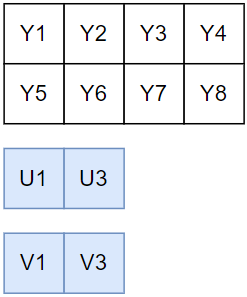](./images/006_3_13.png)

对于 U 平面，U 分量水平方向的采样为 Y 分量的 1/2（每行），故：

*   Width\_U\_Plane = 每行 U 分量个数 = 每行像素个数/2 = Width/2 = 360

*   Stride\_U\_Plane =  Width\_U\_Plane x 通道位深 = 360byte

对于 V 平面，其采样存储逻辑与 U 平面一致，故：

*   Stride\_V\_Plane =  Width\_V\_Plane x 通道位深 = 360byte

如果使用数组 Stride\_I420\[3\] 记录三个平面的跨距（字节长度），即为 Stride\_I420\[3\] = { Width, Width/2, Width/2 }

#### **3.3 NV21**

NV21 的采样和存储逻辑简述为：

*   **采样**：Y分量全采集，宽度方向和高度方向每四个 Y 分量共用一组UV分量，也即第二行复用第一行的 UV 采样

*   **存储**：Y、UV 分别存储于两个平面，对于一个宽度为 4 个像素、高度为 2 个像素的采样区域，两个平面分别为 4x2、4x1 的数组，UV 共同存储于第二个平面，并按 V、U 的顺序交错存放

[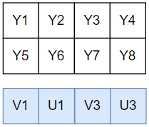](./images/006_3_14.png)

对于 UV 平面，因为 U 、V 水平方向采样均为 Y 分量的1/2（每行） ，并且连续交错存储，故：

*   Width\_UV\_Plane = 每行 U分量个数 + V 分量个数 = 每行像素个数/2 + 每行像素个数/2 =  Width = 720

*   Stride\_UV\_Plane =  Width\_UV\_Plane x 通道位深 = 720 byte

如果使用数组 Stride\_NV21\[2\] 记录两个平面的跨距（字节长度），即为 Stride\_NV21\[2\] = { Width, Width }  

需要特别注意的是，虽然综合所有平面来说，I422、I420、NV21 每次读取的 Stride 总和，均为 Width x 2 ：

*   Stride\_I422\[0\] + Stride\_I422\[1\] + Stride\_I422\[2\] = Width x 2

*   Stride\_I420\[0\] + Stride\_I420\[1\] + Stride\_I420\[2\] = Width x 2

*   Stride\_NV21\[0\] + Stride\_NV21\[1\] = Width x 2 
    
但对于 I420 和 NV21，因其 “宽度方向和高度方向每四个 Y 分量，共用一组UV分量” 的特性，每次读取 U、V 平面、或 UV 平面的一行数据，实际是供 Y 平面的两行数据共用的。因此，平均下来，读取整张图像的数据总量会存在差异：

*   Data\_I422 = Data\_Y + Data\_U + Data\_V
    
    = Height x Width + Height x Width/2 + Height x Width/2 
    
    = Height x Width x 2

*   Data\_I420 = Data\_Y + Data\_U + Data\_V
    
    = Height x Width + Height/2 x Width/2 + Height/2 x Width/2 
    
    = Height x Width x 1.5

*   Data\_NV21 = Data\_Y + Data\_UV

    = Height x Width + Height/2 x Width 
    
    = Height x Width x 1.5

可以看到，Data\_I422 大于其余两个。这也证明了 ，YUV420 相对于 YUV422，前者采样数据量更小、压缩率更大。

## 总结

以上，即为常见 YUV 格式 Width 、 Stride 的计算方法。如果大家在理解上有些难度，可以再回顾一下 [色彩和色彩空间-中篇](./006_2.md) 的内容，结合进行梳理。需要再次强调的是，为方便理解，上面的讲述中默认： **使用 Width 直接计算得到的 Stride 符合对齐要求，无需考虑 Padding 填充**，而实践中考虑到不同系统、硬件芯片的对齐处理差异，真实的 Stride 是否要做补齐，仍需再具体确认。

至此，关于计算机如何正确地 、“定量” 读取视频图像数据，我们也有了一定的了解。考虑到硬件芯片、操作系统的多样性，色彩空间采样&存储格式的多样性，要完全厘清所有的 “定量” 规则，还是比较麻烦的。

不过，在使用 “自定义视频采集” 功能时，前面提及的色彩空间、采样&存储格式、Width 和 Stride 等概念，就需要你了然于胸，否则就可能出现诸如“斜条纹”的问题。

最后，我们通过一个思维导图，再梳理一下本文的核心内容。

[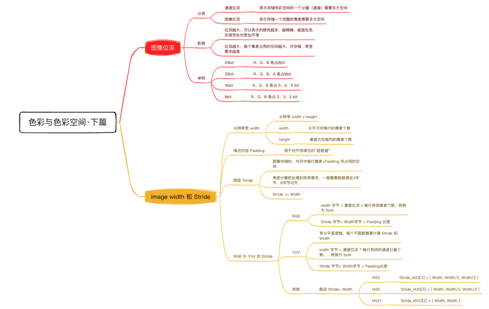](./images/006_3_15.png)

  
参考推文中的举例，假设原图的 Width x Height = 6 x 8，存储时将 Stride 对齐为 8。当使用 Stride = 8，Width = 4，进行读取和渲染，会出现什么问题？

## 思考题

### 上期思考题揭秘

问

作为请参照 YUV 采样格式的“规则”，说明 YUV 4:1:1的采样逻辑。

答

对于一个宽度为 4 个像素、高度为 2 个像素的采样区域（两行四列），第一行需要采样 4 个亮度分量 Y，1 个色度分量组 UV，第二行需要采样 4 个亮度分量 Y，1 个色度分量组 UV。

也即水平方向上，Y分量为全采样， UV 分量组相对于 Y分量做1/4 降采样。

### 本期思考题

参考推文中的举例，假设原图的 Width x Height = 6 x 8，存储时将 Stride 对齐为 8。当使用 Stride = 8，Width = 4，进行读取和渲染，会出现什么问题？

（我们下期揭秘）

  

