在视频系列的前几篇推文中，我们已经接触了视频相关的不少概念，它们都是围绕着几个核心角色 ：色彩、像素、图像和视频来展开的。这几个核心角色之间的关系，大家应该都有了基本的了解，我们再来简单回顾一下。

[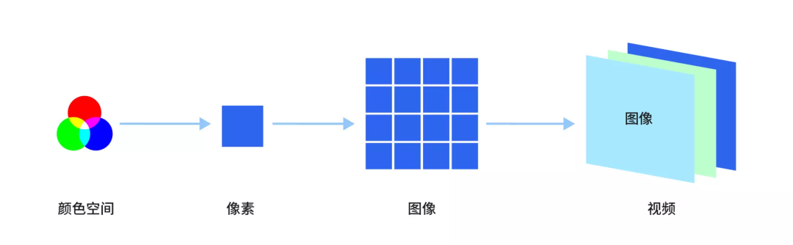](./images/007_1.png)

**从颜色空间到色彩：**通过特定的颜色空间 “ YUV “ 或 ” RGB ”，对色彩进行定义；

**从色彩到像素：**将定义、量化后的色彩信息记录到像素中；

**从像素到图像：**一定数量、记录了不同色彩信息的像素组合，得到一帧完整的图像；

**从图像到视频：**一帧帧图像按 一定频率 连续播放，得到了视频。

以上，就是由像素点及图像、由图像及视频的关系概述。你可能有关注到，在该概述中有两个比较模糊的描述：一定数量 的像素，以及按 一定频率 播放的图像。那么问题来了，所谓 “数量” 和 “频率”，究竟是如何定义的、具体取值是多少呢 ？它们对于视频图像会有哪些具体的影响？

## 何谓“一定数量”的像素？

“一定数量的、记录了不同色彩信息的像素组合在一起，得到一帧完整的图像”。

关于 “一定数量” 是如何定义的，在系列的上一篇推文中，我们就给出了标准答案：分辨率。分辨率的定义大家已初步了解，下面先回顾一下。

*   **分辨率：**视频图像在水平方向、垂直方向上，每行、每列的像素数量。比如：分辨率 1280 x 720（宽 x 高），即表示水平方向上每行有 1280 个像素，垂直方向上每列有 720 个像素；
*   **分辨率宽、高相乘得到的数值，即为每帧图像所含像素的总数。**比如：分辨率 1280 x 720（宽 x 高），即说明每帧图像共包含 1280 x 720  = 921600 个像素

上述定义中，使用了一种常见的分辨率表示方式：“ 宽 x 高 ” ，实际应用中还有其他表示方法，有的只关注 “高” 的属性、有的只关注 “宽” 的属性，常见的有：

*   1080P： 表示分辨率 1920 x 1080。P（Progressive）表示逐行扫描，1080P 表示垂直方向有 1080 行像素（“高” 的属性）。类似的还有：360P（640×360）、540P（960×540）、720P（1280×720）等；
*   4K：表示分辨率 4096 x 2160 或 3840 x 2160。K 表示 “1000” 或 “千”，4K 表示水平方向有约 4000 列像素（“宽” 的属性）。类似的还有 2K（2560 x 1440）、8K（7680 x 4320） 等等。

分辨率的定义，回答了关于 “一定数量” 的问题，但也仅仅是解释了 “数量” 的定义，并没有描述 “数量” 的影响。至于不同分辨率、不同数量的像素，究竟会给图片带来哪些影响，我们需要进一步做讨论。

## 分辨率的影响

所谓眼见为实，对于视频图像而言，没有比直接观察更直观的理解方式了。下面的几幅图，分别是同一个图像画面在 1 x 1、12 x 7、128 x 72、1280 x 720 等分辨率下的表现，我们逐一观察对比。

_（注：在同一显示设备上，单个像素的大小一般是相同的，像素越多、画面面积越大。因为画幅显示限制，也为方便大家观察，下述各图像的尺寸有做一定缩放，不一定符合比例关系，但分辨率的大小关系不变。）_

[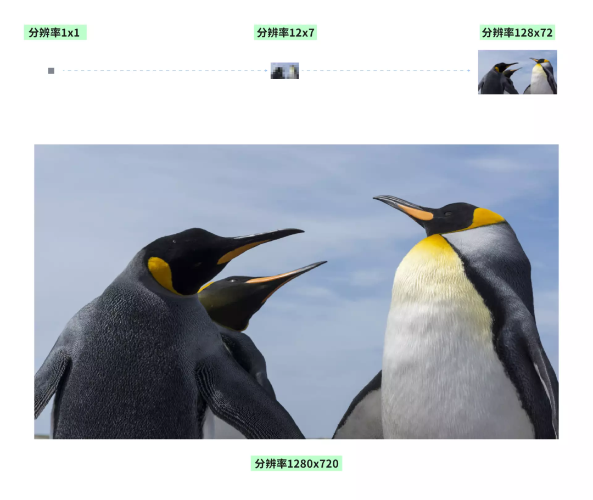](./images/007_2.png)

**1 x 1 分辨率：**这是一个极端的例子，此时整张图像只有一个像素（单像素的面积非常小，肉眼很难识别到，示例图是放大之后的），只能表示一种颜色，看起来是一个纯色的矩形块，基本不包含有效的图像信息。

**12 x 7 分辨率：**我们有 84 个像素，相对于 1 个像素时可以表示更多的颜色。有了颜色区分后，我们可以看到画面有了一些轮廓，但是整体还是糊成一团，但很难辨识到主体的特征。

**128 x 72 分辨率 ：**像素数量增加到较可观的 9216 个，我们将有更多的像素来记录画面信息，画面中的天空、企鹅等主体开始变得明朗、可分辨，但整体还是有些“朦胧”，缺少细节，就像蒙着一层薄纱。

**1280 x 720 分辨率：**像素数量已接近十万，我们将拥有足够的像素来记录画面细节，可以看到，企鹅的毛发、神情、姿态，天空的云彩层次都变得 清晰，整个画面愈发的 真实、细腻。

从完全不可辨识，到模糊朦胧，再到清晰细腻，这就是分辨率由低到高所带来的、最直观的改变。

简单总结，**一般来说分辨率越高，像素越多，则图像的 “可分辨度” 越高，画面越清晰、细腻，细节也越充足生动。**但注意，这里强调了“ 一般来说”，因为 “分辨率”和“清晰度” 若要满足 “正相关” 的关系，还需要考虑一些前提条件，如果忽略这些条件，你可能会遇到“分辨率越高，画面却越模糊”的问题。具体是哪些条件呢？我们待会要讨论的内容就会涉及这块儿，在讨论中揭晓答案。

## 音视频处理路径上的不同分辨率

在本课程的系列推文中，我们曾提到音视频数据的的主要处理路径，主要包括采集/渲染、前/后处理、编码/解码、网络传输收/发等环节。**每一个环节，都可能会修改音视频数据**，而分辨率作为视频图像的基础属性，不可避免地会受到影响。

我们将常见的、分辨率可能变动的位置标识出来，可以得到下方的路径图：

[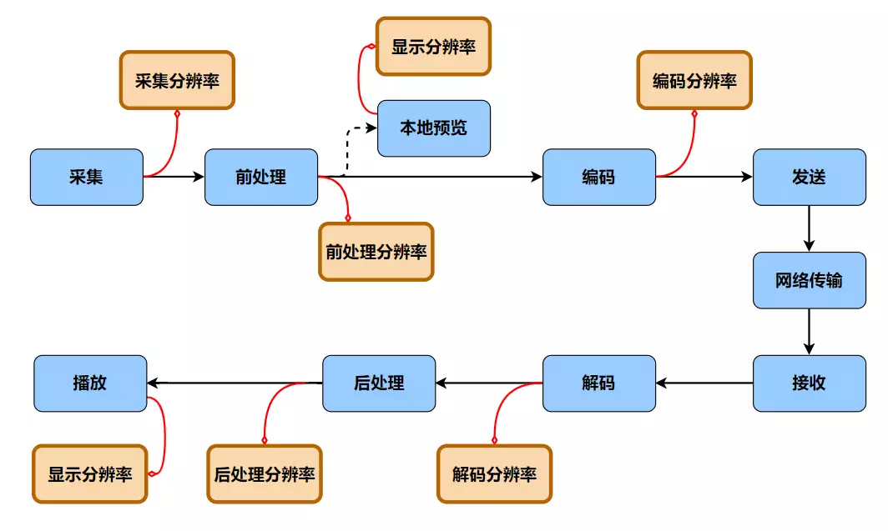](./images/007_3.png)

上图中有多种类型的“分辨率”，我们来逐一梳理。

### 1 采集分辨率

和音频一样，视频图像数据的处理一般从采集开始，首先要介绍的，便是 “采集分辨率” 。**采集分辨率是从摄像头等采集源获取的、最原始图像的分辨率。**物理摄像头所支持的采集分辨率可以通过系统 API 获取，一般是个有限的集合。如果你要求摄像头提供该集合之外的配置，它可能会返回集合内的其他临近值。

在采集之后，图像数据会来到前处理阶段，执行诸如背景虚化、美颜、滤镜等操作，前处理过后的视频图像分辨率，我们不妨称之为 “前处理分辨率”。采集分辨率和前处理分辨率，均表示当前处理环节上，一帧图像所包含的原始像素数量，而接下来的 “显示分辨率” 有所不同。

### 2 显示分辨率   

当我们需要渲染视频图像时，比如在本地实现摄像头的预览，就会接触到显示分辨率。显示分辨率指的是整个显示器面板、或者某个指定的显示区域上可用于图像渲染的像素数量，而不是原始图像的分辨率。

“指定的显示区域” 可以是某个 View 布局组件、某个播放器窗口等等，该局部区域上的分辨率，是更灵活意义上的 “显示分辨率”。如下图所示，显示分辨率指的是红框内的像素宽高。

[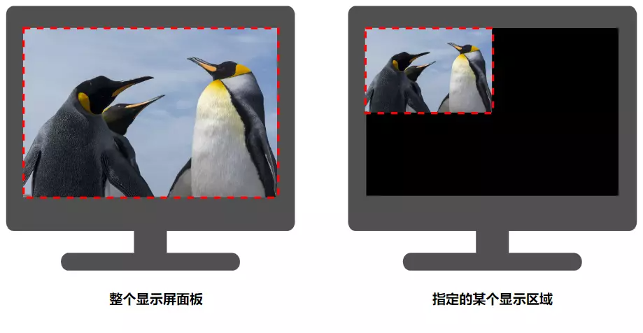](./images/007_4.png)

显示分辨率一般是固定的（尤其指的是整个显示屏面板时），也可以使用宽、高方向的像素数量来定义。比如 4K 屏、2K 屏，就是指显示屏面板在水平方向上最多可容纳 约 4000 列、2000 列像素。需要注意的是，显示分辨率与显示屏尺寸是不同的概念，后者使用长度单位（英寸），一般取显示面板的对角线长度作为度量，比如常说的 27 寸、24 寸 屏。也正因度量标准不同，相同尺寸的显示区域，可以有不同的分辨率。比如 27 英寸的显示屏可能是 2K 的分辨率、也可能是 4K 的分辨率。

显示尺寸相同时，若显示分辨率越高，则说明显示器的像素越密集，意味着它可以更高密度地呈现画面细节，显示效果越细腻，画面拟真度越高。

### 3 编码分辨率 

除了用于本地预览，前处理后的视频图像数据还要继续走到编码环节，进一步做压缩处理后才能用于网络传输。而在视频编码前，为了满足特定的业务需求、或带宽流量的控制需求，仍可能要修改分辨率，最终以 “编码分辨率” 的配置输出。

编码后，视频图像数据从发送端启程，经过漫漫网络传输链路，来到接收端。一般来说，若云端服务没有对数据做特殊处理，解码阶段的解码分辨率将和前序的编码分辨率一致。解码后的视频数据，会再经由后处理环节，最后渲染到显示器上，相应的也会有后处理分辨率和显示分辨率。

假如，整个处理链路上所有的分辨率均相等，那么所有像素将一一对应、“相安无事”。但如果某个环节设定的分辨率有变动，比如采集分辨率设置为 1280 x 720，显示分辨率设置为 960 x 540，编码分辨率设置为 1920 \* 1080，我们应该如何处理呢？

此时，就需要引出一个基础、却又常用到的视频图像处理技术：缩放。

## 分辨率的缩放

视频图像的缩放指的是分辨率的缩放，也就是放大或缩小分辨率。很多应用场景都会涉及到分辨率的缩放。比如从 1080P 的采集分辨率缩小至 720P 的编码分辨率，以减少传输带宽占用；将分辨率为 720P 的图像，缩小到 360P 的窗口上预览，或者放大到 1080P 的显示器上全屏播放等等。

图像在缩放时，像素数量会随分辨率的变化而增减。但要注意的是，像素的减少并非通过随机地 “删除” 来完成，像素的增加也不是通过凭空 “捏造” 来实现的。两种操作都需要在原有像素的基础上，使用缩放算法计算得到新的像素，然后重建出新的图片。

### 1 分辨率缩放的基本原理

首先，对于分辨率为 W x H 的图像，我们可以将其映射到一个二维坐标系上，每个像素对应一个坐标点，假设左下角像素的坐标为（0，0），则右上角像素的坐标为 （W，H）。由于像素的分布是离散、有限的，它们的坐标也都是整数组合，比如（0，0）、（0，1）、（1，1）、…… 、（W，H）。

[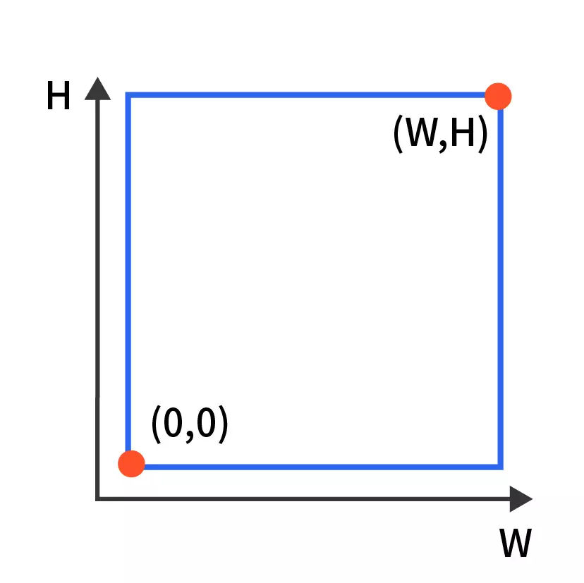](./images/007_5.png)

现在，假设需要将分辨率为 W0 x H0 的原始图像，缩放至分辨率 W1 x H1 的目标图像。我们先对两个图像分别建立坐标系，则二者的像素坐标可分别表示为 P0 ( x0, y0 )、 P1 ( x1 , y1 ) 。缩放的过程，就是已知原图上的像素，求取目标图像的像素 P1 的值过程。

[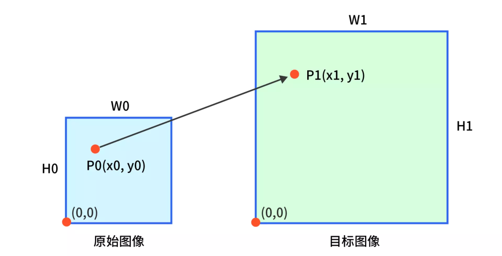](./images/007_6.png)

那么，我们如何计算像素 P1 的值呢？

首先，我们注意到缩放虽然改变了图像的像素尺寸，但仍会保留图像的内容、色彩，也即变化前后的像素值是相同或相似的。最理想的情况，就是能在原始图像上取实际存在的 P0 ，将其像素值直接赋给 P1。假设，缩放前后的分辨率未发生改变（ W0 = W1，H0 = H1），那么目标图像的 P1 ( 0 , 0 ) 在原始图像中的映射即为 P0 ( 0, 0 )，P1 ( 1 , 1 ) 的映射为 P0 ( 1, 1 )，P1 ( 2, 2 ) 的映射为 P0 ( 2, 2 ) ……，整型坐标的 P0 都是原始图像中已知的像素，可以直接取值和赋值给对应的 P1。

如果非理想的情况，缩放前后的分辨率发生了改变，该怎么处理？该如何确定 P1 ( x1 , y1 ) 在原始图像上的映射点？

其实，由于图像的缩放是在二维尺度上，对 “高度”、“宽度” 的伸缩变换，作为图像的最小单位，像素坐标的缩放也可以一视同仁。

从分辨率 W0 x H0 ，变化到分辨率 W1 x H1 ，宽高上的缩放尺度为：

*   W\_scale =  W1/W0 = x1/x0
*   H\_scale =  H1/H0 = y1/y0

所以，缩放前后，对应像素的坐标基本映射关系为：

*   x0 = x1 \* (W0 / W1)
*   y0 = y1 \* (H0 / H1)

也即，目标图像的点  P1 ( x1 , y1 )，在原始图像上的映射为 P0 ( x1 \* (W0 / W1)，y1 \* (H0 / H1) )。

显然，在分辨率不变的理想情况下，W0 / W1 = H0 / H1 = 1，P1 ( x1 , y1 ) 在原始图像上的映射为 P0 ( x1 ，y1 )，符合我们的推演。而在分辨率变动的情况下， P0 ( x1 \* (W0 / W1)，y1 \* (H0 / H1) ) 可能会得到非整数的坐标，非整数坐标的像素在原图上是不存在的。

举个例子：原始图像分辨率  W0 x H0 = 100 x 100，目标图像分辨率 W1 x H1 = 1000 x 1000，此时目标图像 P1 ( x1 , y1 ) 在原始图像上的映射为 P0 ( x1 \* 0.1 ，y1 \* 0.1)，有如下映射关系：

[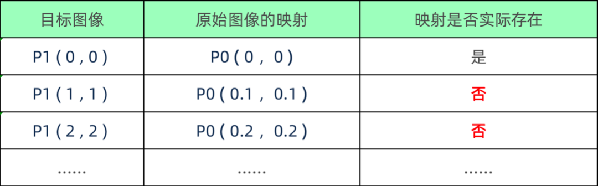](./images/007_7.png)

对于实际存在于原图的映射点，可以将原图中该像素的值直接赋给 P1。对于实际不存在于原图的映射点，就要通过 特定算法 “估算” 其像素值，再赋值给 P1。特定算法 一般基于插值算法实现，常见的插值算法又包括 最邻近插值法、双线性插值法、双三次插值法等。这几种插值算法的基本原理，如下方表格所示，大家做简单了解即可。对于具体的算法解析，在本系列中不做延伸，感兴趣的同学可以查阅资料进一步学习。

[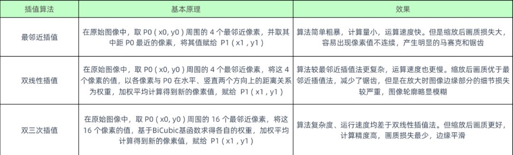](./images/007_8.png)

_以上的“邻近像素”，指的是在原始图像中实际存在的像素，像素坐标为整型。比如，P0(0.1,0.1) 在原图中不存在，取其周围 4 个实际存在的邻近像素，即为 P(0,0)，P(0,1)，P(1,0)，P(1,1)。_

基于上面描述的 “找映射点”、“求映射值” 两个步骤，完成目标图像上的所有像素值的计算，最后进行图片的重建，这就是图像缩放的基本原理。我们发现，基于映射、插值、计算、重建的过程，缩放后的图像会包含很多 “创造” 出来的像素。即使是分辨率放大、像素数量增多时，也并没有得到比原始图像更多的内容细节。图像的缩放往往会导致图像细节的丢失，出现锯齿和模糊等问题，分辨率变化越大、画质劣化可能越严重，我们不能再单纯地认为：分辨率越高、画面越清晰细腻。

当然，实际应用中，可能存在这样的需求：从原始低分辨率的图像、重建出高分辨图像，并且期望画质不降低、甚至画质更高。比如，考虑网络带宽或编码端设备性能的限制，无法满足高分辨率的采集、编码和传输需求，需要实现推流 “低清” 编码、“低码”传输、拉流 “高清” 渲染，在不增加传输带宽压力和成本的前提下提升画质。此时，常规的缩放算法将无法满足需求，可以通过 “ 超分辨率 ”（Super Resolution，SR，超分）方式来实现高清重建。

### 2 分辨率缩放的相关问题  

在了解缩放的基本原理后，我们来看看在实际的音视频应用开发过程中，关于分辨率缩放的常见问题。

#### **问题一：画面模糊问题**

编码分辨率越高、或显示分辨率越高，画面越模糊。若仅考虑分辨率这块，结合音视频数据处理路径以及缩放的原理，可能有如下原因：

*   设定的采集分辨率低于编码分辨率。比如设置采集 180P，却使用了 720P 的编码；
*   图像原始分辨率低于显示分辨率。比如原始图像为 180P，却期望在 720P、 1080P 甚至 2K 的屏幕上做全屏显示。

以上场景必然涉及到分辨率的放大，若使用常规的缩放算法，原始图像的细节太少，缩放后 “估算” 的像素太多，往往会导致画面变模糊。为避免此类问题，我们一般建议开发者尽可能使用相同的采集分辨率、编码分辨率和显示分辨率。一方面可以避免常规缩放（尤其是分辨率放大）导致的画质劣化，一方面也能减小由缩放引入的性能开销。如果在实际需求场景中无法满足各分辨率一致，也至少要保证采集分辨率大于编码分辨率或显示分辨率。

#### **问题二：关于黑边、画面被裁剪、画面拉伸问题**

图像渲染时，出现画面有黑边、画面被裁剪（视角变窄）、画面被拉伸等情况。

一般来说，当图像分辨率与显示分辨率不一致，需要将图像进行适当缩放后再显示时，我们都期望图像缩放后画面比例不变，且和显示区域应完全契合。这就要求图像分辨率与显示分辨率的宽高比例相同。

比如图像分辨率为 1280 x 720（宽 x 高，16:9） ，显示分辨率为 1920 x 1080（宽x高，16:9），则缩放时宽和高都等比放大 1.5 倍，画面比例不变。如果两种分辨率的宽高比例不相同，比如图像分辨率为 1280 x 720（宽x高，16:9） ，显示分辨率为 1080 x 1920（宽 x 高，9:16），无论选取宽、还是高作为基准，都无法在保证原图比例的前提下进行等比缩放，自然也无法保证图像在变化后完美契合显示区域。此时，我们需要参考一些常见的渲染策略，进行取舍。

*   **策略一：等比缩放并自适应（Aspect Fit）**

缩放时，保持图片的原宽高比例，渲染时优先显示全图，显示区域可能会有黑边。

该策略下，我们选择宽高变化较小的尺度，对原图宽高做等比例缩放。比如 1280 x 720（宽 x 高，16:9） 缩放至 1080 x 1920（宽 x 高，9:16），宽的变化比例为 1080/1280 ≈ 84.375%，高的变化比例为 1920/720 ≈ 266.667%。我们取其中的较小尺度，将宽、高均缩小至 84.37%。缩放后的图像分辨率为 1080 x 608，该分辨率的宽与显示分辨率的宽契合，但该分辨率的高小于显示分辨率的高，所以显示区域的高度方向无法完全渲染（一般用黑色填充，并将画面居中），如下图：

_注：红框部分为显示分辨率区域_

[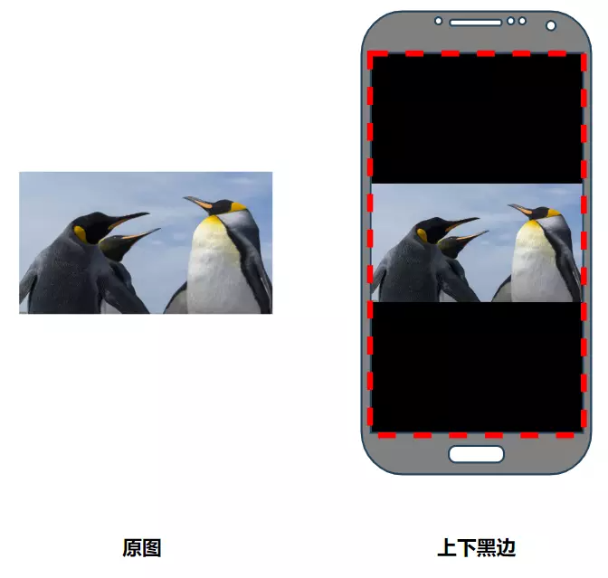](./images/007_9.png)

**策略二：等比缩放并填充（Aspect Fill）**

缩放时，保持图片的原宽高比例，渲染时优先填满全屏，画面可能会被裁减。

该策略下，我们选择宽高变化较大的尺度，对原图宽高做等比例缩放。同样取 1280×720（宽 x高，16:9） 缩放至 1080 x 1920（宽 x 高，9:16）的案例，我们取其中的宽高变化的较大尺度，将宽、高均放大至 266.667%，缩放后的图像分辨率为 3413 x 1920，该分辨率高等于显示分辨率高，但分辨率宽远大于显示分辨率宽，显示区域的宽度方向无法完全容纳图片的水平像素，超出的部分画面被裁剪，如下图：

[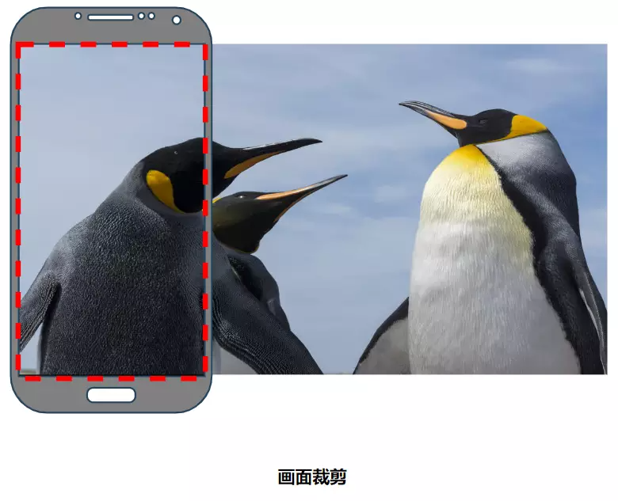](./images/007_10.png)

_注：该策略下，缩放后图片分辨率大于显示分辨率，只能显示图片局部。但具体显示哪一部分、裁减掉哪一部分，仍需要确认。上图默认为基于图像最左侧来显示，将最右侧超出显示区域的部分裁减掉。_

*   **策略三：自由缩放并填充（Scale Fill）**

缩放时，可以改变图片的宽高比例，渲染时显示全图并填满全屏，画面可能会被拉伸。

该策略下，我们将图像分辨率的宽、高分别缩放至显示分辨率的宽、高。同样取 1280×720（宽x高，16:9） 缩放至 1080×1920（宽x高，9:16）的案例，我们将图像分辨率宽缩小至 84.37%，但是高放大至 266.667%，缩放后图像分辨率宽、高等于显示分辨率宽、高，实现了全屏显示，没有黑边。但因图像比例变化，导致画面出现拉伸。如下图，缩放显示后，企鹅变 “高” 变 “瘦” 了。

[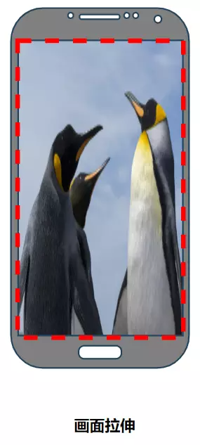](./images/007_11.png)

以上常见的渲染策略告诉我们：同一原始分辨率的图片，可以渲染到不同显示分辨率的屏幕上。但实际显示效果将取决于两种分辨率的关系（大小、比例）。

一般来说，要保证图像显示优先且接受黑边时，我们选用等比缩放并自适应（Aspect Fit）；要保证界面美观而要求全屏显示、并不改变画面比例时，我们选用等比缩放并填充（Aspect Fill），此时，宽高缩放的差异不能太大，否则会导致画面被过渡裁剪。一般很少会选择自由缩放并填充（Scale Fill），除非是对于画面比例没有保真要求的场景，比如纯色图片的全屏显示。

另外，正如前面提到的，在实际应用中，我们往往需要在某个指定的显示区域 上渲染图片，那么该 “指定区域” 上的局部分辨率，也是更灵活意义上的 “显示分辨率”，大家需要对渲染结果有正确的预期，并灵活选择符合需求的策略。

## 分辨率的选择

综合前面讨论的诸多影响因素，在没有缩放处理的前提下我们可以说：提高图像的原始分辨率，可以带来更清晰细腻的画面。高画质当然是我们的合理追求，但这是否意味着，我们要始终追求一个极高的分辨率呢？答案当然是否定的。

系列推文中，类似问题我们已讨论多次。实际应用场景中基于种种制约，我们往往都是“戴着镣铐”在舞蹈。比如音频相关的参数，音频采样率、位深、码率等等，都是综合考虑需求&限制，选取了一个“折中”值。视频分辨率自然也是如此，高分辨率往往意味着机器性能的消耗越高、视频图像的数据量越大、传输带宽的占用越多、成本越高，这势必会影响弱网环境下或低配机器上的使用体验，我们也需要根据场景选择合适的分辨率。

一般RTC 场景下常用的、合适的分辨率有：

[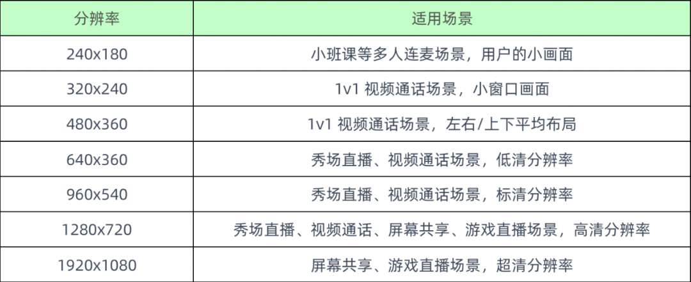](./images/007_12.png)

一般来说，RTC 场景下很少使用 1080P 以上的分辨率，尤其是在移动端，更高配置的显示效果较难拉开差距，反而会极大提高传输带宽、设备性能的压力，收益不高。另外，表格中所列并非相应场景的固定选择，更非有限选择，实际场景使用哪种分辨率更合适，仍需基于业务、产品的需求，实际测试和体验后才能做定夺。

## 总结

至此，关于何谓 “ 一定数量 ” 的讨论，就告一段落了，希望大家通过本篇推文能够对于 “ 分辨率 ” 有进一步地认识。我们下一篇推文，会继续就另一个话题： “一定频率” 的定义和影响，做相关讨论。最后我们通过一个思维导图，总结一下本文的主要内容。

[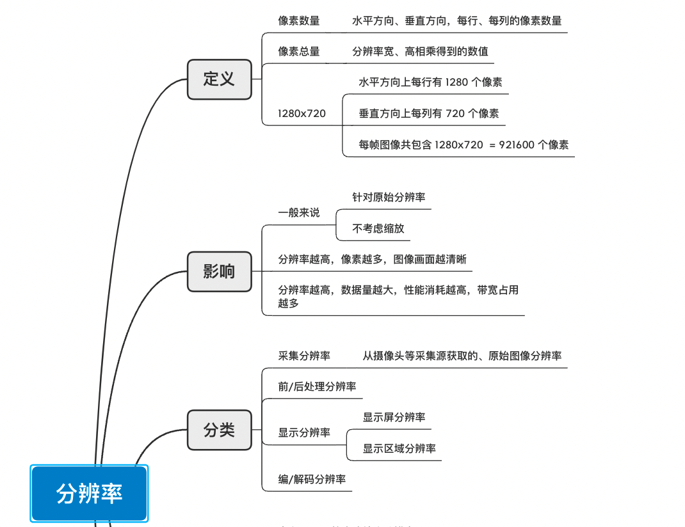](./images/007_13.png)

[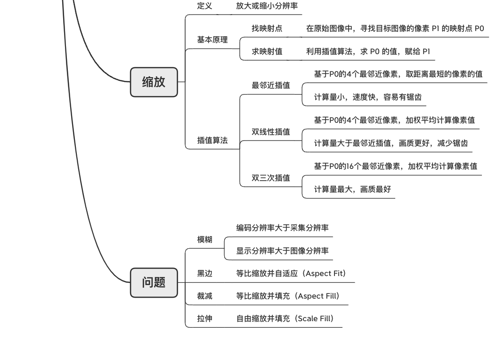](./images/007_14.png)

## 思考题

### 上期思考题揭秘

问

_参考推文中的举例，假设原图的 Width x Height = 6 x 8，存储时将 Stride 对齐为 8。当使用 Stride = 8，Width = 4，进行读取和渲染，会出现什么问题？_

答

若使用正确的配置， Stride = 8 进行读取，Width = 6 进行渲染，则仅会显示出彩色部分， 黑色部分的 Padding 在渲染时会被忽略。

[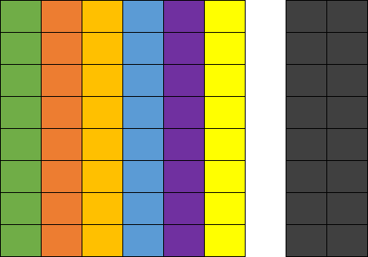](./images/007_15.png)

若使用正确的 Stride = 8，错误的 Width = 4，会出现如下问题：数据读取逻辑正常，但是计算机会以 Width = 4 进行渲染，实际只渲染了部分图像，其余部分（图中紫色和黄色部分）都被当做 Padding 处理。显示出来的画面是被裁减的。

[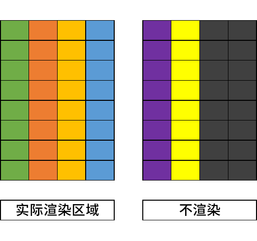](./images/007_16.png)

### 本期思考题

关于本文中的举例，图像分辨率为 1280×720（宽x高，16:9），显示分辨率为 1080×1920（宽x高，9:16），有什么办法，可以实现全屏显示、不拉伸且不裁剪图像画面吗？  

（我们下期揭秘）

