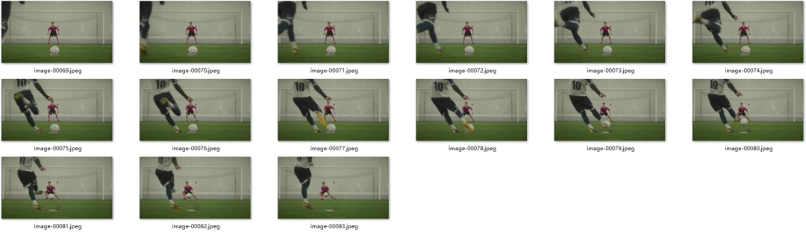
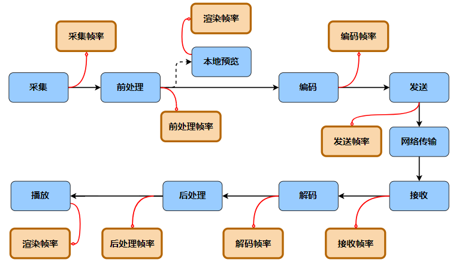
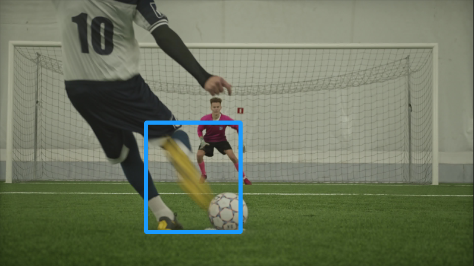
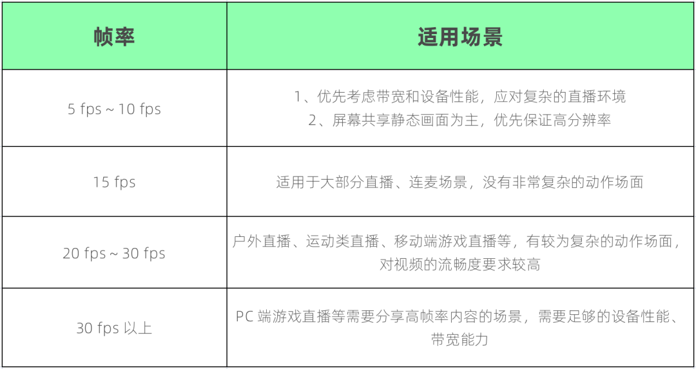
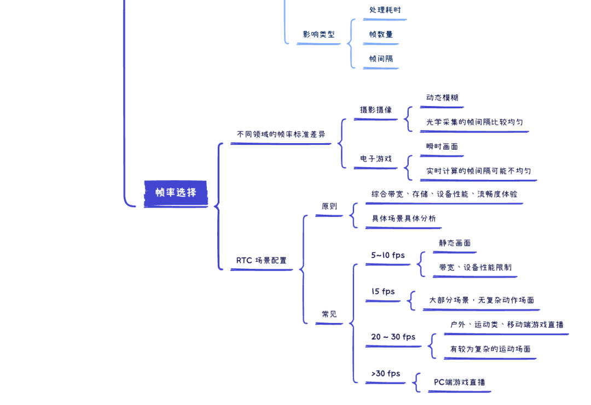

在视频系列的上一篇推文中，我们简单总结了色彩、像素、图像和视频等基础概念之间的关系。并且主要关注了两个组合：像素和图像，图像和视频之间的构成逻辑。我们先来简单回顾一下：

**从像素到图像**：一定数量、记录了不同色彩信息的像素组合，得到一帧完整的图像；

**从图像到视频**：一帧帧图像按一定频率连续播放，得到了视频。

基于上述演变关系，我们也提出了一些疑问：何谓 “一定数量” 和 “一定频率 ”，以及它们对视频图像有什么影响？其中，关于 “一定数量” 的问题，我们已经通过学习 “分辨率” 的相关知识得到了解答，具体参阅【[第七讲：分辨率与帧率·上篇](007_1.md)】。

今天，我们继续来讨论另外一个问题：何谓 “一定频率” ？它对视频又有哪些具体的影响？

## 何谓按“一定频率”播放

在视频系列的第一篇推文中，我们简单讨论过 “视频是如何产生的”，当时提到了一个大家熟知的东西：“翻页动画”，或者说 “翻页连环画”，如下图：

翻页动画非常直观地展示了图像到视频的演变关系，我们回顾一下当时的说明：

> 翻页动画的每一页都是静态的图片，常态下平平无奇。但快速地拨动翻页，让每一页图片快速、连续地进行展示时，原本“静态”的图片在视觉上就变成了“动态”的。  
>   
> **“静态图片”之所以会转变为“动态画面” ，是基于人眼的“视觉暂留”特性：**  
>   
> 人眼看到物体时，物体首先成像于视网膜、并由视神经传入大脑，大脑才感知到物体的像。而当物体从视线中移去时，视神经对物体的印象不会立即消失，仍会延续几百毫秒。当旧图像消失、新图像出现出现的频率足够快时，前后图像在视觉上就产生了“连贯”感，形成了“动态画面”。  
>  而这，也就是我们所说的**“视频”**。

### 1 帧率的定义  

上述说明，其实是对 “一帧帧图像按一定频率连续播放，得到了视频” 的详细描述。如果取单位时间为 1s，当每 1s 播放的图像数量为 N 时，我们称图像帧播放的频率为 N 帧/s。更专业的说法是：视频的帧率为 N fps （Frame Per Second，帧每秒）。

视频的帧率，即为对何为 ”一定频率“ 的解答。 如果某个视频的帧率为 15 fps ，意味着该视频的每一秒都包含 15 帧图像。当我们从该视频中提取出时长 1s 的片段，再进行分解，就可以得到 15 张独立的图片。如果分解得到的图片，如下所示（图片顺序为：从左至右，从上至下）：

仅从上面图片来看，你认为它描述了一个怎样的动态过程呢？若仅作”推断“和”猜测“，或许不难。我们完全可以基于独立的图片内容，结合生活经验进行联想：以上描述的是一个点球射门的过程。但是，仅凭静态的图片，我们的大脑很难整理出动态的信息，更别说形成一个生动流畅的影像了。只有当这些图片按照 “帧率”的规则，如同 “翻页动画”的页面被拨动起来，一切才会变得不一样。

帧率的定义，回答了关于 “一定频率” 的问题，但仅仅是解释了 “数量” 的定义，并没有描述 “数量” 的影响。帧率的高低变化，究竟会给视频带来哪些改变呢，我们接着往下看。

### 2 帧率的影响 

沿用学习分辨率时的思路，我们通过直接观察不同帧率下的视频，来体验帧率差异带来的区别。下面是和前文相同的点球视频，在 1 fps、5 fps、10 fps、25 fps 等帧率下的表现。我们一一作对比和讨论。

<video src="./images/007_2_3.mp4" controls>
  你的浏览器不支持 <code>video</code> 标签。
</video>

**1 fps：**

视频帧率为 1 fps 时，图像播放的频率为 1 秒 1 帧。9s 的射门过程，仅通过 9 帧图像来记录运动员的动作和足球的移动轨迹。此时，我们**可以非常明显地感受到画面的停顿**。由于图像之间的连贯性太差，我们不得不通过 “脑补“ 的方式，来想象帧与帧之间缺少的过程信息，帮助理解视频的内容。与其说这是视频，不如说是一页页点击播放的 PPT 更为恰当。

**5 fps：**

视频帧率为 5 fps 时，图像播放的频率为 1 秒 5 帧。相比 1 fps ，视频的停顿感得到了显著缓解，图像间的连贯性明显提升，那些在 1 fps 下必须依靠想象来理解的过程信息得以呈现。但是，仔细观察运动员的腿部甩动、足球腾空后的移动轨迹，仍有一卡一卡的、 ”不自然“ 的感觉。5 fps 似乎跨越了图像到视频的”鸿沟“，提升了视频流畅度，但还不足以 ”骗过“ 我们的大脑和眼睛。

**10 fps：**

视频帧率为 10 fps 时，图像播放的频率为 1 秒 10 帧。帧率相对于 5 fps 翻倍后，视频记录到运动员肢体动作、足球移动轨迹的更多细节， 流畅度进一步提升，“不自然感” 减轻。一般来说，10 fps 的视频已达到大脑和眼睛所认可的、基本的 ”流畅“。

**25 fps：**

视频帧率为 25 fps 时，图像播放的频率为 1 秒 25 帧。此时，原先卡顿、不自然等问题基本消失，视频观感 “丝滑”，比较符合我们对真实世界的运动场景的感受。现在，再回过头看看 5 fps 等低帧率的视频，可谓是 “天差地别”。

从观感上有明显的停顿、画面不连贯、动作不自然，到最终的观感顺畅、自然丝滑。流畅度的提升，这就是帧率由低到高时视频最直观的改变。

一般来说，足够的帧率配置是视频流畅的前提。但这里又引出一个问题：是否只要帧率足够，视频就一定是流畅的呢？

## 音视频处理路径上的帧率变化

假如有这样一个视频，它的帧率为 100 fps 。相对于前面 25 fps 的例子，帧率大小完全足够，理论上应该是流畅的。每秒播放 100 帧图像，正常情况下我们期望每 10ms 应播放一帧，但如果实际的播放情况如下：每 1000ms，前 100ms 播放 99 帧，后 900ms 播放剩余的 1 帧此时，数值统计上视频的帧率仍可能是 100 fps，但由于视频帧的播放间隔非常“不均匀”。前 100ms 包含了本应耗时 990ms 才播放完的内容，看起来将是 “快进加速” 的效果 ，而后 900ms 因为只有一帧图像，将出现画面的停滞。显然，这种情况下的观感仍然是卡顿、不流畅的，甚至可能比低帧率、但帧间隔均匀的视频体验更差。

因此，除了足够的帧率配置，视频要流畅还要求帧间隔是均匀的。任意一个条件没有满足，就可能出现卡顿问题。那么，哪些情况会导致帧率发生改变、无法达到预期，或者帧间隔变得不均匀呢？要解答这个疑问，我们得继续研究：音视频处理路径上的帧率变化。

通过上一篇推文，我们知道，分辨率在音视频数据处理路径上可能会发生改变，而作为视频的基础属性之一，帧率也免不了如此。细化到每个处理阶段来看，会涉及**采集、渲染显示、前后处理、编解码、网络传输等环节**，我们可以将各阶段输出的帧率进行区分，以方便描述。

**视频处理过程中的常见帧率问题**

理想情况下，我们希望上述各个环节输出的视频帧率相同，且帧间隔均匀稳定，以保证最终渲染出来的视频流畅度与原始采集的一致，但实际应用中却难以尽如人愿。常见的可能问题，比如：

### 1 采集阶段  

因为设备性能问题或设备故障，导致摄像头的采集速度达不到预期，采集帧率会受损；如果摄像头采集帧率过高，每一帧图像的曝光时间不足，可能导致图像偏暗。根据环境亮度变化，可能需要动态地调整采集帧率、改善曝光，以保证采集画面的明亮度。

### 2 前、后处理阶段   

裁剪缩放、美颜滤镜等操作需要对每一帧图像做处理，处理逻辑越复杂，则运算量越大、耗时越长，可能导致单位时间内无法完成预期帧数的处理。

### 3 编码阶段

因为设备性能问题，导致编码模块的工作效率达不到预期，编码帧率会受损；

若上行带宽受限，为避免出现发送拥塞，可能需要动态调整编码帧率，以控制每秒发送的数据量，适应当前带宽。

### 4 网络传输阶段 

传输链路不稳定，视频帧数据的流转出现延迟、拥塞、丢包，导致数据丢失或者传输不均匀（接收端长时间收不到数据，或者短时间内收到过多数据）。

### 5 解码、渲染阶段  

上述的帧率变化，有一些是客观因素引入的被动损失，有一些是为了应对客观因素而执行的主动调整。而所提到的客观因素，主要受复杂的网络环境和各异的终端设备影响，这恰恰是 RTC 应用场景下的常态。 

在这里，我们无法穷举所有可能导致帧率异常的原因，大家只要知道，**帧率从定义上是基于“时间” 维度来计量的 “数量”**，无论是被动的问题，还是主动的调整，任何会影响 “处理耗时”、“帧数量” 、“帧间隔” 的操作，最终都可能影响到帧率。而各阶段的帧率影响一环扣一环，最终体现到渲染显示上，就会出现 ”卡顿 “的问题。

在开发音视频应用时，一般会通过渲染帧率来量化最终的用户体验（针对视频流畅度），如果遇到视频的 ”卡顿“ 问题，就需要沿着音视频的处理路径，排查是哪一个阶段出现了帧率异常。这就要求我们，在整个音视频数据处理链路、各个关键节点上做好帧率统计，这是个不小的工程。

## 帧率的选择

在了解帧率的定义和影响，以及它在音视频数据处理链路上可能的变化后，我们最后再来聊聊，RTC 场景下我们究竟需要多少的帧率。从前文对 1 fps ~ 25 fps 等帧率视频的对比，我们可以确定的是，适当提高帧率会带来更流畅的视频观感。但是否帧率就应该越高越好，仍值得商榷。基于前面的案例，我们再补充一个case，来看看 30 fps 配置下的表现。

<video src="./images/007_2_5.mp4" controls>
  你的浏览器不支持 <code>video</code> 标签。
</video>

如上，观察 30 fps 下的视频，再对比前文 1 fps ~ 25 fps 的视频，你的感受如何呢？

你是否发现，帧率从 1 fps 提升到 15 fps 时，视频流畅度的确在明显提升，但在 15 fps 提升至 25 fps 时，差异感开始减弱。而 25 fps 到 30 fps 的变化，已经微乎其微。这表明，**在超出一定范围后，提升帧率带来的体验优化收益降低。**而与此同时，和音频采样率、位深、视频分辨率一样，视频帧率进一步提高，必然导致数据量增加、处理难度增加，这将给设备存储、传输带宽、设备性能带来挑战。

所以，我们必须 “量力而为”。综合流畅度、带宽、设备性能等维度的考量，RTC 场景常用的帧率为 10 fps ~ 30 fps。

看到这里，你可能会有疑问：15 fps ~ 30 fps 是否太低了？尤其是比较熟悉电子游戏的小伙伴，肯定有了解，30 fps 对于游戏（尤其是动作类型）来说，可能只是一个“勉强能接受”的最低流畅配置，要保证标准的流畅体验可能需要 60 fps 或 更高。而对于一些第一人称类的游戏，甚至要求 >100 fps 的配置来实现最佳体验。相比之下，15 fps ~ 30 fps 的确是相当 “简陋”。

为什么会有这么大的差异呢？这主要**和不同应用领域的图像生成逻辑有关**。

### 1 RTC 场景 

RTC 场景下，我们一般使用摄像机作为视频的采集源，在摄像机快门打开到关闭的持续时间内（也称曝光时间），被摄物体反射的光线得以进入镜头，并被感光元件记录，留下影像。此时，每帧图像所记录的，将是被摄物体在曝光的持续时间内，所有位置影像的完整组合。**我们将其中的一帧单独拎出来，可以看到物体运动产生的 “拖影” 或 “残影”。**参考下图中射门运动员右脚的位置（蓝框内），这是在该帧图像的曝光时间内，鞋子在所有位置的影像的组合。

我们把这种现象称为 **“动态模糊”**。“动态模糊” 在生活中随处可见，现在就举起你的手，反复挥动，你立刻就能观察到手掌运动的 “拖影”。”动态模糊“ 符合人眼所看到的真实世界的效果，会让我们大脑认为该运动更“连贯自然”。

### 2 游戏场景   

而游戏图像的生成逻辑不太一样。

游戏需要实时响应玩家操作来确定画面内容，每一帧图像都由显卡实时计算生成，会准确地表示瞬时画面（可以理解为将摄相机的快门设置为无限快，每一帧的曝光时间无限接近于0），**帧与帧之间就像是“闪现”一般，也就不存在“动态模糊”的效果**。如果没有足够多的帧图像用于 “弥补” 缺失的过程信息，大脑就会认为其不连贯、不真实，流畅度体验就会大打折扣。我们可以通过下面几张图片，来帮助理解动态模糊。假设有两帧图像，记录了一个蓝色方块从画面左侧移动到右侧的过程。 

图1：第一帧

图2：第二帧 A（不包含动态模糊）

图3：第二帧 B（包含动态模糊）

以上，图 2 第二帧 A 为游戏显示的逻辑，图 3 第二帧 B 即为摄像视频的逻辑。蓝色的拖影可以视为动态模糊的效果，它记录了方块移动过程的”轨迹“，让我们大脑在处理前后两帧图像时，更容易产生连贯感。

另外，摄像头采集一般可以保证采集帧的间隔均匀，使视频得以稳定在某个帧率。而游戏图像通过实时演算得到，如果画面复杂度变化剧烈（比如出现频繁的动作场面、复杂环境纹理、多变的光线效果等），每帧计算耗时骤升，可能会导致大幅掉帧，掉帧前后的帧间隔差异会进一步加剧卡顿感。

动态模糊和帧率稳定，使摄像机采集的视频在更低帧率上就实现了比较流畅的效果（实际上，24 fps 已经成为电影电视作品常用的帧率标准）。而电子游戏等动画的渲染，则需要用更高的帧率来实现相同的流畅度。值得一提的是，现在很多游戏也支持动态模糊的功能，可以在渲染每一帧画面时加入动态模糊的模拟，再配合帧率锁定的机制避免其忽高忽低，也能在有限帧率下实现更流畅、真实的游戏体验。

了解到上面的差异，我们再回过头来看看 RTC 场景下常用的帧率配置：10 fps ~ 30 fps，是否就顺眼很多了呢？

### 3 实际场景应用 

接下来，我们再进一步将帧率的选择，落地到实际场景中。

大部分情况下，若视频直播场景的复杂度不高，比如常见的**秀场单主播**，直播画面大部分是相对静态的内容，15 fps 的流畅度可满足需求。如果直播过程中需要有复杂的运动场面，比如**健身操、舞蹈等等，或者是户外纪录式直播**，可以考虑更高的帧率配置，比如 25 fps ~ 30fps。如果是**屏幕共享的直播场景**，共享内容又是电子游戏等高帧率内容，那么 30 fps 以上可能更适合。

当然，我们也不总是追求高帧率，也存在需要指定低帧率的时候。 

比如**教育场景**，学生、老师的头像小窗口对画面动作细节的要求不高，可以使用 10 fps 甚至更低的帧率，优先保证带宽和降低设备性能消耗，以应对参差不齐的直播环境，保障连麦质量。同样是屏幕共享场景，如果共享内容是 PPT 等静态内容，对画面的清晰度将远高于流畅度，也可以考虑低帧率、高分辨率的配置。我们通过表格简单总结如下：

以上提供的配置比较粗略，只是作为最基础的参考。毕竟实际场景千万、需求侧重各异，具体问题仍需具体分析，正确的做法是在产品设计、研发阶段，就进行充分地测试、和对比，选择一个满足实际体验需求的方案，或者在产品上提供可动态修改配置的入口，方便后期的个性化定制。

## 总结

好了，关于何谓 “ 一定频率 ” 的问题，我们就讨论至此。希望大家通过本篇推文，能够进一步理解图像与视频之间的关系，也对 “ 帧率 ” 这个影响视频流畅度的关键指标有一定的了解，帮助大家选择适合自己产品的帧率配置。最后，我们通过一个思维导图，总结一下本文的主要内容：

## 思考题

### 上期思考题揭秘

问

关于文中的举例，图像分辨率为 1280 x 720（宽 x 高，16:9），显示分辨率为 1080×1920（宽 x 高，9:16），有什么办法，可以实现全屏显示、不拉伸且不裁剪图像画面吗？

答

可以将图像旋转90度或180度后，再进行渲染。

一般在Android移动端的屏幕共享场景，可能会遇到类似情况：当分享端（推流侧）分享的画面，在竖屏应用和横屏应用之间切换时，系统提供的采集图像的分辨率也将在（高>宽）或（宽>高）之间变化，为了避免画面被裁剪，我们需要主动修改编码分辨率至相应比例。此时，拉流端需要根据解码分辨率的宽高情况，对应选择竖屏UI、或者横屏UI进行渲染，以实现全屏显示。

### 本期思考题

如果摄像头采集帧率过高，每一帧图像的曝光时间不足，可能导致图像偏暗。根据环境亮度变化，可能需要动态地调整采集帧率、改善曝光，以保证采集画面的明亮度”文中的这一段描述，该如何理解？