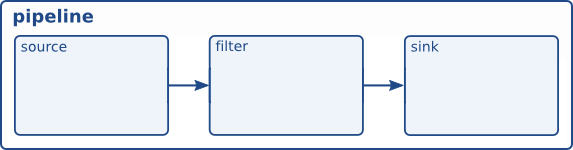
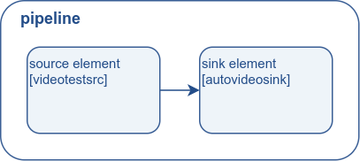

## 目标

上一个教程演示了如何自动构建管道。现在，我们将通过实例化每个元素并将它们全部链接在一起来手动构建管道。在此过程中，我们将学习：

- 什么是 GStreamer 元素以及如何创建一个。
- 如何将元素相互连接。
- 如何自定义元素的行为。
- 如何观察总线的错误情况并从 GStreamer 消息中提取信息。

## 手动 Hello World

将此代码复制到名为 basic-tutorial-2.c 的文本文件中（或在 GStreamer 安装中找到它）。

```C
#include <gst/gst.h>

#ifdef __APPLE__
#include <TargetConditionals.h>
#endif

int
tutorial_main (int argc, char *argv[])
{
  GstElement *pipeline, *source, *sink;
  GstBus *bus;
  GstMessage *msg;
  GstStateChangeReturn ret;

  /* Initialize GStreamer */
  gst_init (&argc, &argv);

  /* Create the elements */
  source = gst_element_factory_make ("videotestsrc", "source");
  sink = gst_element_factory_make ("autovideosink", "sink");

  /* Create the empty pipeline */
  pipeline = gst_pipeline_new ("test-pipeline");

  if (!pipeline || !source || !sink) {
    g_printerr ("Not all elements could be created.\n");
    return -1;
  }

  /* Build the pipeline */
  gst_bin_add_many (GST_BIN (pipeline), source, sink, NULL);
  if (gst_element_link (source, sink) != TRUE) {
    g_printerr ("Elements could not be linked.\n");
    gst_object_unref (pipeline);
    return -1;
  }

  /* Modify the source's properties */
  g_object_set(source, "pattern", 0, NULL);

  /* Start playing */
  ret = gst_element_set_state (pipeline, GST_STATE_PLAYING);
  if (ret == GST_STATE_CHANGE_FAILURE) {
    g_printerr ("Unable to set the pipeline to the playing state.\n");
    gst_object_unref (pipeline);
    return -1;
  }

  /* Wait until error or EOS */
  bus = gst_element_get_bus (pipeline);
  msg =
      gst_bus_timed_pop_filtered (bus, GST_CLOCK_TIME_NONE,
      GST_MESSAGE_ERROR | GST_MESSAGE_EOS);

  /* Parse message */
  if (msg != NULL) {
    GError *err;
    gchar *debug_info;

    switch (GST_MESSAGE_TYPE (msg)) {
      case GST_MESSAGE_ERROR:
        gst_message_parse_error (msg, &err, &debug_info);
        g_printerr ("Error received from element %s: %s\n",
            GST_OBJECT_NAME (msg->src), err->message);
        g_printerr ("Debugging information: %s\n",
            debug_info ? debug_info : "none");
        g_clear_error (&err);
        g_free (debug_info);
        break;
      case GST_MESSAGE_EOS:
        g_print ("End-Of-Stream reached.\n");
        break;
      default:
        /* We should not reach here because we only asked for ERRORs and EOS */
        g_printerr ("Unexpected message received.\n");
        break;
    }
    gst_message_unref (msg);
  }

  /* Free resources */
  gst_object_unref (bus);
  gst_element_set_state (pipeline, GST_STATE_NULL);
  gst_object_unref (pipeline);
  return 0;
}

int
main (int argc, char *argv[])
{
#if defined(__APPLE__) && TARGET_OS_MAC && !TARGET_OS_IPHONE
  return gst_macos_main ((GstMainFunc) tutorial_main, argc, argv, NULL);
#else
  return tutorial_main (argc, argv);
#endif
}
```

> 需要帮助？
>
> 如果您需要编译此代码的帮助，请参阅针对您的平台构建教程部分：Linux、Mac OS X 或 Windows 上，或在 Linux 上使用以下特定命令：
>
> ```gcc basic-tutorial-2.c -o basic-tutorial-2 `pkg-config --cflags --libs gstreamer-1.0` ```
>
> 如果您需要运行此代码的帮助，请参阅适用于您的平台的运行教程部分：Linux、Mac OS X 或 Windows 的
> 
> 本教程打开一个窗口并显示一个没有音频的测试模式
> 
> 必需安装的库：gstreamer-1.0
>
>

## 代码走查

这些元素是 GStreamer 的基本构造块。当数据通过过滤器元素从源元素（数据生产者）流向下游流向接收器元素（数据使用者）时，它们会对其进行处理。



### 元素创建

我们将跳过 GStreamer 初始化，因为它与上一个教程相同：

```C
/* Create the elements */
source = gst_element_factory_make ("videotestsrc", "source");
sink = gst_element_factory_make ("autovideosink", "sink");
```

如这段代码所示，可以使用 gst_element_factory_make() 创建新元素。第一个参数是要创建的元素的类型（基本教程 14：方便的元素展示了一些常见的类型，基础教程 10:GStreamer 工具展示了如何获取所有可用类型的列表）。第二个参数是我们想给这个特定实例指定的名称。如果您没有保留指针，命名您的元素对于以后检索它们很有用（以及获得更有意义的调试输出）。但是，如果您为名称传递 NULL，GStreamer 将为您提供唯一的名称。

在本教程中，我们将创建两个元素：videotestsrc 和 autovideosink。没有 filter 元素。因此，管道将如下所示：



videoTestsrc 是一个源元素（它生成数据），用于创建测试视频模式。此元素对于调试目的（和教程）很有用，在实际应用程序中通常找不到。

autovideosink 是一个 sink 元素（它使用数据），它显示在 一个窗口接收到的图像。存在多个视频接收器， 取决于操作系统，具有不同的功能范围。 autoVideosink 会自动选择并实例化最佳代码，因此您不必担心细节，并且您的代码与平台无关。

### 管道创建

```C
/* Create the empty pipeline */
pipeline = gst_pipeline_new ("test-pipeline");
```

GStreamer 中的所有元素通常必须先包含在管道中才能使用，因为它负责一些计时和消息传递功能。我们使用 gst_pipeline_new() 创建管道。

```C
/* Build the pipeline */
gst_bin_add_many (GST_BIN (pipeline), source, sink, NULL);
if (gst_element_link (source, sink) != TRUE) {
    g_printerr("Elements could not be linked.\n");
    gst_object_unref(pipeline);
    return -1;
}
```
管道是一种特殊类型的 bin，它是用于包含其他元素的元素。因此，所有适用于 bin 的方法也适用于管道。

在我们的例子中，我们调用 gst_bin_add_many() 将元素添加到管道中（注意强制转换）。此函数接受要添加的元素列表，以 NULL 结尾。可以使用 gst_bin_add() 添加单个元素。

但是，这些元素尚未相互链接。为此，我们需要使用 gst_element_link()。它的第一个参数是源，第二个参数是目标。顺序很重要，因为必须按照数据流建立链接（即，从源元素到接收器元素）。请记住，只有位于同一 bin 中的元素才能链接在一起，因此请记住在尝试链接它们之前将它们添加到管道中！

### 性能

GStreamer 元素都是一种特殊类型的 GObject，它是提供属性设施的实体。

大多数 GStreamer 元素都具有可自定义的属性：可以修改这些属性以更改元素的行为（可写属性）或查询以了解元素的内部状态（可读属性）。

使用 g_object_get() 读取属性，使用 g_object_set() 写入属性。

g_object_set() 接受以 NULL 结尾的属性-名称、属性-值对列表，因此可以一次性更改多个属性。

这就是属性处理方法具有 g_ 前缀的原因。

回到上面示例中的内容，

```C
/* Modify the source's properties */
g_object_set (source, "pattern", 0, NULL);
```

上面的代码行更改了 videotestsrc 的 “pattern” 属性，该属性控制元素输出的测试视频的类型。尝试不同的值！

元素公开的所有属性的名称和可能的值可以使用基础教程 10：GStreamer 工具中描述的 gst-inspect-1.0 工具找到，也可以在该元素的文档中找到（这里是 videotestsrc）。

### 错误检查

此时，我们已经构建和设置了整个管道，本教程的其余部分与上一个教程非常相似，但我们将添加更多错误检查：

```C
/* Start playing */
ret = gst_element_set_state (pipeline, GST_STATE_PLAYING);
if (ret == GST_STATE_CHANGE_FAILURE) {
    g_printerr ("Unable to set the pipeline to the playing state.\n");
    gst_object_unref (pipeline);
    return -1;
}
```

我们调用 gst_element_set_state()，但这次我们检查其返回值是否有错误。更改状态是一个微妙的过程，基础教程 3：动态管道中提供了更多详细信息。

```C
/* Wait until error or EOS */
bus = gst_element_get_bus (pipeline);
msg =
    gst_bus_timed_pop_filtered (bus, GST_CLOCK_TIME_NONE,
    GST_MESSAGE_ERROR | GST_MESSAGE_EOS);

/* Parse message */
if (msg != NULL) {
    GError *err;
    gchar *debug_info;

    switch (GST_MESSAGE_TYPE (msg)) {
      case GST_MESSAGE_ERROR:
        gst_message_parse_error (msg, &err, &debug_info);
        g_printerr ("Error received from element %s: %s\n",
            GST_OBJECT_NAME (msg->src), err->message);
        g_printerr ("Debugging information: %s\n",
            debug_info ? debug_info : "none");
        g_clear_error (&err);
        g_free (debug_info);
        break;
      case GST_MESSAGE_EOS:
        g_print ("End-Of-Stream reached.\n");
        break;
      default:
        /* We should not reach here because we only asked for ERRORs and EOS */
        g_printerr ("Unexpected message received.\n");
        break;
    }
    gst_message_unref (msg);
}
```
gst_bus_timed_pop_filtered() 等待执行结束，并返回我们之前忽略的 GstMessage。当 GStreamer 遇到错误条件或 EOS 时，我们要求 gst_bus_timed_pop_filtered() 返回，因此我们需要检查发生了哪一个，并在屏幕上打印一条消息（您的应用程序可能希望执行更复杂的操作）。

GstMessage 是一种非常通用的结构，几乎可以传递任何类型的信息。幸运的是，GStreamer 为每种消息提供了一系列解析函数。

在这种情况下，一旦我们知道消息包含错误（通过使用 GST_MESSAGE_TYPE() 宏），我们可以使用 gst_message_parse_error() 返回 GLib GError 错误结构和用于调试的字符串。检查代码以查看如何使用和稍后释放这些内容。

### GStreamer 总线

在这一点上，值得更正式地介绍 GStreamer 总线。它是负责将元素生成的 GstMessage按顺序传递到应用程序线程的对象。最后一点很重要，因为实际的媒体流是在应用程序以外的另一个线程中完成的。

消息可以从总线同步提取 gst_bus_timed_pop_filtered() 及其同级，或者异步使用 signals（在下一个教程中所示）。您的应用程序应始终关注总线，以收到错误和其他与播放相关的问题的通知。

代码的其余部分是清理序列，这与基本教程 1：Hello world！ 中的相同。


## 练习

如果您想练习，请尝试以下练习：添加视频滤镜元素。 用 vertigoTV 以获得良好的效果。您需要创建它，将其添加到管道中，并将其与其他元素链接。

根据您的平台和可用插件，您可能会收到 “negotiation” 错误，因为 sink 不理解过滤器正在生成什么（有关协商的更多信息，请参阅基本教程 6：媒体格式和 Pad 功能）。在这种情况下，请尝试在 filter （即，构建一个包含 4 个元素的管道。更多信息 videoconvert 在基础教程 14：方便的元素中）。

## 总结

本教程展示了：

- 如何使用 gst_element_factory_make() 创建元素
- 如何使用 gst_pipeline_new() 创建空管道
- 如何使用 gst_bin_add_many() 将元素添加到管道中
- 如何使用 gst_element_link() 将元素彼此链接

两个教程中的第一个教程到此结束，专门介绍基本的 GStreamer 概念。第二个教程接下来。

请记住，本页附带了本教程，您应该可以找到本教程的完整源代码以及构建本教程所需的任何附件。

很高兴您来到这里，很快再见！


