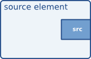
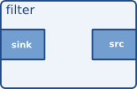
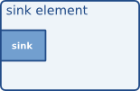
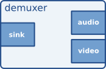
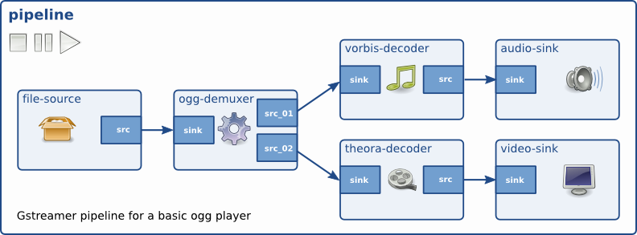
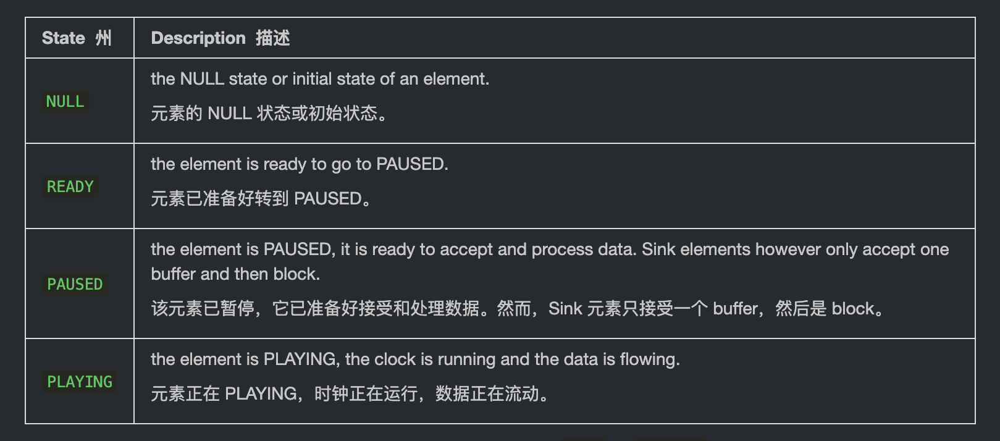

## 目标

本教程介绍了使用 GStreamer 所需的其余基本概念，这些概念允许在信息可用时“动态”构建管道，而不是在应用程序开始时定义整体式管道。

完成本教程后，您将具备启动 回放教程。这里回顾的要点将是：

- 如何在链接元素时实现更精细的控制。
- 如何收到有趣事件的通知，以便您及时做出反应。
- 元素可以处于的各种状态。

## 介绍

正如您即将看到的，本教程中的管道在设置为 playing 状态之前尚未完全构建。这没关系。如果我们不采取进一步的行动，数据将到达管道的末尾，并且管道将产生错误消息并停止。但我们将采取进一步的行动...

在此示例中，我们将打开一个多路复用（或多路复用）的文件，即音频和视频一起存储在容器文件中。 负责打开此类容器的元素称为 解复用器以及容器格式的一些示例包括 Matroska （MKV）、Quick Time （QT、MOV）、Ogg 或高级系统格式 （ASF、WMV、WMA）。

如果容器嵌入了多个流（例如，一个视频和两个音频轨道），则解复用器会将它们分开并通过不同的输出端口公开它们。通过这种方式，可以在管道中创建不同的分支，处理不同类型的数据。

GStreamer 元素相互通信的端口称为 Pad （GstPad）。存在 sink pads，数据通过它进入元素，而 source pads，数据通过它离开元素。自然而然地，source elements 只包含 source pads，sink elements 只包含 sink pads，而 filter elements 同时包含两者。








解复用器包含一个 sink pad（多路复用数据通过该 pad 到达）和多个 source pad（一个用于容器中的每个流）：



为了完整起见，这里有一个简化的管道，其中包含一个 Deuxer 和两个分支，一个用于音频，一个用于视频。 这是 不是此示例中将构建的管道：



处理 demuxer 时的主要复杂性是，在它们收到一些数据并有机会查看容器以查看内部内容之前，它们无法产生任何信息。也就是说，demuxer 开始时没有其他元素可以链接到的源 pad，因此管道必须终止于它们。

解决方案是构建从源到 demuxer 的管道，并将其设置为 run （play）。当 demuxer 收到足够的信息以了解容器中流的数量和类型时，它将开始创建源 pads。现在是我们完成构建 pipeline 并将其附加到新添加的 demuxer pad 的合适时机。

为简单起见，在此示例中，我们将仅链接到音频板并忽略视频。

## 动态 Hello World

将此代码复制到名为 basic-tutorial-3.c 的文本文件中（或在 GStreamer 安装中找到它）。

```C

#include <gst/gst.h>

/* Structure to contain all our information, so we can pass it to callbacks */
typedef struct _CustomData {
  GstElement *pipeline;
  GstElement *source;
  GstElement *convert;
  GstElement *resample;
  GstElement *sink;
} CustomData;

/* Handler for the pad-added signal */
static void pad_added_handler (GstElement *src, GstPad *pad, CustomData *data);

int main(int argc, char *argv[]) {
  CustomData data;
  GstBus *bus;
  GstMessage *msg;
  GstStateChangeReturn ret;
  gboolean terminate = FALSE;

  /* Initialize GStreamer */
  gst_init (&argc, &argv);

  /* Create the elements */
  data.source = gst_element_factory_make ("uridecodebin", "source");
  data.convert = gst_element_factory_make ("audioconvert", "convert");
  data.resample = gst_element_factory_make ("audioresample", "resample");
  data.sink = gst_element_factory_make ("autoaudiosink", "sink");

  /* Create the empty pipeline */
  data.pipeline = gst_pipeline_new ("test-pipeline");

  if (!data.pipeline || !data.source || !data.convert || !data.resample || !data.sink) {
    g_printerr ("Not all elements could be created.\n");
    return -1;
  }

  /* Build the pipeline. Note that we are NOT linking the source at this
   * point. We will do it later. */
  gst_bin_add_many (GST_BIN (data.pipeline), data.source, data.convert, data.resample, data.sink, NULL);
  if (!gst_element_link_many (data.convert, data.resample, data.sink, NULL)) {
    g_printerr ("Elements could not be linked.\n");
    gst_object_unref (data.pipeline);
    return -1;
  }

  /* Set the URI to play */
  g_object_set (data.source, "uri", "https://gstreamer.freedesktop.org/data/media/sintel_trailer-480p.webm", NULL);

  /* Connect to the pad-added signal */
  g_signal_connect (data.source, "pad-added", G_CALLBACK (pad_added_handler), &data);

  /* Start playing */
  ret = gst_element_set_state (data.pipeline, GST_STATE_PLAYING);
  if (ret == GST_STATE_CHANGE_FAILURE) {
    g_printerr ("Unable to set the pipeline to the playing state.\n");
    gst_object_unref (data.pipeline);
    return -1;
  }

  /* Listen to the bus */
  bus = gst_element_get_bus (data.pipeline);
  do {
    msg = gst_bus_timed_pop_filtered (bus, GST_CLOCK_TIME_NONE,
        GST_MESSAGE_STATE_CHANGED | GST_MESSAGE_ERROR | GST_MESSAGE_EOS);

    /* Parse message */
    if (msg != NULL) {
      GError *err;
      gchar *debug_info;

      switch (GST_MESSAGE_TYPE (msg)) {
        case GST_MESSAGE_ERROR:
          gst_message_parse_error (msg, &err, &debug_info);
          g_printerr ("Error received from element %s: %s\n", GST_OBJECT_NAME (msg->src), err->message);
          g_printerr ("Debugging information: %s\n", debug_info ? debug_info : "none");
          g_clear_error (&err);
          g_free (debug_info);
          terminate = TRUE;
          break;
        case GST_MESSAGE_EOS:
          g_print ("End-Of-Stream reached.\n");
          terminate = TRUE;
          break;
        case GST_MESSAGE_STATE_CHANGED:
          /* We are only interested in state-changed messages from the pipeline */
          if (GST_MESSAGE_SRC (msg) == GST_OBJECT (data.pipeline)) {
            GstState old_state, new_state, pending_state;
            gst_message_parse_state_changed (msg, &old_state, &new_state, &pending_state);
            g_print ("Pipeline state changed from %s to %s:\n",
                gst_element_state_get_name (old_state), gst_element_state_get_name (new_state));
          }
          break;
        default:
          /* We should not reach here */
          g_printerr ("Unexpected message received.\n");
          break;
      }
      gst_message_unref (msg);
    }
  } while (!terminate);

  /* Free resources */
  gst_object_unref (bus);
  gst_element_set_state (data.pipeline, GST_STATE_NULL);
  gst_object_unref (data.pipeline);
  return 0;
}

/* This function will be called by the pad-added signal */
static void pad_added_handler (GstElement *src, GstPad *new_pad, CustomData *data) {
  GstPad *sink_pad = gst_element_get_static_pad (data->convert, "sink");
  GstPadLinkReturn ret;
  GstCaps *new_pad_caps = NULL;
  GstStructure *new_pad_struct = NULL;
  const gchar *new_pad_type = NULL;

  g_print ("Received new pad '%s' from '%s':\n", GST_PAD_NAME (new_pad), GST_ELEMENT_NAME (src));

  /* If our converter is already linked, we have nothing to do here */
  if (gst_pad_is_linked (sink_pad)) {
    g_print ("We are already linked. Ignoring.\n");
    goto exit;
  }

  /* Check the new pad's type */
  new_pad_caps = gst_pad_get_current_caps (new_pad);
  new_pad_struct = gst_caps_get_structure (new_pad_caps, 0);
  new_pad_type = gst_structure_get_name (new_pad_struct);
  if (!g_str_has_prefix (new_pad_type, "audio/x-raw")) {
    g_print ("It has type '%s' which is not raw audio. Ignoring.\n", new_pad_type);
    goto exit;
  }

  /* Attempt the link */
  ret = gst_pad_link (new_pad, sink_pad);
  if (GST_PAD_LINK_FAILED (ret)) {
    g_print ("Type is '%s' but link failed.\n", new_pad_type);
  } else {
    g_print ("Link succeeded (type '%s').\n", new_pad_type);
  }

exit:
  /* Unreference the new pad's caps, if we got them */
  if (new_pad_caps != NULL)
    gst_caps_unref (new_pad_caps);

  /* Unreference the sink pad */
  gst_object_unref (sink_pad);
}

```

> 需要帮助？
>
> 如果您需要编译此代码的帮助，请参阅针对您的平台构建教程部分：Linux、Mac OS X 或 Windows 上，或在 Linux 上使用以下特定命令：
>
> ```gcc basic-tutorial-3.c -o basic-tutorial-3 `pkg-config --cflags --libs gstreamer-1.0` ```
>
> 如果您需要运行此代码的帮助，请参阅适用于您的平台的运行教程部分：Linux、Mac OS X 或 Windows 的
> 
> 本教程仅播放音频。媒体是从 Internet 获取的，因此可能需要几秒钟才能启动，具体取决于您的连接速度。
>
> 必需安装的库：gstreamer-1.0
>
>

## 代码走查

```C
/* Structure to contain all our information, so we can pass it to callbacks */
typedef struct _CustomData {
  GstElement *pipeline;
  GstElement *source;
  GstElement *convert;
  GstElement *resample;
  GstElement *sink;
} CustomData;
```
到目前为止，我们已经将所需的所有信息（基本上是指向 GstElement的指针）保存为局部变量。由于本教程（以及大多数实际应用程序）涉及回调，我们将所有数据分组在一个结构中以便于处理。

```C
/* Handler for the pad-added signal */
static void pad_added_handler (GstElement *src, GstPad *pad, CustomData *data);
```

这是一个前向引用，稍后会用到。

```C
/* Create the elements */
data.source = gst_element_factory_make ("uridecodebin", "source");
data.convert = gst_element_factory_make ("audioconvert", "convert");
data.resample = gst_element_factory_make ("audioresample", "resample");
data.sink = gst_element_factory_make ("autoaudiosink", "sink");
```

我们像往常一样创建元素。uridecodebin 将在内部实例化所有必要的元素（源、解复用器和解码器），以将 URI 转换为原始音频和/或视频流。它完成的工作只有 playbin 的一半。由于它包含解复用器，因此它的源板最初不可用，我们需要动态链接到它们。

AudioConvert 对于在不同音频格式之间进行转换非常有用，确保此示例适用于任何平台，因为音频解码器生成的格式可能与音频接收器预期的格式不同。

AudioResample 可用于在不同音频采样率之间进行转换，同样确保此示例适用于任何平台，因为音频解码器生成的音频采样率可能不是音频接收器支持的速率。

autoaudiosink 相当于上一教程中用于音频的 autovideosink。它会将音频流呈现到音频卡。

```C
if (!gst_element_link_many (data.convert, data.resample, data.sink, NULL)) {
  g_printerr ("Elements could not be linked.\n");
  gst_object_unref (data.pipeline);
  return -1;
}
```

在这里，我们链接了 elements converter、resample 和 sink，但我们没有将它们与 source 链接，因为此时它不包含 source pads。我们只是让这个分支 （converter + sink） 没有链接，直到以后。

```C
/* Set the URI to play */
g_object_set (data.source, "uri", "https://gstreamer.freedesktop.org/data/media/sintel_trailer-480p.webm", NULL);
```

我们通过属性将文件的 URI 设置为播放，就像我们在上一个教程中所做的那样。

### 信号

GSignals 是 GStreamer 中的一个关键点。它们允许您在发生有趣的事情时收到通知（通过回调）。信号由名称标识，每个 GObject 都有自己的信号。

在这一行中，我们附加到源（uridecodebin 元素）的 “pad-added” 信号。为此，我们使用 g_signal_connect() 并提供要使用的回调函数 （pad_added_handler） 和数据指针。GStreamer 对此数据指针不执行任何作，它只是将其转发给回调，以便我们可以与它共享信息。在这种情况下，我们将一个指针传递给我们专门为此目的构建的 CustomData 结构。

GstElement 生成的信号可以在其文档中找到，也可以使用 gst-inspect-1.0 工具找到，如基本教程 10：GStreamer 工具中所述。

我们现在可以开始了！只需将管道设置为 PLAYING 状态，然后开始侦听总线是否有有趣的消息（如 ERROR 或 EOS），就像前面的教程一样。

### 回调

当我们的 source 元素最终有足够的信息开始生成数据时，它将创建 source pads，并触发 “pad-added” 信号。此时，我们的回调将被调用：

```C
static void pad_added_handler (GstElement *src, GstPad *new_pad, CustomData *data) {
```

src 是触发信号的 GstElement。在这个例子中，它只能是 uridecodebin，因为它是我们附加的唯一信号。信号处理程序的第一个参数始终是触发它的对象。

new_pad 是刚刚添加到 src 元素的 GstPad。这通常是我们要链接到的 Pad。

data 是我们在附加到信号时提供的指针。在此示例中，我们使用它来传递 CustomData 指针。

```C
GstPad *sink_pad = gst_element_get_static_pad (data->convert, "sink");
```

从 CustomData 中提取转换器元素，然后使用 gst_element_get_static_pad() 检索其 sink pad。这就是我们要new_pad链接到的 pad。在前面的教程中，我们将元素与元素链接起来，并让 GStreamer 选择合适的 pad。现在我们将直接链接 pads。

```C
/* If our converter is already linked, we have nothing to do here */
if (gst_pad_is_linked (sink_pad)) {
  g_print ("We are already linked. Ignoring.\n");
  goto exit;
}
```

UrideCodeBin 可以创建它认为合适的任意数量的 pad，对于每个 pad，都会调用此回调。一旦我们已经链接，这些代码行将阻止我们尝试链接到新的 pad。

```C
/* Check the new pad's type */
new_pad_caps = gst_pad_get_current_caps (new_pad, NULL);
new_pad_struct = gst_caps_get_structure (new_pad_caps, 0);
new_pad_type = gst_structure_get_name (new_pad_struct);
if (!g_str_has_prefix (new_pad_type, "audio/x-raw")) {
  g_print ("It has type '%s' which is not raw audio. Ignoring.\n", new_pad_type);
  goto exit;
}
```

现在我们将检查这个新 pad 将要输出的数据类型，因为我们只对产生音频的 pad 感兴趣。我们之前已经创建了一个处理音频的 pipeline （一个与 audioresample 和 autoaudiosink），并且我们无法将其链接到生成视频的 PAD。

gst_pad_get_current_caps（） 检索 pad 的当前功能（即它当前输出的数据类型），包装在 GstCaps 中 结构。 一个 pad 可以支持的所有可能的 caps 都可以查询 gst_pad_query_caps（） 的 GstCaps 中。焊盘可以提供许多功能，因此 GstCaps 可以包含许多 GstStructure，每个 GstStructure 表示不同的功能。焊盘上的当前上限将始终具有单个 GstStructure 并表示单个媒体格式，或者如果还没有当前上限，则返回 NULL。

最后，使用 gst_structure_get_name（） 我们恢复结构的名称，其中包含格式的主要描述（实际上是它的媒体类型）。

如果名称不是 audio/x-raw，则这不是解码的音频板，我们对它不感兴趣。

否则，请尝试以下链接：

```C
/* Attempt the link */
ret = gst_pad_link (new_pad, sink_pad);
if (GST_PAD_LINK_FAILED (ret)) {
  g_print ("Type is '%s' but link failed.\n", new_pad_type);
} else {
  g_print ("Link succeeded (type '%s').\n", new_pad_type);
}
```

gst_pad_link() 尝试链接两个 pads。与 gst_element_link() 的情况一样，必须指定从 source 到 sink 的链接，并且两个 pads 必须由驻留在同一个 bin（或 pipeline）中的元素拥有。


我们完成了！当出现正确类型的 pad 时，它将被链接到音频处理管道的其余部分，并且执行将继续，直到 ERROR 或 EOS。但是，我们将通过引入 State 的概念，从本教程中挤出更多内容。

### GStreamer 状态

当我们说到将管道引入 PLAYING 状态之前，播放不会开始，我们已经讨论了一些状态。我们将在这里介绍其余的状态及其含义。GStreamer 中有 4 种状态：



你只能在相邻的 members 之间移动，也就是说，你不能从 NULL 开始 要玩，您必须完成中间的 READY 和 PAUSED 国家。 但是，如果您将管道设置为 PLAYING，则 GStreamer 将为您进行中间过渡。

```C
case GST_MESSAGE_STATE_CHANGED:
  /* We are only interested in state-changed messages from the pipeline */
  if (GST_MESSAGE_SRC (msg) == GST_OBJECT (data.pipeline)) {
    GstState old_state, new_state, pending_state;
    gst_message_parse_state_changed (msg, &old_state, &new_state, &pending_state);
    g_print ("Pipeline state changed from %s to %s:\n",
        gst_element_state_get_name (old_state), gst_element_state_get_name (new_state));
  }
  break;
```

我们添加了这段代码，用于侦听有关状态更改的总线消息，并将其打印在屏幕上，以帮助您了解转换。每个元素都会在总线上放置有关其当前状态的消息，因此我们将它们过滤掉，只侦听来自管道的消息。

## 练习

动态 pad 链接传统上对许多程序员来说是一个困难的话题。通过实例化 autovideosink（可能在前面有一个 videoconvert）来证明你已经掌握了它，并在正确的 pad 出现时将其链接到 demuxer。提示：您已经在屏幕上打印了视频板的类型。

你现在应该看到（和听到）与基本教程 1：Hello world！ 中相同的电影。在该教程中，你使用了 playbin，这是一个方便的元素，可以自动为你处理所有 demuxing 和 pad 链接。大多数 Playback 教程都专门介绍 playbin。

## 总结

在本教程中，您学习了：

- 如何使用 GSignals 接收事件通知
- 如何直接连接 GstPad而不是其父元素。
- GStreamer 元素的各种状态。

您还组合了这些项目以构建动态管道，该管道不是在程序启动时定义的，而是在有关媒体的信息可用时创建的。

现在，您可以继续学习基本教程，并在基本教程 4：时间管理中了解如何执行查找和与时间相关的查询，或者转到 Playback 教程，并更深入地了解 playbin 元素。

请记住，本页附带了本教程，您应该可以找到本教程的完整源代码以及构建本教程所需的任何附件。很高兴您来到这里，很快再见！