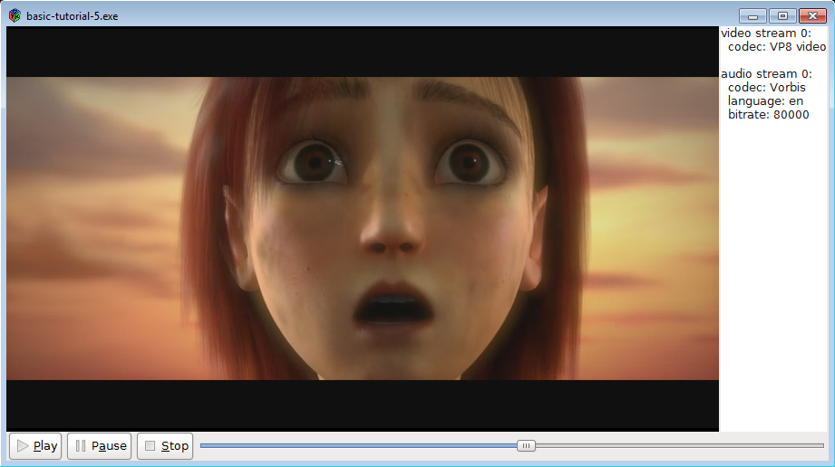

## 目标

本教程展示了如何将 GStreamer 集成到图形用户界面 （GUI） 工具包中，如 GTK+。基本上，GStreamer 负责媒体播放，而 GUI 工具包处理用户交互。最有趣的部分是两个库必须交互的部分：指示 GStreamer 将视频输出到 GTK+ 窗口，并将用户作转发到 GStreamer。

特别是，您将学习：

- 如何告诉 GStreamer 将视频输出到特定窗口（而不是创建自己的窗口）。

- 如何使用来自 GStreamer 的信息持续刷新 GUI。

- 如何从 GStreamer 的多个线程更新 GUI，大多数 GUI 工具包都禁止此作。

- 一种机制，用于仅订阅您感兴趣的消息，而不是收到所有消息的通知。

## 介绍

我们将使用 GTK+ 工具包，但这些概念适用于其他工具包，例如 Qt。最低限度的 GTK+ 知识将有助于理解本教程。

重点是告诉 GStreamer 将视频输出到我们选择的窗口。

一个常见的问题是 GUI 工具包通常只允许通过主（或应用程序）线程作图形“小部件”，而 GStreamer 通常会生成多个线程来处理不同的任务。从回调中调用 GTK+ 函数通常会失败，因为回调在调用线程中执行，而调用线程不需要是主线程。这个问题可以通过在回调中的 GStreamer 总线上发布消息来解决：消息将被主线程接收，然后主线程将做出相应的反应。

最后，到目前为止，我们已经注册了一个 handle_message 函数，每次总线上出现消息时都会调用该函数，这迫使我们解析每条消息以查看我们是否感兴趣。在本教程中，使用了一种不同的方法，该方法为每种消息注册一个回调，因此解析更少，总体代码更少。

## GTK+ 中的媒体播放器

让我们基于 playbin 编写一个非常简单的媒体播放器，这次是带有 GUI 的！

将此代码复制到名为 basic-tutorial-5.c 的文本文件中（或在 GStreamer 安装中找到它）。


```C
#include <string.h>

#include <gtk/gtk.h>
#include <gst/gst.h>
#include <gdk/gdk.h>

/* Structure to contain all our information, so we can pass it around */
typedef struct _CustomData {
  GstElement *playbin;           /* Our one and only pipeline */

  GtkWidget *sink_widget;         /* The widget where our video will be displayed */
  GtkWidget *slider;              /* Slider widget to keep track of current position */
  GtkWidget *streams_list;        /* Text widget to display info about the streams */
  gulong slider_update_signal_id; /* Signal ID for the slider update signal */

  GstState state;                 /* Current state of the pipeline */
  gint64 duration;                /* Duration of the clip, in nanoseconds */
} CustomData;

/* This function is called when the PLAY button is clicked */
static void play_cb (GtkButton *button, CustomData *data) {
  gst_element_set_state (data->playbin, GST_STATE_PLAYING);
}

/* This function is called when the PAUSE button is clicked */
static void pause_cb (GtkButton *button, CustomData *data) {
  gst_element_set_state (data->playbin, GST_STATE_PAUSED);
}

/* This function is called when the STOP button is clicked */
static void stop_cb (GtkButton *button, CustomData *data) {
  gst_element_set_state (data->playbin, GST_STATE_READY);
}

/* This function is called when the main window is closed */
static void delete_event_cb (GtkWidget *widget, GdkEvent *event, CustomData *data) {
  stop_cb (NULL, data);
  gtk_main_quit ();
}

/* This function is called when the slider changes its position. We perform a seek to the
 * new position here. */
static void slider_cb (GtkRange *range, CustomData *data) {
  gdouble value = gtk_range_get_value (GTK_RANGE (data->slider));
  gst_element_seek_simple (data->playbin, GST_FORMAT_TIME, GST_SEEK_FLAG_FLUSH | GST_SEEK_FLAG_KEY_UNIT,
      (gint64)(value * GST_SECOND));
}

/* This creates all the GTK+ widgets that compose our application, and registers the callbacks */
static void create_ui (CustomData *data) {
  GtkWidget *main_window;  /* The uppermost window, containing all other windows */
  GtkWidget *main_box;     /* VBox to hold main_hbox and the controls */
  GtkWidget *main_hbox;    /* HBox to hold the video sink and the stream info text widget */
  GtkWidget *controls;     /* HBox to hold the buttons and the slider */
  GtkWidget *play_button, *pause_button, *stop_button; /* Buttons */

  main_window = gtk_window_new (GTK_WINDOW_TOPLEVEL);
  g_signal_connect (G_OBJECT (main_window), "delete-event", G_CALLBACK (delete_event_cb), data);

  play_button = gtk_button_new_from_icon_name ("media-playback-start", GTK_ICON_SIZE_SMALL_TOOLBAR);
  g_signal_connect (G_OBJECT (play_button), "clicked", G_CALLBACK (play_cb), data);

  pause_button = gtk_button_new_from_icon_name ("media-playback-pause", GTK_ICON_SIZE_SMALL_TOOLBAR);
  g_signal_connect (G_OBJECT (pause_button), "clicked", G_CALLBACK (pause_cb), data);

  stop_button = gtk_button_new_from_icon_name ("media-playback-stop", GTK_ICON_SIZE_SMALL_TOOLBAR);
  g_signal_connect (G_OBJECT (stop_button), "clicked", G_CALLBACK (stop_cb), data);

  data->slider = gtk_scale_new_with_range (GTK_ORIENTATION_HORIZONTAL, 0, 100, 1);
  gtk_scale_set_draw_value (GTK_SCALE (data->slider), 0);
  data->slider_update_signal_id = g_signal_connect (G_OBJECT (data->slider), "value-changed", G_CALLBACK (slider_cb), data);

  data->streams_list = gtk_text_view_new ();
  gtk_text_view_set_editable (GTK_TEXT_VIEW (data->streams_list), FALSE);

  controls = gtk_box_new (GTK_ORIENTATION_HORIZONTAL, 0);
  gtk_box_pack_start (GTK_BOX (controls), play_button, FALSE, FALSE, 2);
  gtk_box_pack_start (GTK_BOX (controls), pause_button, FALSE, FALSE, 2);
  gtk_box_pack_start (GTK_BOX (controls), stop_button, FALSE, FALSE, 2);
  gtk_box_pack_start (GTK_BOX (controls), data->slider, TRUE, TRUE, 2);

  main_hbox = gtk_box_new (GTK_ORIENTATION_HORIZONTAL, 0);
  gtk_box_pack_start (GTK_BOX (main_hbox), data->sink_widget, TRUE, TRUE, 0);
  gtk_box_pack_start (GTK_BOX (main_hbox), data->streams_list, FALSE, FALSE, 2);

  main_box = gtk_box_new (GTK_ORIENTATION_VERTICAL, 0);
  gtk_box_pack_start (GTK_BOX (main_box), main_hbox, TRUE, TRUE, 0);
  gtk_box_pack_start (GTK_BOX (main_box), controls, FALSE, FALSE, 0);
  gtk_container_add (GTK_CONTAINER (main_window), main_box);
  gtk_window_set_default_size (GTK_WINDOW (main_window), 640, 480);

  gtk_widget_show_all (main_window);
}

/* This function is called periodically to refresh the GUI */
static gboolean refresh_ui (CustomData *data) {
  gint64 current = -1;

  /* We do not want to update anything unless we are in the PAUSED or PLAYING states */
  if (data->state < GST_STATE_PAUSED)
    return TRUE;

  /* If we didn't know it yet, query the stream duration */
  if (!GST_CLOCK_TIME_IS_VALID (data->duration)) {
    if (!gst_element_query_duration (data->playbin, GST_FORMAT_TIME, &data->duration)) {
      g_printerr ("Could not query current duration.\n");
    } else {
      /* Set the range of the slider to the clip duration, in SECONDS */
      gtk_range_set_range (GTK_RANGE (data->slider), 0, (gdouble)data->duration / GST_SECOND);
    }
  }

  if (gst_element_query_position (data->playbin, GST_FORMAT_TIME, &current)) {
    /* Block the "value-changed" signal, so the slider_cb function is not called
     * (which would trigger a seek the user has not requested) */
    g_signal_handler_block (data->slider, data->slider_update_signal_id);
    /* Set the position of the slider to the current pipeline position, in SECONDS */
    gtk_range_set_value (GTK_RANGE (data->slider), (gdouble)current / GST_SECOND);
    /* Re-enable the signal */
    g_signal_handler_unblock (data->slider, data->slider_update_signal_id);
  }
  return TRUE;
}

/* This function is called when new metadata is discovered in the stream */
static void tags_cb (GstElement *playbin, gint stream, CustomData *data) {
  /* We are possibly in a GStreamer working thread, so we notify the main
   * thread of this event through a message in the bus */
  gst_element_post_message (playbin,
    gst_message_new_application (GST_OBJECT (playbin),
      gst_structure_new_empty ("tags-changed")));
}

/* This function is called when an error message is posted on the bus */
static void error_cb (GstBus *bus, GstMessage *msg, CustomData *data) {
  GError *err;
  gchar *debug_info;

  /* Print error details on the screen */
  gst_message_parse_error (msg, &err, &debug_info);
  g_printerr ("Error received from element %s: %s\n", GST_OBJECT_NAME (msg->src), err->message);
  g_printerr ("Debugging information: %s\n", debug_info ? debug_info : "none");
  g_clear_error (&err);
  g_free (debug_info);

  /* Set the pipeline to READY (which stops playback) */
  gst_element_set_state (data->playbin, GST_STATE_READY);
}

/* This function is called when an End-Of-Stream message is posted on the bus.
 * We just set the pipeline to READY (which stops playback) */
static void eos_cb (GstBus *bus, GstMessage *msg, CustomData *data) {
  g_print ("End-Of-Stream reached.\n");
  gst_element_set_state (data->playbin, GST_STATE_READY);
}

/* This function is called when the pipeline changes states. We use it to
 * keep track of the current state. */
static void state_changed_cb (GstBus *bus, GstMessage *msg, CustomData *data) {
  GstState old_state, new_state, pending_state;
  gst_message_parse_state_changed (msg, &old_state, &new_state, &pending_state);
  if (GST_MESSAGE_SRC (msg) == GST_OBJECT (data->playbin)) {
    data->state = new_state;
    g_print ("State set to %s\n", gst_element_state_get_name (new_state));
    if (old_state == GST_STATE_READY && new_state == GST_STATE_PAUSED) {
      /* For extra responsiveness, we refresh the GUI as soon as we reach the PAUSED state */
      refresh_ui (data);
    }
  }
}

/* Extract metadata from all the streams and write it to the text widget in the GUI */
static void analyze_streams (CustomData *data) {
  gint i;
  GstTagList *tags;
  gchar *str, *total_str;
  guint rate;
  gint n_video, n_audio, n_text;
  GtkTextBuffer *text;

  /* Clean current contents of the widget */
  text = gtk_text_view_get_buffer (GTK_TEXT_VIEW (data->streams_list));
  gtk_text_buffer_set_text (text, "", -1);

  /* Read some properties */
  g_object_get (data->playbin, "n-video", &n_video, NULL);
  g_object_get (data->playbin, "n-audio", &n_audio, NULL);
  g_object_get (data->playbin, "n-text", &n_text, NULL);

  for (i = 0; i < n_video; i++) {
    tags = NULL;
    /* Retrieve the stream's video tags */
    g_signal_emit_by_name (data->playbin, "get-video-tags", i, &tags);
    if (tags) {
      total_str = g_strdup_printf ("video stream %d:\n", i);
      gtk_text_buffer_insert_at_cursor (text, total_str, -1);
      g_free (total_str);
      gst_tag_list_get_string (tags, GST_TAG_VIDEO_CODEC, &str);
      total_str = g_strdup_printf ("  codec: %s\n", str ? str : "unknown");
      gtk_text_buffer_insert_at_cursor (text, total_str, -1);
      g_free (total_str);
      g_free (str);
      gst_tag_list_free (tags);
    }
  }

  for (i = 0; i < n_audio; i++) {
    tags = NULL;
    /* Retrieve the stream's audio tags */
    g_signal_emit_by_name (data->playbin, "get-audio-tags", i, &tags);
    if (tags) {
      total_str = g_strdup_printf ("\naudio stream %d:\n", i);
      gtk_text_buffer_insert_at_cursor (text, total_str, -1);
      g_free (total_str);
      if (gst_tag_list_get_string (tags, GST_TAG_AUDIO_CODEC, &str)) {
        total_str = g_strdup_printf ("  codec: %s\n", str);
        gtk_text_buffer_insert_at_cursor (text, total_str, -1);
        g_free (total_str);
        g_free (str);
      }
      if (gst_tag_list_get_string (tags, GST_TAG_LANGUAGE_CODE, &str)) {
        total_str = g_strdup_printf ("  language: %s\n", str);
        gtk_text_buffer_insert_at_cursor (text, total_str, -1);
        g_free (total_str);
        g_free (str);
      }
      if (gst_tag_list_get_uint (tags, GST_TAG_BITRATE, &rate)) {
        total_str = g_strdup_printf ("  bitrate: %d\n", rate);
        gtk_text_buffer_insert_at_cursor (text, total_str, -1);
        g_free (total_str);
      }
      gst_tag_list_free (tags);
    }
  }

  for (i = 0; i < n_text; i++) {
    tags = NULL;
    /* Retrieve the stream's subtitle tags */
    g_signal_emit_by_name (data->playbin, "get-text-tags", i, &tags);
    if (tags) {
      total_str = g_strdup_printf ("\nsubtitle stream %d:\n", i);
      gtk_text_buffer_insert_at_cursor (text, total_str, -1);
      g_free (total_str);
      if (gst_tag_list_get_string (tags, GST_TAG_LANGUAGE_CODE, &str)) {
        total_str = g_strdup_printf ("  language: %s\n", str);
        gtk_text_buffer_insert_at_cursor (text, total_str, -1);
        g_free (total_str);
        g_free (str);
      }
      gst_tag_list_free (tags);
    }
  }
}

/* This function is called when an "application" message is posted on the bus.
 * Here we retrieve the message posted by the tags_cb callback */
static void application_cb (GstBus *bus, GstMessage *msg, CustomData *data) {
  if (g_strcmp0 (gst_structure_get_name (gst_message_get_structure (msg)), "tags-changed") == 0) {
    /* If the message is the "tags-changed" (only one we are currently issuing), update
     * the stream info GUI */
    analyze_streams (data);
  }
}

int main(int argc, char *argv[]) {
  CustomData data;
  GstStateChangeReturn ret;
  GstBus *bus;
  GstElement *gtkglsink, *videosink;

  /* Initialize GTK */
  gtk_init (&argc, &argv);

  /* Initialize GStreamer */
  gst_init (&argc, &argv);

  /* Initialize our data structure */
  memset (&data, 0, sizeof (data));
  data.duration = GST_CLOCK_TIME_NONE;

  /* Create the elements */
  data.playbin = gst_element_factory_make ("playbin", "playbin");
  videosink = gst_element_factory_make ("glsinkbin", "glsinkbin");
  gtkglsink = gst_element_factory_make ("gtkglsink", "gtkglsink");

  /* Here we create the GTK Sink element which will provide us with a GTK widget where
   * GStreamer will render the video at and we can add to our UI.
   * Try to create the OpenGL version of the video sink, and fallback if that fails */
  if (gtkglsink != NULL && videosink != NULL) {
    g_printerr ("Successfully created GTK GL Sink");

    g_object_set (videosink, "sink", gtkglsink, NULL);

    /* The gtkglsink creates the gtk widget for us. This is accessible through a property.
     * So we get it and use it later to add it to our gui. */
    g_object_get (gtkglsink, "widget", &data.sink_widget, NULL);
  } else {
    g_printerr ("Could not create gtkglsink, falling back to gtksink.\n");

    videosink = gst_element_factory_make ("gtksink", "gtksink");
    g_object_get (videosink, "widget", &data.sink_widget, NULL);
  }

  if (!data.playbin || !videosink) {
    g_printerr ("Not all elements could be created.\n");
    return -1;
  }

  /* Set the URI to play */
  g_object_set (data.playbin, "uri", "https://gstreamer.freedesktop.org/data/media/sintel_trailer-480p.webm", NULL);

  /* Set the video-sink  */
  g_object_set (data.playbin, "video-sink", videosink, NULL);

  /* Connect to interesting signals in playbin */
  g_signal_connect (G_OBJECT (data.playbin), "video-tags-changed", (GCallback) tags_cb, &data);
  g_signal_connect (G_OBJECT (data.playbin), "audio-tags-changed", (GCallback) tags_cb, &data);
  g_signal_connect (G_OBJECT (data.playbin), "text-tags-changed", (GCallback) tags_cb, &data);

  /* Create the GUI */
  create_ui (&data);

  /* Instruct the bus to emit signals for each received message, and connect to the interesting signals */
  bus = gst_element_get_bus (data.playbin);
  gst_bus_add_signal_watch (bus);
  g_signal_connect (G_OBJECT (bus), "message::error", (GCallback)error_cb, &data);
  g_signal_connect (G_OBJECT (bus), "message::eos", (GCallback)eos_cb, &data);
  g_signal_connect (G_OBJECT (bus), "message::state-changed", (GCallback)state_changed_cb, &data);
  g_signal_connect (G_OBJECT (bus), "message::application", (GCallback)application_cb, &data);
  gst_object_unref (bus);

  /* Start playing */
  ret = gst_element_set_state (data.playbin, GST_STATE_PLAYING);
  if (ret == GST_STATE_CHANGE_FAILURE) {
    g_printerr ("Unable to set the pipeline to the playing state.\n");
    gst_object_unref (data.playbin);
    gst_object_unref (videosink);
    return -1;
  }

  /* Register a function that GLib will call every second */
  g_timeout_add_seconds (1, (GSourceFunc)refresh_ui, &data);

  /* Start the GTK main loop. We will not regain control until gtk_main_quit is called. */
  gtk_main ();

  /* Free resources */
  gst_element_set_state (data.playbin, GST_STATE_NULL);
  gst_object_unref (data.playbin);
  gst_object_unref (videosink);

  return 0;
}
```

> 需要帮助？
>
> 如果您在编译此代码时需要帮助，请参阅针对您的平台构建教程部分：Linux、Mac OS X 或 Windows，或在 Linux 上使用以下特定命令：
>
> ``` gcc basic-tutorial-5.c -o basic-tutorial-5 `pkg-config --cflags --libs gtk+-3.0 gstreamer-1.0` ```
>
> 如果您需要运行此代码的帮助，请参阅适用于您的平台的运行教程部分：Linux、Mac OS X 或 Windows 的
> 
> 本教程将打开一个 GTK+ 窗口并显示一个电影，并附带音频。媒体是从 Internet 获取的，因此该窗口可能需要几秒钟才能显示，具体取决于您的连接速度。该窗口有一些 GTK+ 按钮用于暂停、停止和播放电影，还有一个滑块用于显示流的当前位置，可以拖动该滑块来更改它。此外，有关流的信息显示在窗口右边缘的列中。
>
> 请记住，没有延迟管理（缓冲），因此在连接速度较慢时，电影可能会在几秒钟后停止。了解基本教程 12：流式处理如何解决此问题。
>
> 必需安装的库：gtk+-3.0 gstreamer-1.0
>
>

## 代码走查

关于本教程的结构，我们不再使用前向函数定义：函数将在使用之前定义。此外，为了清晰解释，代码片段的显示顺序并不总是与程序顺序匹配。使用行号在完整代码中查找代码片段。

本教程主要由回调函数组成，这些函数将从 GStreamer 或 GTK+ 调用，因此让我们回顾一下注册所有这些回调的主函数。


```C
int main(int argc, char *argv[]) {
  CustomData data;
  GstStateChangeReturn ret;
  GstBus *bus;
  GstElement *gtkglsink, *videosink;

  /* Initialize GTK */
  gtk_init (&argc, &argv);

  /* Initialize GStreamer */
  gst_init (&argc, &argv);

  /* Initialize our data structure */
  memset (&data, 0, sizeof (data));
  data.duration = GST_CLOCK_TIME_NONE;

  /* Create the elements */
  data.playbin = gst_element_factory_make ("playbin", "playbin");
  videosink = gst_element_factory_make ("glsinkbin", "glsinkbin");
  gtkglsink = gst_element_factory_make ("gtkglsink", "gtkglsink");

  /* Here we create the GTK Sink element which will provide us with a GTK widget where
   * GStreamer will render the video at and we can add to our UI.
   * Try to create the OpenGL version of the video sink, and fallback if that fails */
  if ((gtkglsink) && (videosink)) {
    g_printerr ("Successfully created GTK GL Sink");

    g_object_set (videosink, "sink", gtkglsink, NULL);

    /* The gtkglsink creates the gtk widget for us. This is accessible through a property.
     * So we get it and use it later to add it to our gui. */
    g_object_get (gtkglsink, "widget", &data.sink_widget, NULL);
  } else {
    g_printerr ("Could not create gtkglsink, falling back to gtksink.\n");

    videosink = gst_element_factory_make ("gtksink", "gtksink");
    g_object_get (videosink, "widget", &data.sink_widget, NULL);
  }

  if ((!data.playbin) || (!videosink)) {
    g_printerr ("Not all elements could be created.\n");
    return -1;
  }

  /* Set the URI to play */
  g_object_set (data.playbin, "uri", "https://gstreamer.freedesktop.org/data/media/sintel_trailer-480p.webm", NULL);

  /* Set the video-sink  */
  g_object_set (data.playbin, "video-sink", videosink, NULL);
```

标准 GStreamer 初始化和 playbin 管道创建，以及 GTK 初始化。我们还创建了视频接收器元素，该元素将渲染到 GTK 小部件中。我们稍后将在 UI 中使用这个小部件。

```C
 /* Connect to interesting signals in playbin */
  g_signal_connect (G_OBJECT (data.playbin), "video-tags-changed", (GCallback) tags_cb, &data);
  g_signal_connect (G_OBJECT (data.playbin), "audio-tags-changed", (GCallback) tags_cb, &data);
  g_signal_connect (G_OBJECT (data.playbin), "text-tags-changed", (GCallback) tags_cb, &data);
```
我们希望在流中出现新标签（元数据）时收到通知。为简单起见，我们将处理来自同一回调tags_cb的各种标签（视频、音频和文本）。

```C
/* Create the GUI */
create_ui (&data);
```

所有 GTK+ 小部件的创建和信号注册都发生在这个函数中。它只包含与 GTK 相关的函数调用，因此我们将跳过它的定义。它注册的信号传达用户命令，如下所示。

```C
  /* Instruct the bus to emit signals for each received message, and connect to the interesting signals */
  bus = gst_element_get_bus (data.playbin);
  gst_bus_add_signal_watch (bus);
  g_signal_connect (G_OBJECT (bus), "message::error", (GCallback)error_cb, &data);
  g_signal_connect (G_OBJECT (bus), "message::eos", (GCallback)eos_cb, &data);
  g_signal_connect (G_OBJECT (bus), "message::state-changed", (GCallback)state_changed_cb, &data);
  g_signal_connect (G_OBJECT (bus), "message::application", (GCallback)application_cb, &data);
  gst_object_unref (bus);
```

在 Playback 教程 1： Playbin 用法中，gst_bus_add_watch() 用于注册一个函数，该函数接收发布到 GStreamer 总线的每条消息。我们可以通过使用信号来实现更精细的粒度，它允许我们只注册我们感兴趣的消息。通过调用 gst_bus_add_signal_watch()，我们指示总线在每次接收到消息时发出信号。此信号的名称为 message::detail，其中 detail 是触发信号发出的消息。例如，当总线收到 EOS 消息时，它会发出一个名为 message::eos 的信号。

本教程使用 Signals 的详细信息仅注册到我们关心的消息。如果我们注册了 message signal，我们会收到每条消息的通知，就像 gst_bus_add_watch() 所做的那样。

请记住，为了使总线监视工作（无论是 gst_bus_add_watch（） 还是 gst_bus_add_signal_watch（）），必须运行 GLib Main Loop。在这种情况下，它隐藏在 GTK+ 主循环中。

```C
/* Register a function that GLib will call every second */
g_timeout_add_seconds (1, (GSourceFunc)refresh_ui, &data);
```

在将控制权转移给 GTK+ 之前，我们使用 g_timeout_add_seconds() 来注册另一个回调，这次是超时，所以它每秒都会被调用。我们将使用它来刷新 refresh_ui 函数的 GUI。

在此之后，我们完成了设置，可以启动 GTK+ 主循环了。当有趣的事情发生时，我们将从 callback 中重新获得控制权。我们来回顾一下回调。每个回调都有不同的签名，具体取决于调用者。您可以在 signal 的文档中查找签名 （参数的含义和返回值）。

```C
/* This function is called when the PLAY button is clicked */
static void play_cb (GtkButton *button, CustomData *data) {
  gst_element_set_state (data->playbin, GST_STATE_PLAYING);
}

/* This function is called when the PAUSE button is clicked */
static void pause_cb (GtkButton *button, CustomData *data) {
  gst_element_set_state (data->playbin, GST_STATE_PAUSED);
}

/* This function is called when the STOP button is clicked */
static void stop_cb (GtkButton *button, CustomData *data) {
  gst_element_set_state (data->playbin, GST_STATE_READY);
}
```

这三个小回调与 GUI 中的 PLAY、PAUSE 和 STOP 按钮相关联。他们只需将 pipeline 设置为相应的 state。请注意，在 STOP 状态下，我们将管道设置为 READY。我们本可以将管道一直降低到 NULL 状态，但是，转换会慢一些，因为需要释放并重新获取某些资源（如音频设备）。

```C
/* This function is called when the main window is closed */
static void delete_event_cb (GtkWidget *widget, GdkEvent *event, CustomData *data) {
  stop_cb (NULL, data);
  gtk_main_quit ();
}
```

gtk_main_quit() 最终将调用 main 中的 gtk_main_run() 以终止，在这种情况下，这将完成程序。在这里，我们在主窗口关闭时调用它，在停止管道之后（只是为了整洁）。

```C
/* This function is called when the slider changes its position. We perform a seek to the
 * new position here. */
static void slider_cb (GtkRange *range, CustomData *data) {
  gdouble value = gtk_range_get_value (GTK_RANGE (data->slider));
  gst_element_seek_simple (data->playbin, GST_FORMAT_TIME, GST_SEEK_FLAG_FLUSH | GST_SEEK_FLAG_KEY_UNIT,
      (gint64)(value * GST_SECOND));
}
```

这是一个例子，说明由于 GStreamer 和 GTK+ 的协作，像搜索器栏（或允许搜索的滑块）这样的复杂 GUI 元素如何很容易地实现。如果滑块已被拖动到新位置，请告诉 GStreamer 使用 gst_element_seek_simple() 查找该位置（如基础教程 4：时间管理中所示）。滑块已设置好，因此其值表示秒。

值得一提的是，通过进行一些限制可以获得一些性能（和响应能力），也就是说，不响应每个用户请求 seek。由于查找作必然需要一些时间，因此在查找后等待半秒（例如）再允许另一个查找作通常更好。否则，如果用户疯狂拖动滑块，应用程序可能看起来没有响应，这将不允许在新搜索排队之前完成任何搜索。

```C
/* This function is called periodically to refresh the GUI */
static gboolean refresh_ui (CustomData *data) {
  gint64 current = -1;

  /* We do not want to update anything unless we are in the PAUSED or PLAYING states */
  if (data->state < GST_STATE_PAUSED)
    return TRUE;
```

此功能将移动滑块以反映媒体的当前位置。首先，如果我们没有处于 PLAYING 状态，则在这里无事可做（另外，位置和持续时间查询通常会失败）。

```C
/* If we didn't know it yet, query the stream duration */
if (!GST_CLOCK_TIME_IS_VALID (data->duration)) {
  if (!gst_element_query_duration (data->playbin, GST_FORMAT_TIME, &data->duration)) {
    g_printerr ("Could not query current duration.\n");
  } else {
    /* Set the range of the slider to the clip duration, in SECONDS */
    gtk_range_set_range (GTK_RANGE (data->slider), 0, (gdouble)data->duration / GST_SECOND);
  }
}
```

如果我们不知道 Clip 的持续时间，我们会恢复它，以便我们可以设置滑块的范围。

```C
if (gst_element_query_position (data->playbin, GST_FORMAT_TIME, &current)) {
  /* Block the "value-changed" signal, so the slider_cb function is not called
   * (which would trigger a seek the user has not requested) */
  g_signal_handler_block (data->slider, data->slider_update_signal_id);
  /* Set the position of the slider to the current pipeline position, in SECONDS */
  gtk_range_set_value (GTK_RANGE (data->slider), (gdouble)current / GST_SECOND);
  /* Re-enable the signal */
  g_signal_handler_unblock (data->slider, data->slider_update_signal_id);
}
return TRUE;
```

我们查询当前管道位置，并相应地设置滑块的位置。这将触发 value-changed 信号的发出，我们用它来了解用户何时拖动滑块。由于我们不希望 seek 发生，除非用户请求，因此我们在此作期间使用 g_signal_handler_block（） 和 g_signal_handler_unblock（） 禁用值更改信号发出。

从此函数返回 TRUE 将在将来保持调用状态。如果我们返回 FALSE，计时器将被删除。

```C
/* This function is called when new metadata is discovered in the stream */
static void tags_cb (GstElement *playbin, gint stream, CustomData *data) {
  /* We are possibly in a GStreamer working thread, so we notify the main
   * thread of this event through a message in the bus */
  gst_element_post_message (playbin,
    gst_message_new_application (GST_OBJECT (playbin),
      gst_structure_new_empty ("tags-changed")));
}
```
这是本教程的重点之一。当在媒体中发现新标签时，将从流线程（即应用程序（或主）线程以外的线程）调用此函数。我们在这里想做的是更新一个 GTK+ 小部件来反映这些新信息，但 GTK+ 不允许从主线程以外的线程进行作。

解决方案是让 playbin 在 bus 上发布一条消息并返回调用线程。在适当的时候，主线程将接收此消息并更新 GTK。

gst_element_post_message（） 使 GStreamer 元素将给定的消息发布到总线。gst_message_new_application（） 创建 APPLICATION 类型的新消息。GStreamer 消息具有不同的类型，这种特定类型保留给应用程序：它将通过总线，不受 GStreamer 的影响。类型列表可以在 GstMessageType 文档中找到。

消息可以通过其嵌入式 GstStructure 传递其他信息，GstStructure 是一个非常灵活的数据容器。在这里，我们使用 gst_structure_new（） 创建一个新结构，并将其命名为 tags-changed，以避免在我们想发送其他应用程序消息时产生混淆。

稍后，一旦进入主线程，总线将收到此消息并发出 message：：application 信号，我们已将其关联到 application_cb 函数：

```C
/* This function is called when an "application" message is posted on the bus.
 * Here we retrieve the message posted by the tags_cb callback */
static void application_cb (GstBus *bus, GstMessage *msg, CustomData *data) {
  if (g_strcmp0 (gst_structure_get_name (gst_message_get_structure (msg)), "tags-changed") == 0) {
    /* If the message is the "tags-changed" (only one we are currently issuing), update
     * the stream info GUI */
    analyze_streams (data);
  }
}
```
一旦我确定这是 tags-changed 消息，我们调用 analyze_streams 函数，该函数也用于 Playback tutorial 1： Playbin usage，那里有更详细的介绍。它基本上是从流中恢复标签，并将它们写入 GUI 中的文本小部件中。

error_cb、eos_cb 和 state_changed_cb 并不值得解释，因为它们的作用与之前的所有教程相同，但现在从它们自己的函数开始。

就是这样！本教程中的代码量可能看起来令人生畏，但所需的概念很少而且很容易。如果您遵循了前面的教程并且对 GTK 有一点了解，那么您可能已经了解了这个现在可以享受自己的媒体播放器了！



## 练习

如果此媒体播放器对您来说还不够好，请尝试将显示流信息的文本小部件更改为适当的列表视图（或树视图）。然后，当用户选择不同的流时，使 GStreamer 切换流！要切换流，您需要阅读 播放教程 1：Playbin 使用。

## 总结

本教程展示了：

- 如何使用 gtksink 元素将视频输出到特定的 GTK 小部件。
- 如何通过使用 g_timeout_add_seconds （） 注册超时回调来定期刷新 GUI。
- 如何使用 gst_element_post_message（） 通过总线通过应用程序消息将信息传达给主线程。
- 如何通过使用 gst_bus_add_signal_watch（） 使总线发出信号并使用信号详细信息区分所有消息类型，从而仅收到感兴趣的消息的通知。

这使您可以构建一个具有适当图形用户界面的有点完整的媒体播放器。

以下基本教程始终关注其他单独的 GStreamer 主题

很高兴您来到这里，很快再见！
