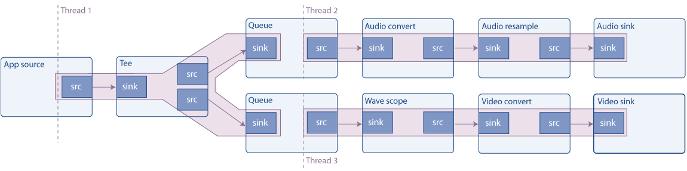

## 目标

GStreamer 会自动处理多线程处理，但在某些情况下，您可能需要手动解耦线程。本教程将介绍如何执行此作，此外，还完成了有关 Pad 可用性的阐述。更准确地说，本文档解释了：

- 如何为管道的某些部分创建新的执行线程

- 什么是 Pad 可用性

- 如何复制流

## 介绍

### 多线程

GStreamer 是一个多线程框架。这意味着，在内部，它会根据需要创建和销毁线程，例如，将流与应用程序线程分离。此外，插件还可以自由创建线程进行自己的处理，例如，视频解码器可以创建 4 个线程以充分利用具有 4 个内核的 CPU。

最重要的是，在构建管道时，应用程序可以显式指定分支（管道的一部分）在不同的线程上运行（例如，让音频和视频解码器同时执行）。

这是使用 queue 元素完成的，其工作方式如下。sink pad 只是将数据排入队列并返回控制权。在不同的线程上，数据被取消排队并推送到下游。此元素还用于缓冲，如后面的流式处理教程所示。队列的大小可以通过属性来控制。

### 管道示例

此示例构建以下管道：



源是一个合成音频信号（连续音调），它使用 tee 元素进行分割（它通过其源 Pad 发送通过其 Sink Pad 接收到的所有内容）。然后，一个分支将信号发送到声卡，另一个分支渲染波形的视频并将其发送到屏幕。

如图所示，队列会创建一个新线程，因此此管道在 3 个线程中运行。具有多个 sink 的管道通常需要多线程处理，因为要同步，sink 通常会阻止执行，直到所有其他 sink 都准备就绪，如果只有一个线程被第一个 sink 阻塞，则它们无法准备就绪。

### 请求 Pad

在基础教程3：动态管道中，我们看到了一个元素 （uridecodebin），它一开始就没有pad，当数据开始流动并且该元素了解媒体时，它们就会出现。这些被称为 Sometimes Pads，与始终可用的常规pad形成对比，称为 Always Pads。

第三种 pad 是 Request Pad，它是按需创建的。经典的例子是 tee 元素，它有一个 sink pad 并且没有初始 source pad：需要请求它们，然后 tee 添加它们。这样，输入流可以复制任意次数。缺点是，使用 Request Pads 链接元素不像链接 Always Pads 那样自动，如本示例的演练所示。

此外，要请求（或释放）处于 PLAYING 或 PAUSED 状态的打击垫，您需要采取本教程中未介绍的额外注意事项（打击垫阻塞）。不过，在 NULL 或 READY 状态下请求 （或释放） Pad是安全的。

事不宜迟，让我们看看代码。

## 简单的多线程示例

将此代码复制到名为 basic-tutorial-7.c 的文本文件中（或在 GStreamer 安装中找到它）。

```C
#include <gst/gst.h>

int main(int argc, char *argv[]) {
  GstElement *pipeline, *audio_source, *tee, *audio_queue, *audio_convert, *audio_resample, *audio_sink;
  GstElement *video_queue, *visual, *video_convert, *video_sink;
  GstBus *bus;
  GstMessage *msg;
  GstPad *tee_audio_pad, *tee_video_pad;
  GstPad *queue_audio_pad, *queue_video_pad;

  /* Initialize GStreamer */
  gst_init (&argc, &argv);

  /* Create the elements */
  audio_source = gst_element_factory_make ("audiotestsrc", "audio_source");
  tee = gst_element_factory_make ("tee", "tee");
  audio_queue = gst_element_factory_make ("queue", "audio_queue");
  audio_convert = gst_element_factory_make ("audioconvert", "audio_convert");
  audio_resample = gst_element_factory_make ("audioresample", "audio_resample");
  audio_sink = gst_element_factory_make ("autoaudiosink", "audio_sink");
  video_queue = gst_element_factory_make ("queue", "video_queue");
  visual = gst_element_factory_make ("wavescope", "visual");
  video_convert = gst_element_factory_make ("videoconvert", "csp");
  video_sink = gst_element_factory_make ("autovideosink", "video_sink");

  /* Create the empty pipeline */
  pipeline = gst_pipeline_new ("test-pipeline");

  if (!pipeline || !audio_source || !tee || !audio_queue || !audio_convert || !audio_resample || !audio_sink ||
      !video_queue || !visual || !video_convert || !video_sink) {
    g_printerr ("Not all elements could be created.\n");
    return -1;
  }

  /* Configure elements */
  g_object_set (audio_source, "freq", 215.0f, NULL);
  g_object_set (visual, "shader", 0, "style", 1, NULL);

  /* Link all elements that can be automatically linked because they have "Always" pads */
  gst_bin_add_many (GST_BIN (pipeline), audio_source, tee, audio_queue, audio_convert, audio_resample, audio_sink,
      video_queue, visual, video_convert, video_sink, NULL);
  if (gst_element_link_many (audio_source, tee, NULL) != TRUE ||
      gst_element_link_many (audio_queue, audio_convert, audio_resample, audio_sink, NULL) != TRUE ||
      gst_element_link_many (video_queue, visual, video_convert, video_sink, NULL) != TRUE) {
    g_printerr ("Elements could not be linked.\n");
    gst_object_unref (pipeline);
    return -1;
  }

  /* Manually link the Tee, which has "Request" pads */
  tee_audio_pad = gst_element_request_pad_simple (tee, "src_%u");
  g_print ("Obtained request pad %s for audio branch.\n", gst_pad_get_name (tee_audio_pad));
  queue_audio_pad = gst_element_get_static_pad (audio_queue, "sink");
  tee_video_pad = gst_element_request_pad_simple (tee, "src_%u");
  g_print ("Obtained request pad %s for video branch.\n", gst_pad_get_name (tee_video_pad));
  queue_video_pad = gst_element_get_static_pad (video_queue, "sink");
  if (gst_pad_link (tee_audio_pad, queue_audio_pad) != GST_PAD_LINK_OK ||
      gst_pad_link (tee_video_pad, queue_video_pad) != GST_PAD_LINK_OK) {
    g_printerr ("Tee could not be linked.\n");
    gst_object_unref (pipeline);
    return -1;
  }
  gst_object_unref (queue_audio_pad);
  gst_object_unref (queue_video_pad);

  /* Start playing the pipeline */
  gst_element_set_state (pipeline, GST_STATE_PLAYING);

  /* Wait until error or EOS */
  bus = gst_element_get_bus (pipeline);
  msg = gst_bus_timed_pop_filtered (bus, GST_CLOCK_TIME_NONE, GST_MESSAGE_ERROR | GST_MESSAGE_EOS);

  /* Release the request pads from the Tee, and unref them */
  gst_element_release_request_pad (tee, tee_audio_pad);
  gst_element_release_request_pad (tee, tee_video_pad);
  gst_object_unref (tee_audio_pad);
  gst_object_unref (tee_video_pad);

  /* Free resources */
  if (msg != NULL)
    gst_message_unref (msg);
  gst_object_unref (bus);
  gst_element_set_state (pipeline, GST_STATE_NULL);

  gst_object_unref (pipeline);
  return 0;
}
```

> 需要帮助？
>
> 如果您在编译此代码时需要帮助，请参阅针对您的平台构建教程部分：Linux、Mac OS X 或 Windows，或在 Linux 上使用以下特定命令：
>
> ``` gcc basic-tutorial-7.c -o basic-tutorial-7 `pkg-config --cflags --libs gstreamer-1.0` ```
>
> 如果您需要运行此代码的帮助，请参阅适用于您的平台的运行教程部分：Linux、Mac OS X 或 Windows 的
> 
> 本教程通过声卡播放可听音，并打开一个窗口，其中包含音调的波形表示。波形应该是正弦曲线，但由于窗口的刷新，可能不会显示如此。
>
> 请记住，没有延迟管理(缓冲)，因此在连接速度较慢时，电影可能会在几秒钟后停止。了解基本教程 12：流式处理如何解决此问题。
>
> 必需安装的库：gstreamer-1.0
>
>

## 代码走查

```C
/* Create the elements */
audio_source = gst_element_factory_make ("audiotestsrc", "audio_source");
tee = gst_element_factory_make ("tee", "tee");
audio_queue = gst_element_factory_make ("queue", "audio_queue");
audio_convert = gst_element_factory_make ("audioconvert", "audio_convert");
audio_resample = gst_element_factory_make ("audioresample", "audio_resample");
audio_sink = gst_element_factory_make ("autoaudiosink", "audio_sink");
video_queue = gst_element_factory_make ("queue", "video_queue");
visual = gst_element_factory_make ("wavescope", "visual");
video_convert = gst_element_factory_make ("videoconvert", "video_convert");
video_sink = gst_element_factory_make ("autovideosink", "video_sink");
```

上图中的所有元素都在此处实例化：

AudioTestsrc 产生合成音调。Wavescope 使用音频信号并呈现波形，就好像它是一个（公认的廉价的）示波器一样。我们已经使用了 autoaudiosink 和 autovideosink。

转换元素（audioconvert、audioresample 和 videoconvert）是保证管道可以链接所必需的。事实上，音频和视频接收器的功能取决于硬件，在设计时您不知道它们是否会匹配 audiotestsrc 和 wavescope 生成的 Caps。但是，如果 Cap 匹配，这些元素将在 “直通” 模式下运行，并且不会修改信号，因此对性能的影响可以忽略不计。

```C
/* Configure elements */
g_object_set (audio_source, "freq", 215.0f, NULL);
g_object_set (visual, "shader", 0, "style", 1, NULL);
```

为了更好地演示而进行的小调整：audiotestsrc 的 “freq” 属性控制波的频率（215Hz 使波在窗口中看起来几乎静止），波的这种样式和着色器使波连续。使用基本教程 10：GStreamer 工具中描述的 gst-inspect-1.0 工具来了解这些元素的所有属性。

```C
/* Link all elements that can be automatically linked because they have "Always" pads */
gst_bin_add_many (GST_BIN (pipeline), audio_source, tee, audio_queue, audio_convert, audio_sink,
    video_queue, visual, video_convert, video_sink, NULL);
if (gst_element_link_many (audio_source, tee, NULL) != TRUE ||
    gst_element_link_many (audio_queue, audio_convert, audio_sink, NULL) != TRUE ||
    gst_element_link_many (video_queue, visual, video_convert, video_sink, NULL) != TRUE) {
  g_printerr ("Elements could not be linked.\n");
  gst_object_unref (pipeline);
  return -1;
}
```
此代码块将所有元素添加到管道中，然后链接可以自动链接的元素（如注释所示，具有 Always Pads 的元素）。

> 
> gst_element_link_many（） 实际上可以用 Request Pad 链接元素。它在内部请求 Pads，因此您不必担心链接的元素具有 Always 或 Request Pads。
> 虽然看起来很奇怪，但这实际上很不方便，因为你仍然需要在之后释放请求的 Pads，而且，如果 Pad 是由 gst_element_link_many（） 自动请求的，则很容易忘记。
> 通过始终手动请求 Request Pads 来避免麻烦，如下一个代码块所示。
>

```C
/* Manually link the Tee, which has "Request" pads */
tee_audio_pad = gst_element_request_pad_simple (tee, "src_%u");
g_print ("Obtained request pad %s for audio branch.\n", gst_pad_get_name (tee_audio_pad));
queue_audio_pad = gst_element_get_static_pad (audio_queue, "sink");
tee_video_pad = gst_element_request_pad_simple (tee, "src_%u");
g_print ("Obtained request pad %s for video branch.\n", gst_pad_get_name (tee_video_pad));
queue_video_pad = gst_element_get_static_pad (video_queue, "sink");
if (gst_pad_link (tee_audio_pad, queue_audio_pad) != GST_PAD_LINK_OK ||
    gst_pad_link (tee_video_pad, queue_video_pad) != GST_PAD_LINK_OK) {
  g_printerr ("Tee could not be linked.\n");
  gst_object_unref (pipeline);
  return -1;
}
gst_object_unref (queue_audio_pad);
gst_object_unref (queue_video_pad);
```

要链接 Request Pad，需要通过将它们 “request” 到 element 来获取它们。一个元素可能能够生成不同类型的请求 Pad，因此，在请求它们时，必须提供所需的 Pad 模板名称。在 tee 元素的文档中，我们看到它有两个名为 “sink” （用于其 sink Pads） 和 “src_%u” （用于请求 Pads） 的 pad 模板。我们使用 gst_element_request_pad_simple（） 从 tee 请求两个 Pads（用于 audio 和 video 分支）。

然后，我们从这些请求 Pads 需要链接到的下游元素中获取 Pads。这些是普通的 Always Pads，因此我们使用 gst_element_get_static_pad（） 获取它们。

最后，我们将 pad 与 gst_pad_link（） 链接起来。这是 gst_element_link（） 和 gst_element_link_many（） 在内部使用的函数。

我们获得的 sink pad 需要用 gst_object_unref（） 释放。当我们不再需要请求板时，将在程序结束时释放它们。

然后，我们将管道设置为照常播放，并等待生成错误消息或 EOS。剩下唯一要做的就是清理请求的 Pads：

```C
/* Release the request pads from the Tee, and unref them */
gst_element_release_request_pad (tee, tee_audio_pad);
gst_element_release_request_pad (tee, tee_video_pad);
gst_object_unref (tee_audio_pad);
gst_object_unref (tee_video_pad);
```

gst_element_release_request_pad（） 从 tee 释放Pad，但仍需要使用 gst_object_unref（） 取消引用 （释放） 它。


## 总结

本教程展示了：

- 如何使用队列元素使管道的各个部分在不同的线程上运行。

- 什么是请求板以及如何使用 gst_element_request_pad_simple（）、gst_pad_link（） 和 gst_element_release_request_pad（） 将元素与请求板链接起来。

- 如何使用 tee 元素在不同的分支中提供相同的流。

下一个教程将在此教程的基础上构建，以展示如何手动将数据注入正在运行的管道并从中提取数据。

很高兴您来到这里，很快再见！

