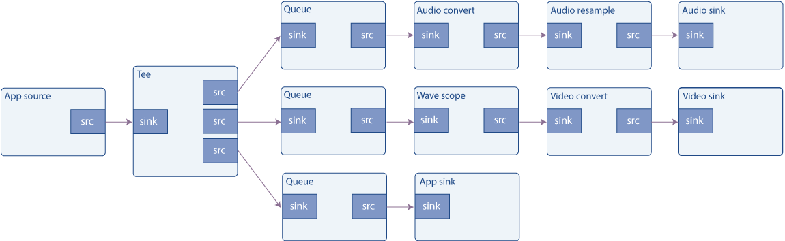

## 目标

使用 GStreamer 构建的管道不需要完全关闭。数据可以随时以多种方式注入管道并从中提取。本教程展示了：

- 如何将外部数据注入到通用 GStreamer 管道中。

- 如何从常规 GStreamer 管道中提取数据。

- 如何访问和作此数据。

播放教程 3：简化管道 介绍了如何在基于 playbin 的管道中实现相同的目标。

## 简介

应用程序可以通过多种方式与流经 GStreamer 管道的数据进行交互。本教程介绍了最简单的方法，因为它使用了为此唯一目的而创建的元素。

用于将应用程序数据注入 GStreamer 管道的元素是 appsrc，用于将 GStreamer 数据提取回应用程序的对应元素是 appsink。为避免混淆名称，请从 GStreamer 的角度考虑一下：appsrc 只是一个常规源，它提供从天而降的数据（实际上是由应用程序提供的）。appsink 是一个常规的 sink，流经 GStreamer 管道的数据在这里被销毁（实际上，它由应用程序恢复）。

appsrc 和 appsink 的用途非常广泛，它们提供了自己的 API（请参阅其文档），可以通过链接到 gstreamer-app 库来访问这些 API。但是，在本教程中，我们将使用一种更简单的方法并通过信号控制它们。

appsrc 可以在多种模式下工作：在 Pull 模式下，它每次需要时都会从应用程序请求数据。在推送模式下，应用程序按自己的速度推送数据。此外，在 push 模式下，应用程序可以选择在已经提供足够的数据时在 push 函数中阻塞，或者它可以监听 enough-data 和 need-data 信号来控制流。此示例实现后一种方法。有关其他方法的信息可以在 appsrc 文档中找到。

### 缓冲区

数据以称为缓冲区的块的形式通过 GStreamer 管道传输。由于此示例生成和使用数据，因此我们需要了解 GstBuffers。

Source Pads 会生成 Sink Pad 消耗的缓冲区;GStreamer 获取这些缓冲区并将它们从一个元素传递到另一个元素。

缓冲区仅表示一个数据单元，不要假设所有缓冲区都具有相同的大小或表示相同的时间量。您也不应假设如果单个缓冲区进入一个元素，则会出现单个缓冲区。元素可以随意使用接收到的缓冲区。GstBuffers 还可能包含多个实际内存缓冲区。实际的内存缓冲区使用 GstMemory 对象抽象出来，并且 GstBuffer 可以包含多个 GstMemory 对象。

每个缓冲区都有附加的时间戳和持续时间，它们描述了缓冲区的内容应在哪一刻被解码、渲染或显示。时间戳是一个非常复杂和微妙的主题，但这个简化的愿景现在应该就足够了。

例如，filesrc （读取文件的 GStreamer 元素） 生成具有 “ANY” 大写且没有时间戳信息的缓冲区。解复用后（请参阅基本教程 3：动态管道）缓冲区可以具有一些特定的大写字母，例如 “video/x-h264”。解码后，每个缓冲区将包含一个视频帧，该帧带有原始大写字母 （“video/x-raw，format=...”） 和非常精确的时间戳，指示何时应显示该帧。

### 本教程

本教程以两种方式扩展了 Basic tutorial 7： Multithreading and Pad Availability：首先，audiotestsrc 被一个 appsrc 替换，它将生成音频数据。其次，向 tee 添加了一个新分支，以便进入音频接收器的数据和波形显示也被复制到应用程序接收器中。appsink 将信息上传回应用程序，然后应用程序只是通知用户已收到数据，但它显然可以执行更复杂的任务。



## 粗略波形发生器

将此代码复制到名为 basic-tutorial-8.c 的文本文件中（或在 GStreamer 安装中找到它）。

```C
#include <gst/gst.h>
#include <gst/audio/audio.h>
#include <string.h>

#define CHUNK_SIZE 1024   /* Amount of bytes we are sending in each buffer */
#define SAMPLE_RATE 44100 /* Samples per second we are sending */

/* Structure to contain all our information, so we can pass it to callbacks */
typedef struct _CustomData {
  GstElement *pipeline, *app_source, *tee, *audio_queue, *audio_convert1, *audio_resample, *audio_sink;
  GstElement *video_queue, *audio_convert2, *visual, *video_convert, *video_sink;
  GstElement *app_queue, *app_sink;

  guint64 num_samples;   /* Number of samples generated so far (for timestamp generation) */
  gfloat a, b, c, d;     /* For waveform generation */

  guint sourceid;        /* To control the GSource */

  GMainLoop *main_loop;  /* GLib's Main Loop */
} CustomData;

/* This method is called by the idle GSource in the mainloop, to feed CHUNK_SIZE bytes into appsrc.
 * The idle handler is added to the mainloop when appsrc requests us to start sending data (need-data signal)
 * and is removed when appsrc has enough data (enough-data signal).
 */
static gboolean push_data (CustomData *data) {
  GstBuffer *buffer;
  GstFlowReturn ret;
  int i;
  GstMapInfo map;
  gint16 *raw;
  gint num_samples = CHUNK_SIZE / 2; /* Because each sample is 16 bits */
  gfloat freq;

  /* Create a new empty buffer */
  buffer = gst_buffer_new_and_alloc (CHUNK_SIZE);

  /* Set its timestamp and duration */
  GST_BUFFER_TIMESTAMP (buffer) = gst_util_uint64_scale (data->num_samples, GST_SECOND, SAMPLE_RATE);
  GST_BUFFER_DURATION (buffer) = gst_util_uint64_scale (num_samples, GST_SECOND, SAMPLE_RATE);

  /* Generate some psychodelic waveforms */
  gst_buffer_map (buffer, &map, GST_MAP_WRITE);
  raw = (gint16 *)map.data;
  data->c += data->d;
  data->d -= data->c / 1000;
  freq = 1100 + 1000 * data->d;
  for (i = 0; i < num_samples; i++) {
    data->a += data->b;
    data->b -= data->a / freq;
    raw[i] = (gint16)(500 * data->a);
  }
  gst_buffer_unmap (buffer, &map);
  data->num_samples += num_samples;

  /* Push the buffer into the appsrc */
  g_signal_emit_by_name (data->app_source, "push-buffer", buffer, &ret);

  /* Free the buffer now that we are done with it */
  gst_buffer_unref (buffer);

  if (ret != GST_FLOW_OK) {
    /* We got some error, stop sending data */
    return FALSE;
  }

  return TRUE;
}

/* This signal callback triggers when appsrc needs data. Here, we add an idle handler
 * to the mainloop to start pushing data into the appsrc */
static void start_feed (GstElement *source, guint size, CustomData *data) {
  if (data->sourceid == 0) {
    g_print ("Start feeding\n");
    data->sourceid = g_idle_add ((GSourceFunc) push_data, data);
  }
}

/* This callback triggers when appsrc has enough data and we can stop sending.
 * We remove the idle handler from the mainloop */
static void stop_feed (GstElement *source, CustomData *data) {
  if (data->sourceid != 0) {
    g_print ("Stop feeding\n");
    g_source_remove (data->sourceid);
    data->sourceid = 0;
  }
}

/* The appsink has received a buffer */
static GstFlowReturn new_sample (GstElement *sink, CustomData *data) {
  GstSample *sample;

  /* Retrieve the buffer */
  g_signal_emit_by_name (sink, "pull-sample", &sample);
  if (sample) {
    /* The only thing we do in this example is print a * to indicate a received buffer */
    g_print ("*");
    gst_sample_unref (sample);
    return GST_FLOW_OK;
  }

  return GST_FLOW_ERROR;
}

/* This function is called when an error message is posted on the bus */
static void error_cb (GstBus *bus, GstMessage *msg, CustomData *data) {
  GError *err;
  gchar *debug_info;

  /* Print error details on the screen */
  gst_message_parse_error (msg, &err, &debug_info);
  g_printerr ("Error received from element %s: %s\n", GST_OBJECT_NAME (msg->src), err->message);
  g_printerr ("Debugging information: %s\n", debug_info ? debug_info : "none");
  g_clear_error (&err);
  g_free (debug_info);

  g_main_loop_quit (data->main_loop);
}

int main(int argc, char *argv[]) {
  CustomData data;
  GstPad *tee_audio_pad, *tee_video_pad, *tee_app_pad;
  GstPad *queue_audio_pad, *queue_video_pad, *queue_app_pad;
  GstAudioInfo info;
  GstCaps *audio_caps;
  GstBus *bus;

  /* Initialize custom data structure */
  memset (&data, 0, sizeof (data));
  data.b = 1; /* For waveform generation */
  data.d = 1;

  /* Initialize GStreamer */
  gst_init (&argc, &argv);

  /* Create the elements */
  data.app_source = gst_element_factory_make ("appsrc", "audio_source");
  data.tee = gst_element_factory_make ("tee", "tee");
  data.audio_queue = gst_element_factory_make ("queue", "audio_queue");
  data.audio_convert1 = gst_element_factory_make ("audioconvert", "audio_convert1");
  data.audio_resample = gst_element_factory_make ("audioresample", "audio_resample");
  data.audio_sink = gst_element_factory_make ("autoaudiosink", "audio_sink");
  data.video_queue = gst_element_factory_make ("queue", "video_queue");
  data.audio_convert2 = gst_element_factory_make ("audioconvert", "audio_convert2");
  data.visual = gst_element_factory_make ("wavescope", "visual");
  data.video_convert = gst_element_factory_make ("videoconvert", "video_convert");
  data.video_sink = gst_element_factory_make ("autovideosink", "video_sink");
  data.app_queue = gst_element_factory_make ("queue", "app_queue");
  data.app_sink = gst_element_factory_make ("appsink", "app_sink");

  /* Create the empty pipeline */
  data.pipeline = gst_pipeline_new ("test-pipeline");

  if (!data.pipeline || !data.app_source || !data.tee || !data.audio_queue || !data.audio_convert1 ||
      !data.audio_resample || !data.audio_sink || !data.video_queue || !data.audio_convert2 || !data.visual ||
      !data.video_convert || !data.video_sink || !data.app_queue || !data.app_sink) {
    g_printerr ("Not all elements could be created.\n");
    return -1;
  }

  /* Configure wavescope */
  g_object_set (data.visual, "shader", 0, "style", 0, NULL);

  /* Configure appsrc */
  gst_audio_info_set_format (&info, GST_AUDIO_FORMAT_S16, SAMPLE_RATE, 1, NULL);
  audio_caps = gst_audio_info_to_caps (&info);
  g_object_set (data.app_source, "caps", audio_caps, "format", GST_FORMAT_TIME, NULL);
  g_signal_connect (data.app_source, "need-data", G_CALLBACK (start_feed), &data);
  g_signal_connect (data.app_source, "enough-data", G_CALLBACK (stop_feed), &data);

  /* Configure appsink */
  g_object_set (data.app_sink, "emit-signals", TRUE, "caps", audio_caps, NULL);
  g_signal_connect (data.app_sink, "new-sample", G_CALLBACK (new_sample), &data);
  gst_caps_unref (audio_caps);

  /* Link all elements that can be automatically linked because they have "Always" pads */
  gst_bin_add_many (GST_BIN (data.pipeline), data.app_source, data.tee, data.audio_queue, data.audio_convert1, data.audio_resample,
      data.audio_sink, data.video_queue, data.audio_convert2, data.visual, data.video_convert, data.video_sink, data.app_queue,
      data.app_sink, NULL);
  if (gst_element_link_many (data.app_source, data.tee, NULL) != TRUE ||
      gst_element_link_many (data.audio_queue, data.audio_convert1, data.audio_resample, data.audio_sink, NULL) != TRUE ||
      gst_element_link_many (data.video_queue, data.audio_convert2, data.visual, data.video_convert, data.video_sink, NULL) != TRUE ||
      gst_element_link_many (data.app_queue, data.app_sink, NULL) != TRUE) {
    g_printerr ("Elements could not be linked.\n");
    gst_object_unref (data.pipeline);
    return -1;
  }

  /* Manually link the Tee, which has "Request" pads */
  tee_audio_pad = gst_element_request_pad_simple (data.tee, "src_%u");
  g_print ("Obtained request pad %s for audio branch.\n", gst_pad_get_name (tee_audio_pad));
  queue_audio_pad = gst_element_get_static_pad (data.audio_queue, "sink");
  tee_video_pad = gst_element_request_pad_simple (data.tee, "src_%u");
  g_print ("Obtained request pad %s for video branch.\n", gst_pad_get_name (tee_video_pad));
  queue_video_pad = gst_element_get_static_pad (data.video_queue, "sink");
  tee_app_pad = gst_element_request_pad_simple (data.tee, "src_%u");
  g_print ("Obtained request pad %s for app branch.\n", gst_pad_get_name (tee_app_pad));
  queue_app_pad = gst_element_get_static_pad (data.app_queue, "sink");
  if (gst_pad_link (tee_audio_pad, queue_audio_pad) != GST_PAD_LINK_OK ||
      gst_pad_link (tee_video_pad, queue_video_pad) != GST_PAD_LINK_OK ||
      gst_pad_link (tee_app_pad, queue_app_pad) != GST_PAD_LINK_OK) {
    g_printerr ("Tee could not be linked\n");
    gst_object_unref (data.pipeline);
    return -1;
  }
  gst_object_unref (queue_audio_pad);
  gst_object_unref (queue_video_pad);
  gst_object_unref (queue_app_pad);

  /* Instruct the bus to emit signals for each received message, and connect to the interesting signals */
  bus = gst_element_get_bus (data.pipeline);
  gst_bus_add_signal_watch (bus);
  g_signal_connect (G_OBJECT (bus), "message::error", (GCallback)error_cb, &data);
  gst_object_unref (bus);

  /* Start playing the pipeline */
  gst_element_set_state (data.pipeline, GST_STATE_PLAYING);

  /* Create a GLib Main Loop and set it to run */
  data.main_loop = g_main_loop_new (NULL, FALSE);
  g_main_loop_run (data.main_loop);

  /* Release the request pads from the Tee, and unref them */
  gst_element_release_request_pad (data.tee, tee_audio_pad);
  gst_element_release_request_pad (data.tee, tee_video_pad);
  gst_element_release_request_pad (data.tee, tee_app_pad);
  gst_object_unref (tee_audio_pad);
  gst_object_unref (tee_video_pad);
  gst_object_unref (tee_app_pad);

  /* Free resources */
  gst_element_set_state (data.pipeline, GST_STATE_NULL);
  gst_object_unref (data.pipeline);
  return 0;
}
```

> 需要帮助？
>
> 如果您在编译此代码时需要帮助，请参阅针对您的平台构建教程部分：Linux、Mac OS X 或 Windows，或在 Linux 上使用以下特定命令：
>
> ``` gcc basic-tutorial-8.c -o basic-tutorial-8 `pkg-config --cflags --libs gstreamer-1.0 gstreamer-audio-1.0` ```
>
> 如果您需要运行此代码的帮助，请参阅适用于您的平台的运行教程部分：Linux、Mac OS X 或 Windows 的
> 
> 本教程通过声卡播放不同频率的可听音，并打开一个窗口，其中包含音调的波形表示。波形应该是正弦曲线，但由于窗口的刷新，可能不会显示如此。
>
> 请记住，没有延迟管理(缓冲)，因此在连接速度较慢时，电影可能会在几秒钟后停止。了解基本教程 12：流式处理如何解决此问题。
>
> 必需安装的库：gstreamer-1.0
>
>

## 代码走读

创建管道的代码（第 131 行到第 205 行）是 Basic tutorial 7： Multithreading and Pad Availability 的放大版本。它涉及实例化所有元素，将元素与 Always Pads 链接，以及手动链接 tee 元素的 Request Pads。

关于 appsrc 和 appsink 元素的配置：

```C
/* Configure appsrc */
gst_audio_info_set_format (&info, GST_AUDIO_FORMAT_S16, SAMPLE_RATE, 1, NULL);
audio_caps = gst_audio_info_to_caps (&info);
g_object_set (data.app_source, "caps", audio_caps, NULL);
g_signal_connect (data.app_source, "need-data", G_CALLBACK (start_feed), &data);
g_signal_connect (data.app_source, "enough-data", G_CALLBACK (stop_feed), &data);
```

需要在 appsrc 上设置的第一个属性是 caps。它指定了元素将要生成的数据类型，因此 GStreamer 可以检查是否可以与下游元素链接（也就是说，下游元素是否能够理解此类数据）。此属性必须是 GstCaps 对象，该对象很容易从带有 gst_caps_from_string（） 的字符串生成。

然后我们连接到 need-data 和 enough-data 信号。这些分别由 appsrc 在其内部数据队列不足或几乎满时触发。我们将使用这些信号来启动和停止（分别）我们的信号生成过程。

```C
/* Configure appsink */
g_object_set (data.app_sink, "emit-signals", TRUE, "caps", audio_caps, NULL);
g_signal_connect (data.app_sink, "new-sample", G_CALLBACK (new_sample), &data);
gst_caps_unref (audio_caps);
```

关于 appsink 配置，我们连接到 new-sample 信号，每次 sink 接收到缓冲区时都会发出该信号。此外，还需要通过 emit-signals 属性来启用信号发射，因为默认情况下，它是禁用的。

启动管道、等待消息和最终清理将照常完成。让我们回顾一下我们刚刚注册的回调：

```C
/* This signal callback triggers when appsrc needs data. Here, we add an idle handler
 * to the mainloop to start pushing data into the appsrc */
static void start_feed (GstElement *source, guint size, CustomData *data) {
  if (data->sourceid == 0) {
    g_print ("Start feeding\n");
    data->sourceid = g_idle_add ((GSourceFunc) push_data, data);
  }
}
```

当 appsrc 的内部队列即将耗尽（数据耗尽）时，将调用此函数。我们在这里唯一要做的就是用 g_idle_add（） 注册一个 GLib 空闲函数，该函数将数据提供给 appsrc，直到它再次填满。GLib 空闲函数是 GLib 在“空闲”时（即当没有更高优先级的任务要执行时）从其主循环中调用的方法。显然，它需要一个 GLib GMainLoop 来实例化和运行。

这只是 appsrc 允许的多种方法之一。特别是，不需要使用 GLib 从主线程将缓冲区馈送到 appsrc 中，并且您不需要使用 need-data 和 enough-data 信号来与 appsrc 同步（尽管据称这是最方便的）。

我们记下 g_idle_add（） 返回的 sourceid，以便稍后禁用它。

```C
/* This callback triggers when appsrc has enough data and we can stop sending.
 * We remove the idle handler from the mainloop */
static void stop_feed (GstElement *source, CustomData *data) {
  if (data->sourceid != 0) {
    g_print ("Stop feeding\n");
    g_source_remove (data->sourceid);
    data->sourceid = 0;
  }
}
```

当 appsrc 的内部队列足够满时，将调用此函数，以便我们停止推送数据。在这里，我们简单地使用 g_source_remove（） 删除 idle 函数（idle 函数作为 GSource 实现）。

```C
/* This method is called by the idle GSource in the mainloop, to feed CHUNK_SIZE bytes into appsrc.
 * The ide handler is added to the mainloop when appsrc requests us to start sending data (need-data signal)
 * and is removed when appsrc has enough data (enough-data signal).
 */
static gboolean push_data (CustomData *data) {
  GstBuffer *buffer;
  GstFlowReturn ret;
  GstMapInfo map;
  int i;
  gint num_samples = CHUNK_SIZE / 2; /* Because each sample is 16 bits */
  gfloat freq;

  /* Create a new empty buffer */
  buffer = gst_buffer_new_and_alloc (CHUNK_SIZE);

  /* Set its timestamp and duration */
  GST_BUFFER_TIMESTAMP (buffer) = gst_util_uint64_scale (data->num_samples, GST_SECOND, SAMPLE_RATE);
  GST_BUFFER_DURATION (buffer) = gst_util_uint64_scale (num_samples, GST_SECOND, SAMPLE_RATE);

  /* Generate some psychodelic waveforms */
  if (gst_buffer_map (buf, &map, GST_MAP_READ)) {
    gint16 *raw = (gint16 *) map.data;

    /* create samples here */

    /* unmap buffer when done */
    gst_buffer_unmap (buf, &map);
  }
```

这是馈送 appsrc 的函数。GLib 会在我们无法控制的时间和速率上调用它，但我们知道，当它的工作完成时（当 appsrc 中的队列已满时），我们将禁用它。

它的第一个任务是使用 gst_buffer_new_and_alloc（） 创建一个具有给定大小（在本例中，它被任意设置为 1024 字节）的新缓冲区。

我们计算到目前为止使用 CustomData.num_samples 变量生成的样本数，因此我们可以使用 GstBuffer 中的 GST_BUFFER_TIMESTAMP 宏为此缓冲区添加时间戳。

由于我们正在生成相同大小的缓冲区，因此它们的持续时间相同，并且使用 GstBuffer 中的GST_BUFFER_DURATION进行设置。

gst_util_uint64_scale（） 是一个实用函数，用于缩放（乘法和除法）可能很大的数字，而不必担心溢出。

为了访问缓冲区的内存，您首先必须使用 gst_buffer_map（） 进行映射，这将在 GstMapInfo 结构中为您提供一个指针和一个大小，gst_buffer_map（） 将在成功时填充。注意不要写入超过缓冲区的末尾：您分配了它，因此您知道它的大小（以字节和样本为单位）。

我们将跳过波形生成，因为它超出了本教程的范围（它只是生成非常迷幻的波的一种有趣方式）。

```C
/* Push the buffer into the appsrc */
g_signal_emit_by_name (data->app_source, "push-buffer", buffer, &ret);

/* Free the buffer now that we are done with it */
gst_buffer_unref (buffer);
```

请注意，gstreamer-app-1.0 库还有 gst_app_src_push_buffer（） ，与上面的信号发出相比，它可能是一个更好的函数，用于将缓冲区推送到 appsrc 中，因为它具有适当的类型签名，因此更难出错。但是，请注意，如果你使用 gst_app_src_push_buffer（） 它将获得传递的缓冲区的所有权，因此在这种情况下，你不必在推送后取消引用它。

一旦我们准备好了缓冲区，我们就用 push-buffer 动作信号把它传递给 appsrc （参见 回放教程 1：Playbin 使用） 末尾的信息框），然后 gst_buffer_unref（） 它，因为我们不再需要它。

```C
/* The appsink has received a buffer */
static GstFlowReturn new_sample (GstElement *sink, CustomData *data) {
  GstSample *sample;
  /* Retrieve the buffer */
  g_signal_emit_by_name (sink, "pull-sample", &sample);
  if (sample) {
    /* The only thing we do in this example is print a * to indicate a received buffer */
    g_print ("*");
    gst_sample_unref (sample);
    return GST_FLOW_OK;
  }
  return GST_FLOW_ERROR;
}
```

最后，这是在 appsink 收到缓冲区时调用的函数。我们使用 pull-sample 动作信号来检索缓冲区，然后在屏幕上打印一些指标。

请注意，gstreamer-app-1.0 库中还有 gst_app_src_pull_sample（） ，与上面的信号发出相比，它可能是一个更好的函数，用于从 appsink 中提取样本/缓冲区，因为它具有适当的类型签名，因此更难出错。

为了访问数据指针，我们需要像上面一样使用 gst_buffer_map（），它将使用指向数据的指针和数据大小（以字节为单位）填充 GstMapInfo 帮助程序结构。处理完数据后，不要忘记再次gst_buffer_unmap（） 缓冲区。

请记住，此缓冲区不必与我们在 push_data 函数中生成的缓冲区匹配，路径中的任何元素都可能以任何方式更改缓冲区（在本例中不是：appsrc 和 appsink 之间的路径中只有一个 tee，并且 tee 不会更改缓冲区的内容）。

然后，我们对检索到的样本进行 gst_sample_unref（）作，本教程就完成了。

## 总结

本教程展示了应用程序如何：

- 使用 appsrc元素将数据注入管道。

- 使用 appsink 元素从管道中检索数据。

- 通过访问 GstBuffer 来作此数据。

在基于 playbin 的 pipeline 中，实现相同目标的方式略有不同。回放教程 3：简化管道 介绍了如何作。

很高兴您来到这里，很快再见！


