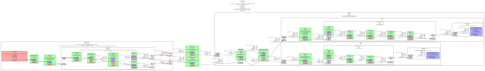

## 目标

有时事情不会按预期进行，并且从总线检索到的错误消息（如果有）没有提供足够的信息。幸运的是，GStreamer 附带了大量的调试信息，这些信息通常暗示了问题可能是什么。本教程展示了：

- 如何从 GStreamer 获取更多调试信息。
- 如何将您自己的调试信息打印到 GStreamer 日志中。
- 如何获取管道图

## 打印调试信息

### 调试日志

GStreamer 及其插件充满了调试跟踪，这是代码中将特别有趣的信息打印到控制台的位置，以及时间戳、进程、类别、源代码文件、函数和元素信息。

调试输出由 GST_DEBUG 环境变量控制。下面是一个 GST_DEBUG=2 的示例：

```shell
0:00:00.868050000  1592   09F62420 WARN  filesrc gstfilesrc.c:1044:gst_file_src_start:<filesrc0> error: No such file "non-existing-file.webm"
```

如您所见，这是相当多的信息。事实上，GStreamer 调试日志非常详细，以至于当完全启用时，它可能会使应用程序无响应（由于控制台滚动）或填满数兆字节的文本文件（当重定向到文件时）。因此，日志是分类的，您很少需要一次启用所有类别。

第一个类别是 Debug Level（调试级别），它是一个指定所需输出量的数字：

| # | Name    | Description                                                    |
|---|---------|----------------------------------------------------------------|
| 0 | none    | No debug information is output.                                |
| 1 | ERROR   | Logs all fatal errors. These are errors that do not allow the  |
|   |         | core or elements to perform the requested action. The          |
|   |         | application can still recover if programmed to handle the      |
|   |         | conditions that triggered the error.                           |
| 2 | WARNING | Logs all warnings. Typically these are non-fatal, but          |
|   |         | user-visible problems are expected to happen.                  |
| 3 | FIXME   | Logs all "fixme" messages. Those typically that a codepath that|
|   |         | is known to be incomplete has been triggered. It may work in   |
|   |         | most cases, but may cause problems in specific instances.      |
| 4 | INFO    | Logs all informational messages. These are typically used for  |
|   |         | events in the system that only happen once, or are important   |
|   |         | and rare enough to be logged at this level.                    |
| 5 | DEBUG   | Logs all debug messages. These are general debug messages for  |
|   |         | events that happen only a limited number of times during an    |
|   |         | object's lifetime; these include setup, teardown, change of    |
|   |         | parameters, etc.                                               |
| 6 | LOG     | Logs all log messages. These are messages for events that      |
|   |         | happen repeatedly during an object's lifetime; these include   |
|   |         | streaming and steady-state conditions. This is used for log    |
|   |         | messages that happen on every buffer in an element for example.|
| 7 | TRACE   | Logs all trace messages. Those are message that happen very    |
|   |         | very often. This is for example is each time the reference     |
|   |         | count of a GstMiniObject, such as a GstBuffer or GstEvent, is  |
|   |         | modified.                                                      |
| 9 | MEMDUMP | Logs all memory dump messages. This is the heaviest logging and|
|   |         | may include dumping the content of blocks of memory.           |
+------------------------------------------------------------------------------+

要启用调试输出，请将 GST_DEBUG 环境变量设置为所需的调试级别。还将显示低于该级别的所有级别（即，如果您设置 GST_DEBUG=2，您将同时收到 ERROR 和 WARNING 消息）。

此外，每个插件或 GStreamer 的一部分都定义了自己的类别，因此您可以为每个单独的类别指定一个调试级别。例如，GST_DEBUG=2，audiotestsrc：6 将对 audiotestsrc 元素使用调试级别 6，对所有其他元素使用调试级别 2。

因此，GST_DEBUG环境变量是以逗号分隔的 category：level 对列表，开头有一个可选级别，表示所有类别的默认调试级别。

“*”通配符也可用。例如，GST_DEBUG=2，audio*：6 将对以单词 audio 开头的所有类别使用调试级别 6。GST_DEBUG=*：2 等效于 GST_DEBUG=2。

使用 gst-launch-1.0 --gst-debug-help 获取所有已注册类别的列表。请记住，每个插件都注册了自己的类别，因此，在安装或删除插件时，此列表可能会更改。

当 GStreamer 总线上发布的错误信息无法帮助您确定问题时，请使用 GST_DEBUG。通常的做法是将输出日志重定向到文件，然后检查该文件，搜索特定消息。

GStreamer 允许自定义调试信息处理程序，但当使用默认处理程序时，调试输出中每行的内容如下所示：

```shell
0:00:00.868050000  1592   09F62420 WARN filesrc gstfilesrc.c:1044:gst_file_src_start:<filesrc0> error: No such file "non-existing-file.webm"
```
这是信息的格式：

```C
| Example          | Explained                                                 |
|------------------|-----------------------------------------------------------|
|0:00:00.868050000 | Time stamp in HH:MM:SS.sssssssss format since the start of|
|                  | the program.                                              |
|1592              | Process ID from which the message was issued. Useful when |
|                  | your problem involves multiple processes.                 |
|09F62420          | Thread ID from which the message was issued. Useful when  |
|                  | your problem involves multiple threads.                   |
|WARN              | Debug level of the message.                               |
|filesrc           | Debug Category of the message.                            |
|gstfilesrc.c:1044 | Source file and line in the GStreamer source code where   |
|                  | this message was issued.                                  |
|gst_file_src_start| Function that issued the message.                         |
|<filesrc0>        | Name of the object that issued the message. It can be an  |
|                  | element, a pad, or something else. Useful when you have   |
|                  | multiple elements of the same kind and need to distinguish|
|                  | among them. Naming your elements with the name property   |
|                  | makes this debug output more readable but GStreamer       |
|                  | assigns each new element a unique name by default.        |
| error: No such   |                                                           |
| file ....        | The actual message.                                       |
+------------------------------------------------------------------------------+
```

### 添加您自己的调试信息

在与 GStreamer 交互的代码部分中，使用 GStreamer 的调试工具很有趣。这样，您就把所有 debug 输出都放在同一个文件中，并保留不同消息之间的时间关系。

为此，请使用 GST_ERROR（）、GST_WARNING（）、GST_INFO（）、GST_LOG（） 和 GST_DEBUG（） 宏。它们接受与 printf 相同的参数，并且使用 default 类别（default 将在输出日志中显示为 Debug 类别）。

要将 category 更改为更有意义的内容，请在代码顶部添加以下两行：

```C
GST_DEBUG_CATEGORY_STATIC (my_category);
#define GST_CAT_DEFAULT my_category
```

然后是这个，在你用 gst_init（） 初始化 GStreamer 之后：

```C
GST_DEBUG_CATEGORY_INIT (my_category, "my category", 0, "This is my very own");
```

这将注册一个新类别（即，在应用程序的持续时间内：它不会存储在任何文件中），并将其设置为代码的默认类别。请参阅 GST_DEBUG_CATEGORY_INIT（） 的文档。

### 获取管道图

对于那些管道开始变得太大并且您无法跟踪连接的内容的情况，GStreamer 能够输出图形文件。这些是 .dot 文件，可以使用 GraphViz 等免费程序读取，用于描述管道的拓扑结构，以及每个链接中协商的上限。

这在使用 playbin 或 uridecodebin 等多合一元素时也非常方便，它们会在其中实例化多个元素。使用 .dot 文件了解他们在其中创建了什么管道（并在此过程中学习一些 GStreamer）。

要获取 .dot 文件，只需将 GST_DEBUG_DUMP_DOT_DIR 环境变量设置为指向要放置文件的文件夹。gst-launch-1.0 将在每次状态更改时创建一个 .dot 文件，以便您了解 CAPS 协商的演变。取消设置变量以禁用此功能。在应用程序中，您可以使用 GST_DEBUG_BIN_TO_DOT_FILE（） 和 GST_DEBUG_BIN_TO_DOT_FILE_WITH_TS（） 宏在方便时生成 .dot 文件。

这里有一个 playbin 生成的 pipelines 类型的示例。这非常复杂，因为 playbin 可以处理许多不同的情况： 你的手动管道通常不需要这么长。如果您的手动管道开始变得非常大，请考虑使用 playbin。



要下载全尺寸图片，请使用本页顶部的附件链接（它是回形针图标）。

## 总结

本教程展示了：

- 如何使用 GST_DEBUG 环境变量从 GStreamer 获取更多调试信息。

- 如何使用 GST_ERROR（） 宏和相关函数将您自己的调试信息打印到 GStreamer 日志中。

- 如何使用 GST_DEBUG_DUMP_DOT_DIR 环境变量获取管道图。

很高兴您来到这里，很快再见！


